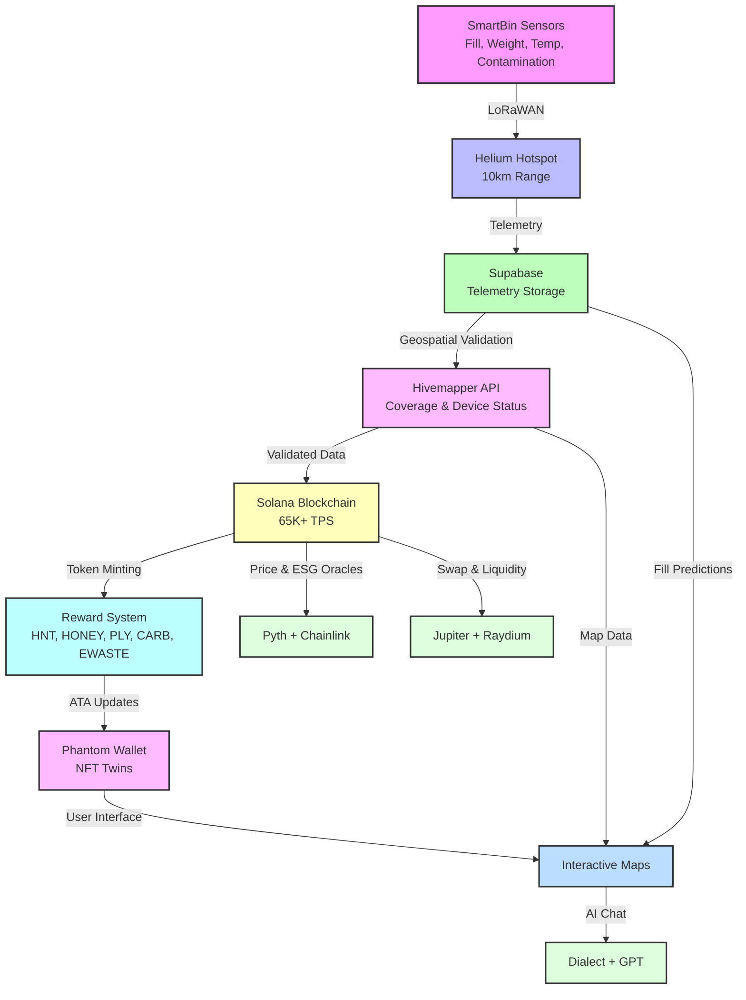

# ♻️ Polymers Protocol – Full Stack Blockchain Platform

---

## Overview

**Polymers Protocol** is a Blockchain-as-a-Service (BaaS) platform on Solana, powering **SmartBin**—a next-generation waste management, ESG tracking, and gamified reward system. It integrates **Helium DePIN** for IoT connectivity, **Hivemapper APIs** for geospatial validation, and **Solana ecosystem tools** for scalable, low-cost transactions and NFT-based rewards.

- **Helium DePIN**: IoT-enabled SmartBins for telemetry (~$0.00001 per 24KB via LoRaWAN).
- **Hivemapper APIs**: Real-time mapping, AR navigation, and city coverage validation.
- **AI Analytics**: ESG tracking, LSTM-based predictive insights, and reward optimization.
- **Solana Ecosystem**: Jupiter, Raydium, Metaplex, Solana Pay, and Blinks for payments and token swaps.
- **Rewards**: HNT, IOT, PLY, CARB, EWASTE, HONEY tokens incentivize sustainable behavior.
- **ESG Analytics**: Tracks plastic collected, CO₂ reduction, and leaderboards.

🌐 **Live Demo / MVP**: [Website & Dashboard](#) (replace with actual URL)  
📖 **Docs**: [/docs/introduction.md](/docs/introduction.md) | [/docs/helium-integration.md](/docs/helium-integration.md)

---

## Highlights

- **SmartBins IoT**: Monitors fill level, contamination, weight, and temperature.
- **Wallets & Tokens**: Supports Phantom, Solflare, Backpack, Privy; tokens include SOL, PLY, CARB, EWASTE, HONEY, USDC.
- **NFT Twins**: Gamified Metaplex NFTs with staking, evolution, and ESG-linked rewards.
- **Payments & Token Swap**: Solana Pay, Jupiter, Raydium, Blinks; supports QR/NFC and manual fallback.
- **ESG Analytics**: Tracks recycling impact, CO₂ reduction, and predictive fill levels using LSTM models.
- **AI Chat & AR Navigation**: GPT-powered chat with PLY billing; Hivemapper + Mapbox AR overlays.
- **Rewards & Gamification**: Badges, NFT evolution, leaderboards, and yield staking.

---

## Architecture Overview



---

## 📂 Collapsible Sections

### ♻️ ESG & Carbon Offset Integration

<details>
<summary>Click to expand ESG details</summary>

#### 1️⃣ Overview
- **Purpose**: Calculate carbon offsets (kg CO₂e avoided) from recycling activities tracked via SmartBins or user contributions (`/recycling`).
- **Endpoints**:
  ```bash
  GET /esg           # Returns carbon offsets and ESG points
  GET /smartbins     # Provides telemetry for offset calculations
  GET /nft-twins     # Links carbon offsets to NFT staking rewards
  POST /nft-twins    # Updates NFT rewards
  ```
- **Storage**:
  - Off-chain: Prisma/TypeORM stores ESG points and offsets.
  - On-chain (optional): Solana program logs verifiable offsets.
- **Integration**: Carbon offsets contribute to ESG points, increasing NFT Twin staking rewards (e.g., 5 PLY per 100 ESG points).

#### 2️⃣ Key Assumptions
- SmartBins report recycling data (weight, material type).
- Carbon offsets use material-specific emission factors (kg CO₂e/kg recycled).
- ESG point conversion: 1 kg CO₂e = 10 points.
- Users identified via Solana wallet public keys.

#### 3️⃣ Carbon Offset Formula
```
Carbon Offset (kg CO₂e) = Weight Recycled (kg) × Emission Factor (kg CO₂e/kg)
ESG Points = Carbon Offset × 10
```

| Material  | kg CO₂e/kg |
|-----------|------------|
| Plastic   | 1.5        |
| Glass     | 0.3        |
| Paper     | 0.9        |
| Aluminum  | 9.0        |

#### 4️⃣ Backend Implementation

**SmartBin Data Recording**
```typescript
async function recordSmartBinData(data: SmartBinData) {
  if (data.weight < 0) throw new Error('Invalid weight');
  await prisma.smartBin.create({ data });
  await calculateCarbonOffset(data.user, data.weight, data.material);
}
```

**Carbon Offset Calculation**
```typescript
const emissionFactors: { [key: string]: number } = { plastic: 1.5, glass: 0.3, paper: 0.9, aluminum: 9.0 };

async function calculateCarbonOffset(user: string, weight: number, material: string) {
  const offset = weight * (emissionFactors[material] || 0.5);
  const points = Math.floor(offset * 10);
  const existing = await prisma.esg.findUnique({ where: { user } });
  if (existing) {
    await prisma.esg.update({
      where: { user },
      data: { points: existing.points + points, carbonOffset: existing.carbonOffset + offset, updatedAt: new Date() },
    });
  } else {
    await prisma.esg.create({ data: { user, points, carbonOffset: offset, updatedAt: new Date() } });
  }
  return { offset, points };
}
```

**NFT Twin Staking Integration**
```typescript
const esgReward = Math.floor(esgPoints / 100) * 5; // 5 PLY per 100 ESG points
const totalReward = baseReward + esgReward;
```

#### 5️⃣ Example Calculations: ESG → NFT Rewards

| Material  | Weight (kg) | Carbon Offset (kg CO₂e) | ESG Points |
|-----------|-------------|-------------------------|------------|
| Plastic   | 5           | 7.5                     | 75         |
| Paper     | 3           | 2.7                     | 27         |
| Aluminum  | 1           | 9.0                     | 90         |

**Total**:
- Carbon Offset: 19.2 kg CO₂e
- ESG Points: 192
- NFT Twin Staking Reward: 5 PLY (`floor(192 / 100) * 5`)

```bash
# Example: Calculate ESG → NFT reward for 5kg plastic, 3kg paper, 1kg aluminum
# Total ESG points: 192 → NFT staking reward: 5 PLY
```

#### 6️⃣ API Examples
```bash
curl -X GET /esg
curl -X GET /smartbins
curl -X GET /nft-twins
curl -X POST /nft-twins
```

</details>

### 🧪 Simulations

<details>
<summary>Click to expand simulation details</summary>

Run simulations to test telemetry, rewards, Hivemapper integration, predictive analytics, and OTA updates without hardware or live APIs. Unit tests ensure robust coverage.

```bash
npm run simulate:iot         # IoT telemetry simulation
npm run simulate:hivemapper  # Hivemapper mapping simulation
npm run simulate:rewards     # Rewards simulation
npm run test:lstm            # Predictive analytics
npm run ota:deploy --bin test_bin --file ./firmware/latest.bin  # OTA update test
npm run test                # Run unit tests (iot.test.ts, rewards.test.ts, ota_utils.test.ts, lstm_model.test.ts)
```

**Unit Tests**:
- `/scripts/__tests__/iot.test.ts`: Tests telemetry submission and validation.
- `/scripts/__tests__/rewards.test.ts`: Tests reward issuance and ESG score checks.
- `/scripts/__tests__/ota_utils.test.ts`: Tests OTA deployment and rollback.
- `/scripts/__tests__/lstm_model.test.ts`: Tests LSTM predictions with mocked ML service.

**Sample Data**:
- `/scripts/sample_data/sample_telemetry.json`: Simulated telemetry for testing.

</details>

### 🛠 API Playground & Examples

<details>
<summary>Click to expand API details</summary>

```bash
curl -X GET /users         # Retrieve user details
curl -X POST /transactions # Create token transfers
curl -X GET /nft-twins     # Fetch NFT Twins
curl -X POST /payments     # Initiate payments
curl -X GET /esg           # Retrieve ESG metrics
curl -X GET /smartbins     # Fetch SmartBin status
curl -X POST /ai-agents    # GPT-powered AI chat
```

**Swagger Docs**: [/docs/swagger.yaml](/docs/swagger.yaml)

</details>

### 🚀 Quickstart & Environment Setup

<details>
<summary>Click to expand Quickstart details</summary>

#### 1️⃣ Prerequisites
```bash
# Install dependencies
npm install -g @solana/cli@1.18.0 @helium/cli@2.0.1 @coral-xyz/anchor-cli@0.30.0
npm install axios@1.7.2 typescript@5.5.4 msw@2.0.0 jest@29.7.0 @supabase/supabase-js@2.45.4
```

#### 2️⃣ Wallet Setup
```bash
# Export Helium wallet
helium wallet export --key-type solana > solana_wallet.json
# Import into Phantom Wallet
```

#### 3️⃣ Environment Configuration
Create `.env`:
```env
NEXT_PUBLIC_SOLANA_RPC_URL=https://api.devnet.solana.com
HELIUM_HOTSPOT_ADDRESS=<your_hotspot_address>
PLY_MINT=<ply_mint_address>
CARB_MINT=<carb_mint_address>
EWASTE_MINT=<ewaste_mint_address>
HONEY_MINT=<honey_mint_address>
REWARD_WALLET_ADDRESS=<reward_wallet_address>
NEXT_PUBLIC_SUPABASE_URL=<supabase_url>
NEXT_PUBLIC_SUPABASE_ANON_KEY=<supabase_anon_key>
HIVEMAPPER_API_KEY=<your_api_key>
HIVEMAPPER_USERNAME=<your_username>
```

**Security**:
- Add `.env` to `.gitignore`:
  ```bash
  echo ".env" >> .gitignore
  ```
- **Production**: Use Doppler ([doppler.com](https://doppler.com)), HashiCorp Vault ([hashicorp.com/products/vault]), or Vercel secrets ([vercel.com/docs/security/secrets]).

#### 4️⃣ Devnet Simulation
```bash
# Clone repository
git clone https://github.com/polymers-protocol/smartbin
cd smartbin
npm install
# Run local validator
solana-test-validator --rpc-port 8899 &
# Deploy programs
anchor deploy --provider.cluster devnet
# Run simulations
npm run simulate:iot
npm run simulate:hivemapper
npm run simulate:rewards
npm run test:lstm
npm run test
npm run ota:deploy --bin test_bin --file ./firmware/latest.bin
```

**Rate Limits**:
- **Hivemapper**: ~100 requests/minute (free tier). Use exponential backoff for 429 errors.
- **Helium**: Throttle batch telemetry to 10 payloads/second to avoid Data Credit spikes (~$0.00001 per 24KB).

</details>

### 📁 Monorepo Structure

<details>
<summary>Click to expand monorepo structure</summary>

```bash
/apps
  /web          # Next.js Dashboard
  /mobile       # React Native / Expo App
  /backend      # Fastify / MCP API
  /shared       # Shared components/hooks/types
/data           # Sample data & seeding
/lib            # Solana, Helium, Hivemapper, Metaplex, Jupiter, Raydium
/hooks          # React hooks
/context        # Wallet/User/AI/ESG contexts
/constants      # Colors, tokens, API endpoints
/utils          # Utility functions
/api            # Backend API routes
/prisma         # Supabase schema & migrations
/docs
  introduction.md
  helium-integration.md
  swagger.yaml
/pages/
/public/images
/storage
/scripts
  deploy.ts
  simulate_*.ts
  __tests__/
    iot.test.ts
    rewards.test.ts
    ota_utils.test.ts
    lstm_model.test.ts
  sample_data/sample_telemetry.json
.env.example
README.md
```

</details>

---

## Support & Community

- **GitHub Issues**: File issues at [github.com/polymers-protocol/smartbin](https://github.com/polymers-protocol/smartbin) (replace with actual repo URL).
- **Helium Community**:
  - Discord: [discord.gg/helium](https://discord.gg/helium)
  - X: Follow `#HeliumDePIN` or `@Helium` (1.2M+ hotspots, September 2025).
- **Hivemapper Community**:
  - Discord: [discord.com/invite/FRWMKyy5v2](https://discord.com/invite/FRWMKyy5v2)
  - Docs: [docs.hivemapper.com](https://docs.hivemapper.com)
- **Polymers Protocol Community**:
  - Discord: [discord.gg/polymersprotocol](https://discord.gg/polymersprotocol) (replace with actual link)
  - Telegram: [t.me/polymersprotocol](https://t.me/polymersprotocol) (replace with actual link)
  - X: Follow `#PolymersProtocol` or `@PolymersProtocol` (replace with official handle)
- **Solana Community**:
  - Discord: [discord.gg/solana](https://discord.gg/solana)
  - Stack Exchange: [solana.stackexchange.com](https://solana.stackexchange.com)

**Contribution**:
- Submit pull requests via GitHub.
- Create detailed issues with logs, steps, and environment details (e.g., Node.js v18.20.4, Solana CLI v1.18.0).
- Join weekly community calls on Discord (check pinned messages).
