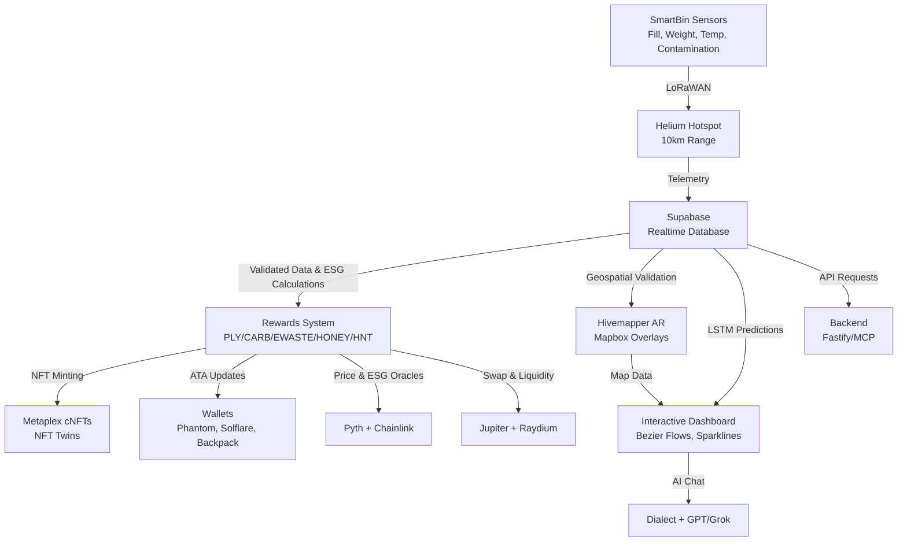

# ♻️ Polymers Protocol

**Polymers Protocol** is a **full-stack Blockchain-as-a-Service (BaaS)** platform built on **Solana**, powering **SmartBin**—an IoT-enabled, gamified waste management system with ESG tracking, token rewards, and NFT Twins. The full-stack architecture integrates **frontend** (React Native/Next.js), **backend** (Fastify/MCP), **blockchain** (Solana, Metaplex, Jupiter, Raydium, Solana Pay), **IoT** (Helium DePIN), and **AI** (TensorFlow.js, GPT/Grok 3) to deliver a scalable, low-cost, and user-friendly solution for sustainable waste management. It features animated Bezier token flows, an enterprise-grade mobile dashboard, AI-driven ESG scanning, AR Wayfinding, and real-time multi-token analytics.

## 🌟 Full-Stack Features

### Frontend
- **Interactive Dashboard** (`ESGImpact.tsx`): Animated dual flywheel, Bezier-curved multi-token flows (PLY, CARB, EWASTE, HONEY, HNT), sparkline mini-charts, and tooltips using GSAP and `react-native-svg-charts`.
- **Mobile App**: React Native/Expo with AI ESG Scanner (`expo-camera` + TensorFlow.js) and AR Wayfinder (Hivemapper + Mapbox).
- **Web Dashboard**: Next.js for real-time ESG analytics and operator controls.
- **UI/UX**: Dark green (`#1A3C34`), sand (`#F4A261`), light gray (`#D3D3D3`), white (`#FFFFFF`); Satoshi-Bold (headings), Geist-Regular (body); GSAP animations.

### Backend
- **Fastify/MCP API**: RESTful endpoints for user data, transactions, ESG metrics, and SmartBin telemetry, integrated with Supabase for storage and LSTM analytics.
- **Supabase**: Real-time database for IoT telemetry and predictive analytics.
- **API Security**: AES-256 encryption, Privy.io wallet authentication (Phantom, Solflare, Backpack).

### Blockchain
- **Solana**: High-throughput (65K+ TPS) blockchain for token minting (PLY, CARB, EWASTE, HONEY, HNT), NFT Twins (Metaplex cNFTs), and payments (Solana Pay).
- **DeFi Integrations**: Jupiter and Raydium for token swaps and liquidity; Pyth and Chainlink oracles for ESG and price data.
- **Blinks**: Dialect-powered notifications and actions for real-time user engagement.

### IoT
- **SmartBins**: Sensors monitor fill level, weight, contamination, and temperature, connected via **Helium DePIN** (~$0.00001/24KB via LoRaWAN).
- **OTA Updates**: Firmware deployment for SmartBins (`npm run ota:deploy`).

### AI
- **AI ESG Scanner**: TensorFlow.js with `expo-camera` for material detection (plastic, glass, paper, aluminum) and ESG scoring (>95% accuracy).
- **AI Assistant**: GPT-powered chat (Grok 3 optional) via Dialect for user support and analytics.
- **LSTM Analytics**: Predictive fill level modeling via Supabase.

### Compliance
- **Standards**: GDPR, EU CSRD, TCFD, ISO 14064-1, ISO 31000.
- **Plastic Pollution Treaty**: Aligned with INC-5.2 (August 2025).
- **Monitoring**: Sentry for error tracking, ensuring enterprise-grade reliability.

### Gamification
- **NFT Twins**: Metaplex cNFTs representing ESG credits with staking and evolution.
- **Token Rewards**: Multi-token system (PLY, CARB, EWASTE, HONEY, HNT) with animated Bezier flows from SmartBins → Supabase → Rewards → NFT Twins.
- **Leaderboard**: Monthly rewards for top users (100 CARB + 50 EWASTE for 1st, etc.).

## 🚀 Live Demo / MVP

[Website & Dashboard](https://polymers.app) *(placeholder)*  
[Mobile App](https://polymers.app/mobile) *(placeholder)*  

### Animated Token Flow Demo
Visualize multi-token flows (PLY, CARB, EWASTE, HONEY, HNT) along Bezier paths from **SmartBins → Supabase → Rewards → NFT Twins** using GSAP and React Native SVG. See `/apps/mobile/src/components/TokenFlowDemo.tsx` or `/docs/demo.md`.

**Run the demo**:
```bash
npm install react-native-svg gsap-rn @fortawesome/react-native-fontawesome
cd apps/mobile
npm run start
```

## 📂 Full-Stack Architecture



**Animated Token Flows**: GSAP-driven Bezier animations visualize multi-token (PLY, CARB, EWASTE, HONEY, HNT) flows from SmartBins to NFT Twins, displayed in the enterprise-grade mobile dashboard.

## 🗂️ Monorepo Structure

```
/apps
  /web          # Next.js Dashboard
  /mobile       # React Native/Expo App (ESGImpact.tsx, TokenFlowDemo.tsx)
  /backend      # Fastify/MCP API
  /shared       # Shared components/hooks/types
/data           # Sample data & seeding
/lib            # Solana, Helium, Hivemapper, Metaplex, Jupiter, Raydium
/hooks          # React hooks
/context        # Wallet/User/AI/ESG contexts
/constants      # Colors, tokens, API endpoints
/utils          # Utility functions
/api            # Backend API routes
/prisma         # Supabase schema & migrations
/docs           # Documentation & Swagger
/scripts        # Deployment & simulation scripts
.env.example
README.md
```

## 🛠️ Quickstart

### 1️⃣ Install Dependencies

```bash
npm install -g @solana/cli @helium/cli @coral-xyz/anchor-cli
npm install axios typescript msw jest @supabase/supabase-js @tensorflow/tfjs expo-camera react-native-svg-charts gsap-rn react-native-svg @fortawesome/react-native-fontawesome
```

### 2️⃣ Setup Wallet

Export Helium wallet for Solana and import into **Phantom**, **Solflare**, or **Backpack**:

```bash
helium wallet export --key-type solana > solana_wallet.json
```

### 3️⃣ Configure Environment

Create `.env` in the project root:

```env
NEXT_PUBLIC_SOLANA_RPC_URL=https://api.devnet.solana.com
HELIUM_HOTSPOT_ADDRESS=<your_hotspot_address>
PLY_MINT=<ply_mint_address>
CARB_MINT=<carb_mint_address>
EWASTE_MINT=<ewaste_mint_address>
HONEY_MINT=<honey_mint_address>
REWARD_WALLET_ADDRESS=<reward_wallet_address>
NEXT_PUBLIC_SUPABASE_URL=<supabase_url>
NEXT_PUBLIC_SUPABASE_ANON_KEY=<supabase_anon_key>
HIVEMAPPER_API_KEY=<your_api_key>
HIVEMAPPER_USERNAME=<your_username>
```

### 4️⃣ Run Devnet Simulation

```bash
git clone https://github.com/polymers-protocol/smartbin
cd smartbin
npm install
solana-test-validator --rpc-port 8899 &
anchor deploy --provider.cluster devnet
npm run simulate:iot
npm run simulate:hivemapper
npm run simulate:rewards
npm run test:lstm
npm run ota:deploy --bin test_bin --file ./firmware/latest.bin
npm run test
```

## 🧪 Testing & Simulations

```bash
npm run simulate:iot         # Simulate SmartBin telemetry
npm run simulate:hivemapper  # Simulate AR mapping
npm run simulate:rewards     # Simulate token reward issuance
npm run test:lstm            # Test LSTM predictive analytics
npm run ota:deploy           # Deploy OTA firmware updates
npm run test                 # Run unit tests
```

Unit tests:
- `/scripts/__tests__/iot.test.ts`
- `/scripts/__tests__/rewards.test.ts`
- `/scripts/__tests__/ota_utils.test.ts`
- `/scripts/__tests__/lstm_model.test.ts`
- `/scripts/__tests__/esg.test.ts`

## 📡 API Endpoints

```bash
GET /users            # Fetch user data
POST /transactions    # Submit transactions
GET /nft-twins        # Retrieve NFT Twins
POST /nft-twins       # Mint NFT Twins
GET /esg              # Fetch ESG metrics
GET /smartbins        # Fetch SmartBin telemetry
POST /payments        # Process Solana Pay transactions
POST /ai-agents       # Trigger AI chat responses
```

Swagger documentation: `/docs/swagger.yaml`

## 🌍 ESG & Carbon Offset Integration

### Core Metrics
- **Carbon Offset (kg CO₂e)**: `Weight Recycled (kg) × Emission Factor (kg CO₂e/kg)`
  - Plastic: 1.5 kg CO₂e/kg
  - Glass: 0.3 kg CO₂e/kg
  - Paper: 0.9 kg CO₂e/kg
  - Aluminum: 9.0 kg CO₂e/kg
- **ESG Points**: `Carbon Offset × 10`
- **Cleanliness Score**: `100 - (Contamination % × 2)`
- **Tons Recycled**: `Weight Recycled (kg) / 1000`
- **Rivers Cleaned**: `Plastic Recycled (kg) × 0.001` (km, per INC-5.2)

### Additional Metrics
- **Energy Savings**: `Weight Recycled (kg) × Energy Factor (kWh/kg)`
  - Plastic: 5.0 kWh/kg
  - Glass: 1.2 kWh/kg
  - Paper: 4.0 kWh/kg
  - Aluminum: 40.0 kWh/kg
- **Water Savings**: `Weight Recycled (kg) × Water Factor (L/kg)`
  - Plastic: 22.0 L/kg
  - Glass: 15.0 L/kg
  - Paper: 10.0 L/kg
  - Aluminum: 150.0 L/kg
- **Social Impact Score**: `(Number of Deposits × 5) + (Leaderboard Rank Points × 2)`
  - Rank points: 100 (1st), 50 (2nd), 25 (3rd), 10 (others)
- **Governance Score**: `(Compliance Checkpoints Passed / Total) × 100`

### Reward Mechanism
- **NFT Twins**: 5 PLY per 100 ESG Points, minted as Metaplex cNFTs.
- **Staking**: `HONEY = Staked ESG Points × 0.01/day`
- **Leaderboard**: 1st: 100 CARB + 50 EWASTE; 2nd: 50 CARB + 25 EWASTE; 3rd: 25 CARB + 10 EWASTE

### Example
For 50 kg plastic, 20 kg glass, 10 kg aluminum, 10% contamination, 5 deposits, rank 2:
- **CO₂e Saved**: `50 × 1.5 + 20 × 0.3 + 10 × 9.0 = 171 kg`
- **ESG Points**: `171 × 10 = 1710`
- **Rewards**: `1710 / 100 × 5 = 85.5 PLY`
- **Energy Savings**: `50 × 5.0 + 20 × 1.2 + 10 × 40.0 = 674 kWh`
- **Water Savings**: `50 × 22.0 + 20 × 15.0 + 10 × 150.0 = 2900 L`
- **Cleanliness Score**: `100 - (10 × 2) = 80`
- **Rivers Cleaned**: `50 × 0.001 = 0.05 km`
- **Social Impact Score**: `(5 × 5) + (50 × 2) = 125`

Detailed documentation: `/docs/esg_calculations.md`

## 🎨 Visual Design
- **Palette**: Dark green (`#1A3C34`), sand (`#F4A261`), light gray (`#D3D3D3`), white (`#FFFFFF`).
- **Typography**: Satoshi-Bold (headings, 18–24px), Geist-Regular (body, 12–16px).
- **Animations**: GSAP for dual flywheel, Bezier-curved token flows, sparkline charts, and tooltips.
- **Components**:
  - `ESGImpact.tsx`: Enterprise-grade dashboard with ESG metrics, sparklines, and operator controls.
  - `TokenFlowDemo.tsx`: Animated Bezier flows for multi-token visualization.
  - AI ESG Scanner: Material detection UI with `expo-camera`.
  - AR Wayfinder: Hivemapper + Mapbox overlays.

## 🔒 Compliance & Security
- **Regulations**: GDPR, EU CSRD, TCFD, ISO 14064-1, ISO 31000, Plastic Pollution Treaty (INC-5.2, August 2025).
- **Security**: AES-256 encryption, Privy.io wallet auth, Sentry error monitoring.
- **Offline Support**: AsyncStorage for caching telemetry and ESG data.

## 🤝 Community & Support
- **GitHub**: [Polymers Protocol Repo](https://github.com/polymers-protocol/smartbin)
- **Discord**: [Polymers Protocol](https://discord.gg/polymers-protocol)
- **Telegram**: [Polymers Protocol](https://t.me/polymersprotocol)
- **Solana**: [Solana Discord](https://discord.gg/solana)
- **Helium**: [Helium Discord](https://discord.gg/helium)

## 📜 License
MIT License – Contributors: Polymers Protocol
