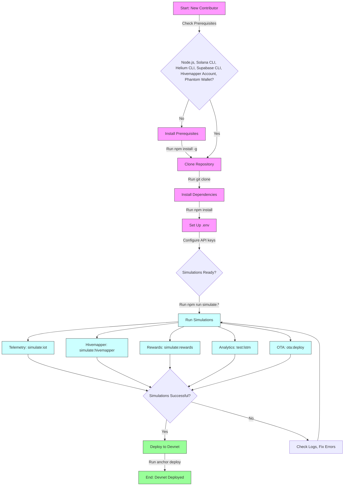

# Polymers Protocol – Full Stack Blockchain Platform

[](https://opensource.org/licenses/MIT)
[](https://www.typescriptlang.org/)
[](https://solana.com/)
[](https://supabase.com/)
[](https://api.polymers.io/swagger)
[](https://docs.polymers.io/ai)
[](https://docs.polymers.io/ar)
[](https://docs.polymers.io/esg)

## Overview

The **Polymers Protocol** is a **Blockchain-as-a-Service (BaaS)** platform built on **Solana**, powering **SmartBin**, a next-generation waste management system. It integrates **Helium’s Decentralized Physical Infrastructure Network (DePIN)** for IoT connectivity, **Hivemapper’s Map Data APIs** for real-time geospatial validation, and **AI-driven analytics** for ESG tracking and predictive insights. The protocol incentivizes sustainable waste management through token rewards (HNT, IOT, PLY, CARB, EWASTE, HONEY) and provides ESG analytics for municipalities and enterprises.

🌐 **Live Demo**: Check out the [Website & Dashboard](https://polymers-website.vercel.app).

This repository contains the code, scripts, and documentation for developing, testing, and deploying the Polymers Protocol. For a detailed introduction, see [/docs/introduction.md](./docs/introduction.md). For advanced setup and integration, see [/docs/helium-integration.md](./docs/helium-integration.md).

### Screenshots

| **Web Dashboard** | **Mobile App** | **SmartBin Map / AR** |
|--------------------|----------------|-----------------------|
|  |  |  |
| Analytics, NFT Twins, ESG | Wallet, AI Chat, Scan-to-Pay | Real-time AR navigation |

## Table of Contents

- [Overview](#overview)
  - [Screenshots](#screenshots)
- [Features](#features)
- [Quickstart](#quickstart)
- [API Examples](#api-examples)
- [Monorepo Structure](#monorepo-structure)
- [Contributing](#contributing)
- [Resources](#resources)
- [License](#license)

## Features

- **SmartBins**: IoT-enabled bins monitoring fill levels, contamination, weight, and temperature via Helium LoRaWAN (~$0.00001 per 24KB).
- **Wallet & Token Management**: Supports Phantom, Solflare, Backpack, Privy, embedded wallets, and biometric fallback for SOL, PLY, CARB, USDC.
- **NFT Twins**: Blockchain-based batch tracking with staking, evolution, and gamified rewards via Metaplex.
- **Payments & Token Swap**: Instant payments and swaps via Solana Pay, Jupiter, Raydium, and Blinks with QR/NFC or manual fallback.
- **Recycling & ESG**: Track plastic collected, CO2 reduction, and city-level leaderboards with exportable reports.
- **AI Chat**: GPT-powered assistance with PLY token billing (10 free messages, 100,000 PLY for 10 more) and saved prompts.
- **AR Navigation**: Hivemapper and Mapbox-powered AR for SmartBin location, with offline caching and static image fallback.
- **Analytics**: LSTM models for predictive fill level forecasting and route optimization, integrated with Supabase.

For details, see [AI Chat](https://docs.polymers.io/ai), [AR Navigation](https://docs.polymers.io/ar), and [ESG Tracking](https://docs.polymers.io/esg).

## Quickstart

### Prerequisites
- **Node.js**: v20+.
- **Solana CLI**: v1.18+ (`npm install -g @solana/cli`).
- **Helium CLI**: v2.0+ (`npm install -g @helium/cli`).
- **Supabase CLI**: For telemetry database.
- **Hivemapper Account**: API keys from [hivemapper.com/map-data-console](https://hivemapper.com/map-data-console).
- **Phantom Wallet**: For Solana transactions.

### Installation
1. **Clone Repository**:
   ```bash
   git clone https://github.com/PolymersNetwork/polymers-protocol
   cd polymers-protocol
   npm install
   ```

2. **Set Up Environment**:
   Create `.env` with:
   ```env
   NEXT_PUBLIC_SUPABASE_URL=https://<your-supabase-url>
   NEXT_PUBLIC_SUPABASE_ANON_KEY=<your-anon-key>
   RPC_URL=https://api.mainnet-beta.solana.com
   SOLANA_PRIVATE_KEY=<base58-private-key>
   HIVEMAPPER_API_KEY=<your-hivemapper-api-key>
   HELIUM_HOTSPOT_ADDRESS=<your_hotspot_address>
   PLY_MINT=PLYKdaCUgxTUw6rSjWbgSN97Qtecb6Fy6SazWf1tvAC
   CARB_MINT=<carb_mint_address>
   EWASTE_MINT=<ewaste_mint_address>
   HONEY_MINT=<honey_mint_address>
   REWARD_WALLET_ADDRESS=<reward_wallet_address>
   ```

3. **Supabase Setup**:
   - Create tables: `Users`, `Wallets`, `NFTTwins`, `Staking`, `Transactions`, `ESG`, `Payments`, `Donations`, `SmartBins`, `SavedPrompts`, `Recycling`, `Swap`.
   - Run migrations and seed data from `/app/data/sample-data.ts`.

4. **Run Local Simulations**:
   Test SmartBin workflows without hardware:
   ```bash
   npm run simulate:iot
   npm run simulate:hivemapper
   npm run simulate:rewards
   npm run test:lstm
   npm run ota:deploy --bin test_bin --file ./firmware/latest.bin
   ```
   See [/docs/helium-integration.md#local-simulation-and-testing](./docs/helium-integration.md#local-simulation-and-testing).

5. **Deploy to Devnet**:
   ```bash
   anchor deploy --provider.cluster devnet
   ```

### Quickstart Flowchart


### Developer Notes
- **Prerequisites**: Install dependencies before cloning to avoid failures:
  ```bash
  npm install -g @solana/cli @helium/cli supabase
  ```
- **Environment**: Secure `SOLANA_PRIVATE_KEY` and API keys in a secrets manager (e.g., Doppler). Verify addresses in `.env` to prevent telemetry or reward issues.
- **Simulations**: Run all simulations before deployment to validate workflows. Use `/scripts/sample_data/sample_telemetry.json` for reproducible tests. See [/docs/helium-integration.md#local-simulation-and-testing](./docs/helium-integration.md#local-simulation-and-testing).
- **OTA Updates**: Test on a simulated bin first:
  ```bash
  npm run ota:deploy --bin test_bin --file ./firmware/latest.bin
  ```
  See [/docs/helium-integration.md#ota-firmware-management](./docs/helium-integration.md#ota-firmware-management).
- **Rewards**: Verify token mints and Solana Pay configs in `/api/wallet/swap.ts`. Test thresholds (e.g., ESG score > 0.5, Hivemapper coverage > 0.8) with `/scripts/simulate_rewards.ts`. See [/docs/helium-integration.md#rewards-integration](./docs/helium-integration.md#rewards-integration).
- **API Testing**: Test endpoints locally using [Swagger Docs](https://api.polymers.io/swagger) with a valid `Authorization: Bearer <your-token>`.
- **Troubleshooting**: Check Supabase logs or console output for simulation failures. Refer to [/docs/helium-integration.md#troubleshooting-and-best-practices](./docs/helium-integration.md#troubleshooting-and-best-practices).

## API Examples

All requests require `Authorization: Bearer <your-token>`. Test endpoints via [Swagger Docs](https://api.polymers.io/swagger).

### GET /users
Retrieve user details.
```bash
curl -X GET "https://api.polymersprotocol.org/users?wallet=5Hb...xYz&limit=10" -H "Authorization: Bearer <your-token>"
```
**Response (200)**:
```json
{
  "users": [
    {
      "id": "user_123",
      "wallet": "5Hb...xYz",
      "email": "user@example.com",
      "createdAt": "2025-09-26T08:06:00Z",
      "role": "user"
    }
  ]
}
```

### POST /transactions
Create a token transfer.
```bash
curl -X POST https://api.polymersprotocol.org/transactions -H "Authorization: Bearer <your-token>" -H "Content-Type: application/json" -d '{"wallet":"5Hb...xYz","amount":100,"token":"PLY","recipient":"7Jk...aBc"}'
```
**Response (201)**:
```json
{
  "transactionId": "txn_456",
  "status": "confirmed",
  "amount": 100,
  "token": "PLY",
  "timestamp": "2025-09-26T08:06:00Z",
  "signature": "5xY...zQw"
}
```

### GET /nft-twins
Retrieve NFT Twins.
```bash
curl -X GET "https://api.polymersprotocol.org/nft-twins?wallet=5Hb...xYz&staked=true" -H "Authorization: Bearer <your-token>"
```
**Response (200)**:
```json
{
  "nfts": [
    {
      "id": "nft_789",
      "owner": "5Hb...xYz",
      "name": "EcoTwin #001",
      "staked": true,
      "rewards": 50000,
      "evolutionLevel": 2
    }
  ]
}
```

### POST /payments
Initiate a payment.
```bash
curl -X POST https://api.polymersprotocol.org/payments -H "Authorization: Bearer <your-token>" -H "Content-Type: application/json" -d '{"wallet":"5Hb...xYz","amount":50,"token":"USDC","method":"solana-pay","recipient":"7Jk...aBc"}'
```
**Response (201)**:
```json
{
  "paymentId": "pay_123",
  "status": "pending",
  "amount": 50,
  "token": "USDC",
  "timestamp": "2025-09-26T08:06:00Z",
  "transactionSignature": "4xY...pQr"
}
```

### GET /esg
Retrieve ESG metrics.
```bash
curl -X GET "https://api.polymersprotocol.org/esg?wallet=5Hb...xYz" -H "Authorization: Bearer <your-token>"
```
**Response (200)**:
```json
{
  "esg": {
    "wallet": "5Hb...xYz",
    "plasticCollected": 25.5,
    "co2Reduced": 10.2,
    "recyclingCount": 15,
    "cityRank": 3
  }
}
```

### GET /smartbins
Fetch SmartBin data.
```bash
curl -X GET "https://api.polymersprotocol.org/smartbins?city=NewYork&status=operational" -H "Authorization: Bearer <your-token>"
```
**Response (200)**:
```json
{
  "smartbins": [
    {
      "id": "bin_456",
      "location": { "lat": 40.7128, "lng": -74.0060 },
      "fillLevel": 75,
      "status": "operational",
      "lastUpdated": "2025-09-26T08:06:00Z"
    }
  ]
}
```

### POST /ai-agents
Send a message to the AI chat.
```bash
curl -X POST https://api.polymersprotocol.org/ai-agents -H "Authorization: Bearer <your-token>" -H "Content-Type: application/json" -d '{"wallet":"5Hb...xYz","message":"What is my recycling impact?"}'
```
**Response (201)**:
```json
{
  "messageId": "msg_789",
  "response": "You’ve recycled 25.5kg of plastic, reducing CO2 by 10.2kg!",
  "remainingMessages": 8,
  "timestamp": "2025-09-26T08:06:00Z"
}
```

For additional endpoints (`/donations`, `/recycling`, `/swap`, `/settings`, `/messages`), see [Swagger Docs](https://api.polymersprotocol.org/swagger).

## Monorepo Structure

```
/apps
  /web          # Next.js Web Dashboard
  /mobile       # React Native/Expo Mobile App
  /backend      # Fastify/MCP Backend API
  /shared       # Shared components, hooks, types
/app/data       # Sample data and seeding
/lib            # Solana, Helium, Hivemapper, Metaplex, Jupiter, Raydium
/hooks          # React hooks for dashboard/mobile
/context        # WalletContext, UserContext, AIProvider, ESGContext
/constants      # Colors, tokens, API endpoints
/utils          # Utility functions
/api            # Backend API routes
/prisma         # Supabase schema, migrations, seed data
/docs
  introduction.md
  helium-integration.md
  swagger.yaml  # API documentation
/public
  /images       # Logos, screenshots
/scripts
  deploy.ts     # Deployment scripts
  simulate_*.ts # Simulation scripts
  sample_data/sample_telemetry.json
.env.example
README.md
```

## Contributing

- Use **TypeScript** and adhere to the monorepo structure.
- Route blockchain operations through **MCP actions** in `/apps/backend`.
- Implement fallbacks for wallets (Phantom → Privy → Biometric), maps (AR → Mapbox → Static), and scanning (QR/NFC → Manual).
- Maintain offline caching for SmartBin telemetry.
- Submit issues or PRs on [GitHub](https://github.com/PolymersNetwork/polymers-protocol).
- Join discussions on X (search “Polymers Protocol” or “Helium IoT”) or Hivemapper’s Discord ([discord.com/invite/FRWMKyy5v2](https://discord.com/invite/FRWMKyy5v2)).

## Resources

- **Polymers Protocol**: [github.com/PolymersNetwork/polymers-protocol](https://github.com/PolymersNetwork/polymers-protocol)
- **Helium Docs**: [docs.helium.com/solana](https://docs.helium.com/solana)
- **Hivemapper Docs**: [docs.hivemapper.com](https://docs.hivemapper.com)
- **Solana Cookbook**: [solanacookbook.com](https://solanacookbook.com)
- **Supabase Docs**: [supabase.com/docs](https://supabase.com/docs)
- **Swagger Docs**: [api.polymers.io/swagger](https://api.polymers.io/swagger)
- **AI Chat**: [docs.polymers.io/ai](https://docs.polymers.io/ai)
- **AR Navigation**: [docs.polymers.io/ar](https://docs.polymers.io/ar)
- **ESG Tracking**: [docs.polymers.io/esg](https://docs.polymers.io/esg)

## License

[MIT License](https://opensource.org/licenses/MIT)
