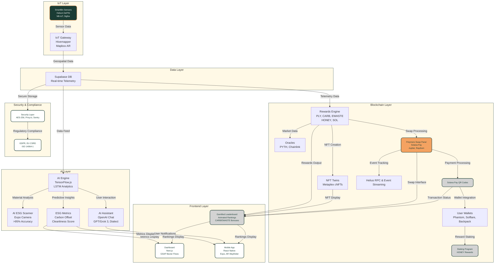

# ♻️ Polymers Protocol - Monorepo

**Polymers Protocol** is a full-stack Blockchain-as-a-Service (BaaS) platform built on [Solana](https://solana.com), powering **SmartBin**—an IoT-enabled, gamified waste management ecosystem for polymer and e-waste recycling. It integrates **ESG tracking**, **NFT Twins**, **tokenized rewards**, and the **Polymers Swap Panel** to drive transparency, sustainability, and user engagement.

The platform combines:
- **Frontend**: React Native mobile app and Next.js frontend + web3 dashboard with GSAP Bezier token flows and AR Wayfinder.
- **Backend**: Fastify/MCP API, Neon / Supabase real-time database, and LSTM predictive analytics.
- **Blockchain**: Solana Pay, Jupiter/Raydium swaps, Metaplex cNFTs, PYTH/Chainlink oracles, Helius RPC.
- **IoT**: SmartBins with Helium DePIN, NB-IoT, Sigfox, and Hivemapper geospatial mapping.
- **AI**: TensorFlow.ts QR-code / ESG scanner, OpenAI, Deepseek, Anthropics, Grok AI agents via Solana and Dialect.
- **Compliance**: GDPR, EU CSRD, ISO 14064-1, Plastic Pollution Treaty (INC-5.2, August 2025).

**Version**: 1.0 Beta  
**Live Demo**: [demo.polymersnetwork.org](https://demo.polymersnetwork.org)  

---

## 🌟 Full-Stack Features

- **Frontend**:
  - Interactive dashboard (`ESGImpact.tsx`) with dual flywheel, Bezier-curved token flows (PLY, CARB, EWASTE, HONEY, SOL), sparkline charts, and GSAP tooltips.
  - Mobile app (React Native/Expo) with AI ESG Scanner (expo-camera, TensorFlow.js), AR Wayfinder (Hivemapper/Mapbox), and [Polymers Swap Panel](#polymers-swap-panel).
  - Web dashboard (Next.js) with GSAP-driven Bezier flows (`TokenFlowDemoWeb.tsx`).
  - UI/UX: Dark green (#1A3C34), sand (#F4A261), light gray (#D3D3D3), white (#FFFFFF); Satoshi-Bold (headings), Geist-Regular (body).

- **Backend**:
  - Fastify/MCP API for user data, transactions, and [SmartBin telemetry](#helium-depin-integration).
  - Supabase for real-time telemetry and LSTM analytics.
  - Security: AES-256 encryption, Privy.io wallet auth (Phantom, Solflare, Backpack).

- **Blockchain**:
  - Solana (65K+ TPS) for token minting, [NFT Twins](#esg-nft-twins--rewards), and [Polymers Swap Panel](#polymers-swap-panel) via Solana Pay, Jupiter, Raydium.
  - Oracles: PYTH (ESG metrics), Chainlink (token prices).
  - Helius for RPC and event streaming.

- **IoT**:
  - SmartBins with [Helium DePIN](#helium-depin-integration), NB-IoT, Sigfox for fill, weight, contamination, temperature telemetry.
  - Geospatial mapping via Hivemapper/Mapbox.
  - OTA firmware updates (`npm run ota:deploy`).

- **AI & Agents**:
  - AI ESG Scanner (>95% accuracy) for material detection.
  - OpenAI Chat/Grok 3 agents via Dialect for user guidance and notifications.
  - LSTM models for predictive fill and reward analytics.

- **Compliance & Security**:
  - GDPR, EU CSRD, ISO 14064-1, ISO 31000 compliance.
  - AES-256 encryption, Privy.io auth, Sentry monitoring.
  - Offline support via AsyncStorage caching.

---

## 🏗️ Architecture Overview

The Polymers Protocol integrates IoT, blockchain, AI, and frontend components into a cohesive monorepo ecosystem. The optimized diagram below illustrates the data and transaction flow from SmartBins to user wallets, dashboards, and leaderboards, with Solana Pay facilitating seamless payments.



---

## 🌐 Helium DePIN Integration

Helium’s [Decentralized Physical Infrastructure Network (DePIN)](https://docs.helium.com/) powers Polymers’ IoT layer, providing low-cost, global connectivity for SmartBins in polymer and e-waste recycling. Leveraging Helium’s LoRaWAN network—on [Solana](https://solana.com) since April 2023 (HIP-70, 81% approval)—Polymers achieves real-time telemetry (fill levels, weight, temperature, contamination) at ~$0.00001 per 24KB payload, feeding [ESG Metrics](#esg-nft-twins--rewards), [NFT Twins](#esg-nft-twins--rewards), [Token Rewards & Swap Panel](#polymers-swap-panel), and [Leaderboard](#gamification--leaderboard).

#### Overview of Helium DePIN
- **LoRaWAN Network**: Low-power, long-range (10–15 km rural, 1–2 km urban) IoT connectivity, ideal for SmartBins.
- **Solana Integration**: Unified HNT token (HIP-138, Jan 2025) for Data Credits (DCs) and on-chain proofs via [Helius](https://helius.dev).
- **Token Model**: DCs minted from HNT for micro-transmissions; daily DC burns (e.g., $20K+ in 2025) reduce HNT supply.
- **Network Growth**: 350K+ Hotspots, 1M+ daily users, with expansions via Telefónica (Mexico) and Google Pixel 8 bundling.

#### Integration Flow
Helium powers `/lib/helium.ts`, with NB-IoT/Sigfox fallbacks (`/lib/nbiot.ts`, `/lib/sigfox.ts`):
1. **Data Capture**: SmartBin sensors (ultrasonic, load cells) transmit via LoRaWAN to Hotspots.
2. **Transmission & DCs**: Payloads (~24KB) consume DCs minted from HNT, authenticated via `HELIUM_API_KEY`.
3. **On-Chain Processing**: Data streams to Supabase via Helius RPC, triggering:
   - [NFT Twins](#esg-nft-twins--rewards) minting (Metaplex).
   - [Token Rewards](#esg-nft-twins--rewards) (PLY, CARB, HONEY) using PYTH oracles.
4. **Feedback Loop**: Updates [Dashboard](#full-stack-features) and Mobile App (AR Wayfinder via Hivemapper/Mapbox); Dialect notifications alert pickups/rewards.
5. **Gamification**: High-quality data boosts [Leaderboard](#gamification--leaderboard) rankings and [Swap Panel](#polymers-swap-panel) eligibility for HNT/HONEY.

#### Technical Implementation
- **Libraries**:
  - `@helium/iot-sdk`: Device onboarding, DC payments, telemetry decoding.
  - `helium-cli`: Wallet setup (`helium wallet export --key-type solana`).
  - [Helius](https://helius.dev): RPC for DC burns, HNT mints.
- **Environment Variables**:
  ```plaintext
  HELIUM_API_KEY=YOUR_HELIUM_API_KEY
  NEXT_PUBLIC_SOLANA_RPC_URL=https://api.mainnet-beta.solana.com
  NB_IOT_MQTT_BROKER=mqtt://broker.hivemq.com
  SIGFOX_API_KEY=YOUR_SIGFOX_API_KEY
  ```
- **Code Example** (from `/lib/helium.ts`):
  ```typescript
  import { HeliumIoT } from '@helium/iot-sdk';
  import { Connection } from '@solana/web3.js';
  import { supabase } from '../lib/supabaseClient';

  async function sendTelemetry(payload: Buffer, deviceId: string, connection: Connection) {
    const helium = new HeliumIoT({ apiKey: process.env.HELIUM_API_KEY });
    const dcCost = await helium.calculateDCCost(payload.length); // ~$0.00001/24KB
    const burnTx = await helium.burnHNTForDCs(dcCost, wallet);
    await connection.sendTransaction(burnTx);
    const response = await helium.transmit(payload, deviceId);
    if (response.success) {
      await supabase.from('telemetry').insert({ data: response.payload, binId: deviceId });
    }
    return response;
  }
  ```
- **Testing**:
  ```bash
  npm run simulate:iot  # Mock Hotspot relays
  npm run test          # Verify telemetry, DC burns (<1s latency)
  npm run ota:deploy    # OTA firmware updates
  ```

#### Benefits for E-Waste Management
| Aspect              | Benefit                              | Impact                                      |
|---------------------|--------------------------------------|---------------------------------------------|
| Cost Efficiency     | $0.00001/24KB vs. $0.01+ cellular    | Scales 100K+ SmartBins globally             |
| Coverage            | 350K+ Hotspots, long-range LoRaWAN   | Accurate [NFT Twins](#esg-nft-twins--rewards) & [ESG Metrics](#esg-nft-twins--rewards) |
| Decentralization    | HNT rewards for Hotspot owners       | Boosts [Leaderboard](#gamification--leaderboard) & [Swap Panel](#polymers-swap-panel) |
| Scalability         | 1M+ connections, ~400ms confirmations | Supports AI predictions for pickups         |
| ESG Alignment       | Low-energy LoRaWAN, on-chain proofs  | Enhances CARB tokens, EU CSRD compliance    |

#### Challenges & Mitigations
- **Coverage Gaps**: Use NB-IoT/Sigfox; Hivemapper maps Hotspots in AR Wayfinder.
- **DC Volatility**: Batch transmissions; swap USDC in [Swap Panel](#polymers-swap-panel).
- **Security**: AES-256 encryption, Privy.io auth.
- **Adoption**: Incentivize Hotspot deployment with HNT/PLY bonuses.

#### Future Potential
- Hybrid IoT/5G SmartBins for video contamination detection.
- DC auto-minting via Solana programs.
- HNT staking for enterprise users.

#### Resources
- [Helium Docs](https://docs.helium.com/)
- [Helius RPC](https://helius.dev)
- [Polymers Repo](https://github.com/polymers-protocol/smartbin)

---

## 📊 ESG, NFT Twins & Rewards

- **Core Metrics**:
  - Carbon Offset (kg CO₂e) = Weight Recycled × Emission Factor
  - ESG Points = Carbon Offset × 10
  - Cleanliness Score = 100 - (Contamination % × 2)
  - Tons Recycled = Weight / 1000
  - Rivers Cleaned = Plastic Recycled × 0.001 km
- **Rewards & NFTs**:
  - [NFT Twins](#esg-nft-twins--rewards): 5 PLY per 100 ESG Points, minted as Metaplex cNFTs.
  - Staking: HONEY = Staked ESG Points × 0.01/day.
  - [Leaderboard](#gamification--leaderboard): Animated rankings with CARB/EWASTE bonuses.
  - [Swap Panel](#polymers-swap-panel): Swap PLY, CARB, EWASTE, SOL via Solana Pay.
- **Tokenomics**:
  | Token  | Purpose                    | Swap Support         |
  |--------|----------------------------|----------------------|
  | PLY    | Recycling points           | Solana Pay, Jupiter  |
  | CARB   | Carbon offset rewards      | Solana Pay, Raydium  |
  | EWASTE | E-waste rewards            | Solana Pay, Jupiter  |
  | HONEY  | Staking rewards            | Solana Pay           |
  | SOL    | Native Solana transactions | Solana Pay, Raydium  |

---

## 💹 Polymers Swap Panel

The [Polymers Swap Panel](#polymers-swap-panel) connects [SmartBins](#helium-depin-integration) → [Rewards](#esg-nft-twins--rewards) → Swaps → Wallets with live multi-token flows, Solana Pay QR codes, and Jupiter/Raydium swaps.

- **Screenshot**: [View Swap Panel Screenshot](/docs/swap-panel-screenshot.png) *(Placeholder: Add actual image to repo)*
- **Interactive GIF**: [View Token Flow Animation](/docs/swap-flow.gif) *(Placeholder: Add to repo)*

#### 📱 Mobile Demo
```jsx
import { SwapPanel } from './components/SwapPanel';
import { TokenFlow } from './components/TokenFlowDemo';

export default function SwapDemo() {
  return (
    <TokenFlow tokens={['PLY','CARB','EWASTE','SOL']} from="SmartBin" to="Wallets">
      <SwapPanel userWallet="Phantom" />
    </TokenFlow>
  );
}
```

#### 💻 Web Dashboard Demo
```jsx
import { SwapPanel } from '../components/SwapPanelWeb';
import { BezierTokenFlow } from '../components/BezierTokenFlow';

export default function WebSwapDemo() {
  return (
    <BezierTokenFlow tokens={['PLY','CARB','EWASTE','SOL']} path="SmartBins→Rewards→Swap→Wallets">
      <SwapPanel />
    </BezierTokenFlow>
  );
}
```

---

## 🏆 Gamification & Leaderboard

- **Animated Rankings**: Monthly rewards:
  - 1st: 100 CARB + 50 EWASTE
  - 2nd: 50 CARB + 25 EWASTE
  - 3rd: 25 CARB + 10 EWASTE
- **Swap Integration**: Rewards swappable via [Polymers Swap Panel](#polymers-swap-panel) with Solana Pay.
- **NFT Visibility**: [NFT Twins](#esg-nft-twins--rewards) reflect ESG points and reward history.

---

## 💸 Solana Pay Integration

Solana Pay enhances Polymers Protocol by enabling fast, low-cost, and user-friendly transactions for token swaps, rewards, and wallet interactions. Integrated with the [Polymers Swap Panel](#polymers-swap-panel), it leverages Solana’s high throughput (65K+ TPS) and sub-second finality to streamline the ecosystem.

#### Key Features
- **QR Code Payments**: Users scan QR codes in the mobile app or dashboard to initiate swaps (e.g., PLY to SOL) or redeem rewards.
- **Transaction Speed**: ~400ms confirmation time, ideal for real-time reward distribution.
- **Low Fees**: ~$0.00025 per transaction, supporting micro-payments for SmartBin rewards.
- **Wallet Support**: Compatible with Phantom, Solflare, and Backpack via Privy.io auth.
- **Swap Integration**: Powers the [Polymers Swap Panel](#polymers-swap-panel) for seamless PLY, CARB, EWASTE, HONEY, and SOL exchanges.

#### Integration Flow
1. **Trigger Event**: SmartBin telemetry or user action (e.g., reward claim) initiates a transaction via the Rewards Engine.
2. **QR Generation**: The Fastify/MCP API generates a Solana Pay QR code (`/api/solana-pay/generate`) linked to the user’s wallet and token amount.
3. **Payment Processing**: Users scan the QR code with their wallet app, authorizing the transaction on Solana.
4. **Confirmation**: Helius RPC streams the transaction status to Supabase, updating the dashboard and mobile app.
5. **Reward/Swap Update**: Tokens are credited or swapped, reflected in the [Leaderboard](#gamification--leaderboard) and [Swap Panel](#polymers-swap-panel).

#### Technical Implementation
- **Libraries**:
  - `@solana/web3.js`: Core Solana blockchain interactions.
  - `@solana/pay`: QR code generation and transaction handling.
  - `qrcode`: Generates QR codes for the frontend.
- **Environment Variables**:
  ```plaintext
  SOLANA_PAY_MERCHANT_KEY=YOUR_MERCHANT_PRIVATE_KEY
  NEXT_PUBLIC_SOLANA_RPC_URL=https://api.mainnet-beta.solana.com
  HELIUS_API_KEY=YOUR_HELIUS_API_KEY
  ```
- **Code Example** (from `/api/wallet/solana-pay.ts`):
  ```typescript
  import { createQR } from '@solana/pay';
  import { Keypair, Connection, Transaction } from '@solana/web3.js';
  import { supabase } from '../../lib/supabaseClient';

  async function generateSolanaPayQR(amount: number, recipient: string, reference: string) {
    const connection = new Connection(process.env.NEXT_PUBLIC_SOLANA_RPC_URL, 'confirmed');
    const merchant = Keypair.fromSecretKey(Uint8Array.from(process.env.SOLANA_PAY_MERCHANT_KEY.split(',')));
    const qr = createQR({
      recipient: merchant.publicKey,
      amount,
      reference,
      label: 'Polymers Reward Payment',
      message: 'Scan to claim your reward!',
    });
    const qrImage = await qr.getImage(); // Returns base64 or buffer
    await supabase.from('transactions').insert({ qrData: qrImage, amount, recipient });
    return qrImage;
  }

  async function confirmTransaction(signature: string) {
    const connection = new Connection(process.env.NEXT_PUBLIC_SOLANA_RPC_URL, 'confirmed');
    const { blockhash } = await connection.getLatestBlockhash();
    const tx = await connection.getTransaction(signature, { commitment: 'confirmed' });
    if (tx) {
      await supabase.from('transactions').update({ status: 'confirmed' }).eq('signature', signature);
      return { success: true, tx };
    }
    return { success: false };
  }
  ```
- **Testing**:
  ```bash
  npm run simulate:solana-pay  # Mock QR generation and transactions
  npm run test:transactions    # Verify payment flow (<400ms latency)
  ```

#### Benefits
- **User Experience**: Seamless QR-based payments enhance mobile app usability.
- **Cost Efficiency**: Low fees enable micro-transactions for rewards and swaps.
- **Scalability**: Supports high transaction volumes for global SmartBin deployments.
- **Integration**: Complements Jupiter/Raydium swaps in the [Polymers Swap Panel](#polymers-swap-panel).

#### Challenges & Mitigations
- **Wallet Adoption**: Promote Phantom/Solflare via tutorials and incentives.
- **Network Congestion**: Use Helius RPC for reliable transaction streaming.
- **Security**: Encrypt QR data with AES-256 and validate via Privy.io auth.

#### Future Potential
- Integrate Solana Pay for HNT staking payments.
- Add multi-signature support for enterprise transactions.
- Enable batch QR payments for bulk reward claims.

#### Resources
- [Solana Pay Docs](https://docs.solana.com/pay)
- [Polymers Repo](https://github.com/polymers-protocol/smartbin)

---

## 📂 Monorepo Structure

```
/apps
  /web              # Next.js dashboard
  /mobile           # React Native app
  /backend          # Fastify/MCP API
/shared
/data
/lib
  /helium.ts        # Helium DePIN integration
  /nbiot.ts         # NB-IoT fallback
  /sigfox.ts        # Sigfox fallback
  /lstm_model.ts    # LSTM analytics
/hooks
/context
/constants
/utils
/api
  /iot/smartbins.ts # Telemetry processing
  /wallet/swap.ts   # Solana Pay swaps
/prisma
/docs
/scripts
  /simulate_iot.ts  # IoT simulations
.env.example
README.md
```

---

## 🛠️ Quickstart

1. **Clone & Install**:
   ```bash
   git clone https://github.com/polymers-protocol/smartbin
   cd smartbin
   npm install
   cp .env.example .env
   ```
2. **Configure `.env`**:
   ```plaintext
   NEXT_PUBLIC_SOLANA_RPC_URL=https://api.mainnet-beta.solana.com
   HELIUM_API_KEY=YOUR_HELIUM_API_KEY
   NB_IOT_MQTT_BROKER=mqtt://broker.hivemq.com
   SIGFOX_API_KEY=YOUR_SIGFOX_API_KEY
   PRIVY_APP_ID=YOUR_PRIVY_APP_ID
   CHAINLINK_API_KEY=YOUR_CHAINLINK_KEY
   SOLANA_PAY_MERCHANT_KEY=YOUR_MERCHANT_PRIVATE_KEY
   ```
3. **Run Simulations**:
   ```bash
   npm run simulate:iot        # Mock Helium Hotspot relays
   npm run simulate:hivemapper # Geospatial mapping
   npm run simulate:rewards    # Reward calculations
   npm run simulate:solana-pay # Mock Solana Pay transactions
   npm run test:lstm           # LSTM analytics
   npm run ota:deploy          # OTA firmware updates
   ```
4. **Run Demos**:
   ```bash
   cd apps/mobile && npm run start  # Mobile app
   cd ../web && npm run dev        # Web dashboard
   ```

---

## 📋 Recommendations

To maximize the impact and scalability of Polymers Protocol, consider the following enhancements:

- **Enhanced User Engagement**:
  - Introduce dynamic missions (e.g., "Recycle 10kg e-waste") with push notifications in the mobile app, leveraging AI Assistant guidance.
  - Enable social sharing of milestones (e.g., NFT Twins or PLY earnings) with visuals on X, integrated with the dashboard.
  - Add multilingual support for dashboards and apps to support global adoption, aligning with GDPR compliance.

- **Scalability & Performance**:
  - Optimize Solana smart contracts with batch minting and staking programs to reduce costs and enhance throughput for 100K+ SmartBins.
  - Implement Supabase edge functions for real-time IoT telemetry processing, supporting Helium DePIN scalability.
  - Explore cross-chain bridges (e.g., Ethereum, Polygon) for NFT Twins and token swaps, expanding beyond Solana Pay.

- **Advanced Analytics**:
  - Integrate live ESG dashboards with contamination heatmaps and carbon offset visuals, powered by PYTH/Chainlink oracles.
  - Enhance LSTM models with larger datasets and anomaly detection for predictive fill levels and reward distribution.
  - Incorporate real-time video analysis via hybrid IoT/5G SmartBins for improved material detection accuracy.

- **Interactivity & Integration**:
  - Embed interactive GSAP Bezier charts in the dashboard and mobile app using React Native WebView with Supabase updates.
  - Publish Swagger/OpenAPI specs for the Fastify/MCP API to encourage third-party integrations, including Solana Pay transactions.
  - Support additional wallets (e.g., Phantom, Solflare, Backpack) with Privy.io auth for seamless Solana Pay onboarding.

- **Sustainability & Compliance**:
  - Automate ESG report generation for EU CSRD and ISO 14064-1 compliance, leveraging AI ESG Scanner data.
  - Develop a carbon credit marketplace for trading CARB tokens, integrated with the Polymers Swap Panel and Solana Pay.
  - Strengthen the audit trail with tamper-proof blockchain logging of SmartBin events, enhanced by Helius RPC and Solana Pay transactions.

- **Community & Ecosystem**:
  - Release a developer SDK for building apps on the Polymers Protocol, utilizing the API, NFT Twins, Swap Panel, and Solana Pay.
  - Form partnerships with e-waste recycling facilities and ESG organizations to expand SmartBin deployments.
  - Encourage open-source contributions to `/lib` (e.g., `helium.ts`, `lstm_model.ts`) and `/api/wallet/solana-pay.ts` with detailed `/docs` guidance.

---

## 🤝 Community & Support

- **GitHub**: [Polymers Protocol Repo](https://github.com/PolymersNetwork/polymers-protpcol)
- **Discord**: [Polymers Protocol](https://discord.com/invite/polymersprotocol)
- **Telegram**: [Polymers Protocol](https://t.me/polymersprotocol)
- **Solana**: [Solana Discord](https://discord.com/invite/solana)
- **Helium**: [Helium Discord](https://discord.com/invite/helium)

---

## 📜 License

MIT License – Contributors: Polymers Protocol
