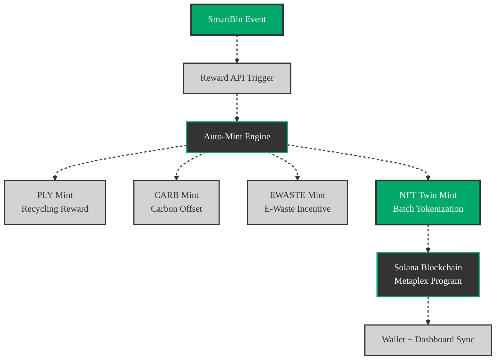
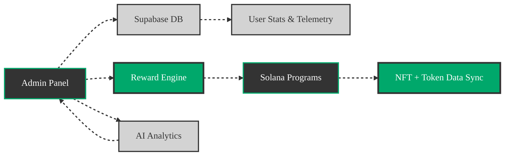
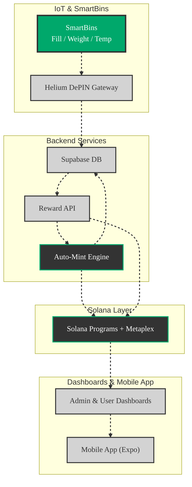

# 🧩 Polymers Protocol – E-Waste & Waste Management

**Version 1.0 – Beta**

Polymers Protocol is a **blockchain-as-a-service (BaaS)** platform leveraging **Solana**, **IoT/DePIN**, and **ESG analytics** to revolutionize polymer and e-waste recycling. It combines **transparent traceability**, **tokenized incentives**, **predictive analytics**, and **AI-assisted management** to enable circular, data-driven waste ecosystems.

---

## 🔹 Core Components

### 🌐 Dashboard
- Real-time telemetry for SmartBins (fill, weight, contamination, temperature).
- ESG metrics (carbon offset, circularity index).
- NFT Twin tracking of recycling batches.
- Predictive analytics for supply & contamination trends.
- Gamified missions and community leaderboards.

### 📱 Mobile App
- Built with **React Native + Expo** (dark theme, green-gray-black palette).
- Features: pickup scheduling, progress tracking, reminders, and token rewards.

### 🧠 AI & Analytics
- LSTM forecasting for material supply/demand.
- ESG score engine for sustainability impact.
- AI contamination detection from IoT telemetry.

### ♻️ SmartBins
- DePIN-connected devices streaming weight, fill level, and contamination data.
- AI-based optimization for pickup scheduling.
- Integrated token reward triggers via SmartBin Reward API.

---

## 🔄 SmartBin Reward API

| Endpoint                  | Method | Description                                  |
|---------------------------|--------|----------------------------------------------|
| `/api/reward/trigger`     | POST   | Trigger reward mint for valid deposits       |
| `/api/telemetry/update`   | POST   | Log SmartBin telemetry data                  |
| `/api/nft/mint`           | POST   | Auto-mint NFT Twin for batch                 |
| `/api/analytics/report`   | GET    | Return aggregated ESG & usage stats          |

**Flow**:
1. SmartBin sends telemetry → `/api/telemetry/update`
2. If thresholds met → `/api/reward/trigger`
3. Reward engine mints tokens + NFT Twin
4. Dashboard & mobile app update in real time

---

## 🪙 Auto-Mint Hierarchy



**Hierarchy Logic**:
- **Level 1**: SmartBin telemetry validation.
- **Level 2**: Reward eligibility scoring.
- **Level 3**: Token + NFT mint execution.
- **Level 4**: Real-time reward display via Supabase & Solana Pay.

---

## 🧮 Admin Dashboard

**Features**:
- Manage users, enterprises, SmartBins, and reward pools.
- Control token supply, minting thresholds, and payout cycles.
- View ESG analytics, contamination heatmaps, and AI forecasts.
- Audit-trail of all blockchain and IoT events.



---

## 🧩 System Architecture



---

## 📂 Project Structure

```
/app               # Frontend (Next.js Dashboard)
/api               # Node.js APIs – Reward + Telemetry
/mobile            # React Native App
/lib               # AI models & utilities
/programs/src      # Solana smart contracts
/scripts           # Deployment scripts
/tests             # Unit + integration tests
/docs              # Documentation & guides
```

---

## 🚀 Getting Started

### Prerequisites
- Node 18+, npm 9+
- Solana CLI + Solana Pay SDK
- Supabase Project
- TensorFlow.js
- Expo CLI

### Setup
```bash
git clone https://github.com/PolymersNetwork/polymers-recycling-platform.git
cd polymers-recycling-platform
npm ci
cp .env.example .env
npm run dev       # Dashboard
npx expo start    # Mobile App
```

### Environment Variables
```
NEXT_PUBLIC_SOLANA_RPC_URL=https://api.mainnet-beta.solana.com
NEXT_PUBLIC_SUPABASE_URL=YOUR_SUPABASE_URL
NEXT_PUBLIC_SUPABASE_ANON_KEY=YOUR_SUPABASE_KEY
PLY_MINT=PLY_TOKEN_MINT
CARB_MINT=CARB_TOKEN_MINT
EWASTE_MINT=EWASTE_TOKEN_MINT
REWARD_WALLET_ADDRESS=REWARD_WALLET
REWARD_WALLET_TOKEN_ACCOUNT=REWARD_WALLET_TOKEN
```

---

## 💰 Tokenized Rewards

| Token  | Utility                     |
|--------|-----------------------------|
| PLY    | Polymer recycling points    |
| CARB   | Carbon offset credits       |
| EWASTE | E-waste recycling rewards   |

```mermaid
graph LR
  U[User Deposit]:::green --> R[Reward API]:::gray
  R --> M[Auto-Mint Engine]:::black
  M --> T[Solana Tx + NFT Twin]:::gray
  T --> W[Wallet & Dashboard]:::black
  W --> L[Leaderboards & ESG Stats]:::gray

  %% Clickable Nodes
  click U "https://docs.polymers.network/user-deposits" "User Deposit Guide"
  click R "https://docs.polymers.network/reward-api" "Reward API Docs"
  click M "https://docs.polymers.network/auto-mint" "Auto-Mint Engine Docs"
  click T "https://solanapay.com/docs" "Solana Transaction Docs"
  click W "https://docs.polymers.network/wallet" "Wallet & Dashboard Guide"
  click L "https://docs.polymers.network/leaderboards" "Leaderboards & ESG Stats Docs"

  %% Styling
  classDef green fill:#00A86B,stroke:#333333,stroke-width:2px,color:#fff,font-family:Satoshi;
  classDef gray fill:#D3D3D3,stroke:#333333,stroke-width:2px,color:#333,font-family:Satoshi;
  classDef black fill:#333333,stroke:#00A86B,stroke-width:2px,color:#fff,font-family:Satoshi;
  classDef active fill:#00A86B,stroke:#333333,stroke-width:3px,color:#fff,font-family:Satoshi;
  linkStyle default stroke:#333,stroke-width:2px,stroke-dasharray:4,4;

  %% Conditional Styling
  class U active
```



---

## 🧪 Testnet Sandbox
1. Fund wallets on Devnet.
2. Configure SmartBins for simulated deposits.
3. Update `.env` to Devnet:
```
NEXT_PUBLIC_SOLANA_RPC_URL=https://api.devnet.solana.com
PLY_MINT=DEV_PLY_MINT
CARB_MINT=DEV_CARB_MINT
EWASTE_MINT=DEV_EWASTE_MINT
REWARD_WALLET_ADDRESS=DEV_REWARD_WALLET
REWARD_WALLET_TOKEN_ACCOUNT=DEV_REWARD_WALLET_TOKEN
```
4. Launch dashboard + mobile app.

---

## 📊 Predictive Rewards Simulation

```mermaid
gantt
  title Rewards Lifecycle
  dateFormat  YYYY-MM-DD
  axisFormat  %d-%m
  section Deposits
  User Deposits      :active, a1, 2025-10-01, 10d
  Enterprise Batches :active, a2, 2025-10-05, 8d
  section Token Minting
  PLY Tokens         :b1, after a1, 10d
  CARB Tokens        :b2, after a2, 8d
  EWASTE Tokens      :b3, after a1, 12d
  section Gamification
  Leaderboards Sync  :c1, after b1, 10d
  ESG Report Update  :c2, after b2, 8d

  %% Clickable Tasks
  click a1 "https://docs.polymers.network/user-deposits" "User Deposits Analytics"
  click a2 "https://docs.polymers.network/enterprise-batches" "Enterprise Batches Analytics"
  click b1 "https://docs.polymers.network/tokens#ply" "PLY Token Minting"
  click b2 "https://docs.polymers.network/tokens#carb" "CARB Token Minting"
  click b3 "https://docs.polymers.network/tokens#ewaste" "EWASTE Token Minting"
  click c1 "https://docs.polymers.network/leaderboards" "Leaderboards Sync Details"
  click c2 "https://docs.polymers.network/esg-reports" "ESG Report Details"

  %% Styling
  classDef active fill:#00A86B,stroke:#333333,stroke-width:2px,color:#fff;
  classDef default fill:#D3D3D3,stroke:#333333,stroke-width:2px,color:#333;
```

---

## 🧪 Tests

```bash
npm run test
```

**Covers**:
- IoT data ingestion and processing
- Solana mint transactions
- Reward calculation and leaderboards
- Admin panel management flows

---

## 🛠 Deployment
- **Frontend**: Vercel (CI/CD)
- **Mobile**: Expo OTA updates
- **Blockchain**: Solana program rollouts
- **Monitoring**: Sentry + Supabase telemetry

---

## 📋 Recommendations

To maximize the impact and scalability of the Polymers Protocol, consider the following enhancements:

1. **Enhanced User Engagement**:
   - **Gamification Expansion**: Introduce dynamic missions (e.g., "Recycle 10kg of e-waste this week") with tiered rewards to boost user participation. Integrate push notifications in the mobile app to alert users about new missions or leaderboard updates.
   - **Social Sharing**: Allow users to share recycling milestones (e.g., PLY tokens earned) on social platforms like X, with embedded NFT Twin visuals to promote the platform virally.
   - **Localized Interfaces**: Support multiple languages in the dashboard and mobile app to expand accessibility in global markets.

2. **Scalability & Performance**:
   - **Solana Program Optimization**: Optimize Solana smart contracts to reduce transaction costs (e.g., batch token minting) and improve throughput for high-volume SmartBin deployments.
   - **Supabase Scaling**: Implement Supabase edge functions for real-time telemetry processing to handle increased IoT data from large-scale SmartBin networks.
   - **Cross-Chain Compatibility**: Explore bridges to other blockchains (e.g., Ethereum, Polygon) for NFT Twins to enhance interoperability with broader ESG ecosystems.

3. **Advanced Analytics**:
   - **Real-Time ESG Dashboards**: Integrate live contamination heatmaps and carbon offset visualizations into the admin and user dashboards, linked from chart nodes (e.g., `AI Analytics` in the Admin Dashboard chart).
   - **AI Model Enhancements**: Train LSTM models on larger datasets to improve supply/demand forecasting accuracy. Add anomaly detection to flag irregular SmartBin data (e.g., contamination spikes).
   - **External Data Integration**: Pull real-time CO₂e metrics from external oracles (e.g., Pyth, Chainlink) to enhance ESG score credibility.

4. **Interactivity & Integration**:
   - **Chart Integration**: Embed interactive Mermaid charts in the dashboard and mobile app using React Native WebView, with real-time updates from Supabase subscriptions (e.g., highlight `SmartBin` nodes when fill levels exceed 80%).
   - **API Documentation**: Publish Swagger/OpenAPI specs for the SmartBin Reward API to encourage third-party integrations, with chart nodes linking to API endpoints (e.g., `/api/reward/trigger`).
   - **Wallet Integration**: Support additional Solana-compatible wallets (e.g., Phantom, Solflare) to improve user onboarding and reward accessibility.

5. **Sustainability & Compliance**:
   - **Regulatory Reporting**: Add automated ESG report generation for compliance with global recycling standards (e.g., EU Circular Economy Action Plan), accessible via the admin dashboard.
   - **Carbon Credit Marketplace**: Enable users to trade CARB tokens in a marketplace, with integration into the dashboard for real-time trading analytics.
   - **Audit Enhancements**: Strengthen the audit trail with blockchain-based tamper-proof logging of all SmartBin and reward events, accessible via the admin panel.

6. **Community & Ecosystem Growth**:
   - **Developer SDK**: Release an SDK for third-party developers to build apps on top of the Polymers Protocol, leveraging the SmartBin Reward API and NFT Twins.
   - **Partnerships**: Collaborate with e-waste recycling facilities and ESG-focused organizations to expand SmartBin deployments and token adoption.
   - **Open-Source Contributions**: Encourage community contributions to the `/lib` and `/programs/src` directories, with clear documentation in `/docs` to foster innovation.

**Implementation Example** (for Chart Integration):
```javascript
// Real-time chart update with Supabase
supabase
  .channel('smartbins')
  .on('postgres_changes', { event: 'UPDATE', schema: 'public', table: 'smartbins' }, payload => {
    const smartBinNode = document.querySelector('#SB');
    if (payload.new.fill_level > 80) {
      smartBinNode.classList.add('active');
      smartBinNode.setAttribute('data-tooltip', `High Fill Level: ${payload.new.fill_level}%`);
    }
  })
  .subscribe();
```
- **Effect**: Dynamically updates the `SmartBin` node in the System Architecture chart when fill levels exceed 80%, enhancing user engagement.

---

## 📜 License

[MIT License](LICENSE)
