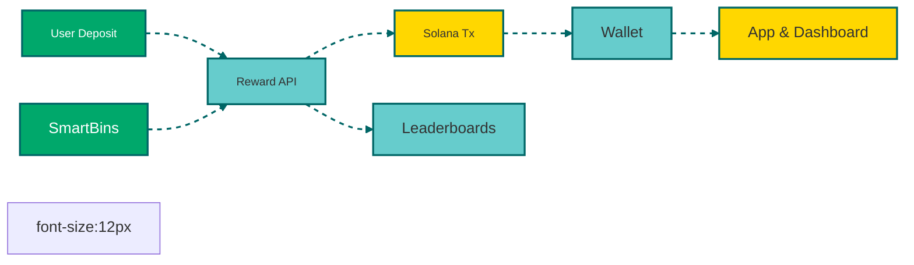
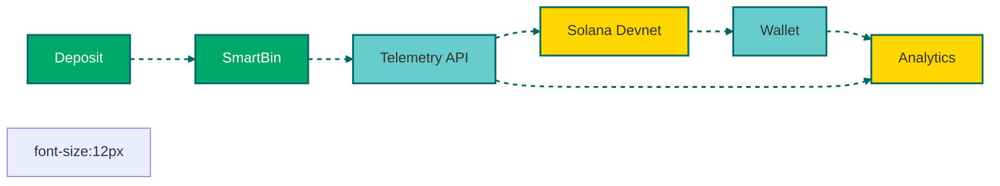

# Polymers Protocol – E-Waste & Waste Management

**Version 1.0 Beta**

Polymers Protocol is a **blockchain-as-a-service platform** integrating **Solana**, **IoT/DePin**, and **ESG solutions** for polymer and e-waste recycling. It provides **supply chain transparency**, **tokenized rewards**, **predictive analytics**, and **gamified engagement** to incentivize sustainable waste management.

---

## 🔹 Key Features

### Dashboard
- Real-time SmartBin telemetry (fill level, contamination, weight, temperature)
- NFT Twins for batch tracking on Solana
- ESG metrics and carbon footprint monitoring
- Predictive analytics for supply and contamination trends
- Gamified missions, leaderboards, and tokenized incentives

### Mobile App
- Built with React Native + Expo (supports OTA updates)
- Dark theme with green-gray-white palette, using Satoshi and Geist fonts
- Features: schedule pickups, track recycling, set reminders
- Real-time Solana-based rewards and gamification

### IoT & SmartBins
- Logs real-time and historical sensor data
- Auto-analyzes fill levels, contamination, and optimal collection times
- AI-driven metric updates triggered by new sensor readings

### NFT Twins
- Metaplex-based NFT minting for each recycling batch
- Tracks polymer type, weight, contamination, and ESG metrics

### Analytics & AI
- LSTM models for forecasting supply/demand and contamination
- Calculates ESG scores and carbon offset metrics
- Auto-updates metrics based on IoT data

### Rewards & Gamification
- Tokens: **PLY** (recycling points), **CARB** (carbon offsets), **EWASTE** (e-waste rewards)
- Leaderboards for users and enterprises
- Reward missions integrated into dashboard and mobile app

---

## 🔄 System Architecture

```mermaid
flowchart TB
  %% IoT Layer
  subgraph IoT["SmartBins / IoT"]
    SmartBin["SmartBins<br>Fill, Weight, Temp"]:::iot
    Helium["Helium DePIN<br>NB-IoT"]:::iot
  end

  %% Backend & Services
  subgraph Backend["Backend & Services"]
    Supabase["Supabase<br>IoT & Token Data"]:::backend
    RewardEngine["Reward Engine<br>Calculations"]:::backend
  end

  %% Oracle Layer
  subgraph Oracles["Oracles"]
    Pyth["Pyth<br>CO₂e Metrics"]:::oracle
    Chainlink["Chainlink<br>Token Prices"]:::oracle
  end

  %% Blockchain Layer
  subgraph Blockchain["Solana Blockchain"]
    SolanaPay["Solana Pay<br>Token Swaps"]:::blockchain
  end

  %% Frontend
  subgraph Frontend["Frontend"]
    Dashboards["Dashboards<br>Balances & Swaps"]:::frontend
    LLM["LLM Agent<br>Prompts"]:::frontend
  end

  %% Data Flow
  SmartBin -->|Data| Helium -->|Relayed| Supabase -->|Processed| RewardEngine -->|Rewards| SolanaPay -->|Updates| Dashboards
  RewardEngine -->|CO₂e| Pyth
  RewardEngine -->|Prices| Chainlink
  LLM -->|Prompts| SolanaPay
  Dashboards -->|Queries| Supabase

  %% Styling
  classDef iot fill:#00A86B,stroke:#006666,stroke-width:2px,color:#FFFFFF,border-radius:10px,font-size:12px;
  classDef backend fill:#66CCCC,stroke:#006666,stroke-width:2px,color:#333333,border-radius:10px,font-size:12px;
  classDef oracle fill:#66CCCC,stroke:#006666,stroke-width:2px,color:#333333,border-radius:10px,font-size:12px;
  classDef blockchain fill:#FFD700,stroke:#006666,stroke-width:2px,color:#333333,border-radius:10px,font-size:12px;
  classDef frontend fill:#FFD700,stroke:#006666,stroke-width:2px,color:#333333,border-radius:10px,font-size:12px;
  linkStyle default stroke:#006666,stroke-width:2px,color:#333333,stroke-dasharray:5,5;
```



---

## 📂 Project Structure

```
/app                   # Frontend dashboard
/api                   # Backend APIs
/components            # React components
/lib                   # AI and utility functions
/programs/src          # Solana programs
/scripts               # Simulation scripts
/tests                 # Unit and integration tests
/docs                  # Documentation
```

---

## 🚀 Getting Started

### Prerequisites
- Node.js ≥16, npm ≥8
- Solana CLI and Solana Pay SDK
- Supabase account for transaction logging
- TensorFlow.js for machine learning
- Expo CLI for mobile app development

### Installation
```bash
git clone https://github.com/PolymersNetwork/polymers-recycling-platform.git
cd polymers-recycling-platform
npm ci
cp .env.example .env
# Configure .env with your credentials
npm run dev       # Start dashboard
npx expo start    # Start mobile app
```

### Environment Variables
Create a `.env` file based on `.env.example` and configure the following:

```env
NEXT_PUBLIC_SOLANA_RPC_URL=https://api.mainnet-beta.solana.com
NEXT_PUBLIC_SUPABASE_URL=YOUR_SUPABASE_URL
NEXT_PUBLIC_SUPABASE_ANON_KEY=YOUR_SUPABASE_KEY
PLY_MINT=PLY_TOKEN_MINT
CARB_MINT=CARB_TOKEN_MINT
EWASTE_MINT=EWASTE_TOKEN_MINT
REWARD_WALLET_ADDRESS=REWARD_WALLET
REWARD_WALLET_TOKEN_ACCOUNT=REWARD_WALLET_TOKEN
```

---

## 💰 Tokenized Rewards

- **PLY**: Points for polymer recycling
- **CARB**: Carbon offset points
- **EWASTE**: E-waste recycling rewards

### Tokenomics Flow


Pre-funded enterprise SmartBins automatically credit bonus tokens.

---

## 🧪 Testnet Rewards Sandbox

Simulate rewards on Solana Devnet:
1. Fund Devnet wallets using a Solana faucet
2. Pre-fund SmartBins for test deposits
3. Configure `.env` for Devnet:

```env
NEXT_PUBLIC_SOLANA_RPC_URL=https://api.devnet.solana.com
PLY_MINT=DEV_PLY_MINT
CARB_MINT=DEV_CARB_MINT
EWASTE_MINT=DEV_EWASTE_TOKEN_MINT
REWARD_WALLET_ADDRESS=DEV_REWARD_WALLET
REWARD_WALLET_TOKEN_ACCOUNT=DEV_REWARD_WALLET_TOKEN
```

4. Run:
```bash
npm run dev       # Start dashboard
npx expo start    # Start mobile app
```

### Rewards Flow


Telemetry data automatically feeds analytics to dashboard charts.

---

## 📊 Predictive Rewards Simulation


---

## 🧪 Tests
Run tests to validate:
- IoT data ingestion and analytics
- Solana program interactions
- Wallet and token transactions
- Mobile prompts and reward flows

```bash
npm run test
```

---

## 🛠 Deployment
- **Dashboard**: Deployed on Vercel
- **Mobile App**: Deployed via Expo with OTA updates
- **Solana Programs**: Deployed with CI/CD and rollback strategy
- **Monitoring**: Sentry for telemetry and error tracking

---

## 📜 License

[MIT License](LICENSE)
