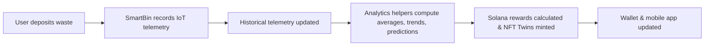

# Polymers Mobile App 

⸻

<!-- HERO SECTION -->

<div align="center" style="background: url('https://via.placeholder.com/1200x300?text=Polymers+Hero+Banner') no-repeat center/cover; border-radius: 15px; padding: 60px 20px; color: white; text-shadow: 2px 2px 8px rgba(0,0,0,0.7);">

<h1 style="font-size: 3em; margin-bottom: 10px;">Polymers Mobile App</h1>
<p style="font-size: 1.5em; margin-bottom: 20px;">E-Waste & Recycling dApp built on Solana</p>

<a href="https://your-live-demo-link.com" style="background: #ff6f61; color: white; padding: 12px 24px; border-radius: 8px; text-decoration: none; font-weight: bold;">🚀 Live Demo</a>

<div style="margin-top: 20px;">


</div>
</div>

**Replace the hero banner URL (`https://via.placeholder.com/1200x300?text=Polymers+Hero+Banner`) with your actual banner image.**

⸻

🎨 **App Screenshots (Responsive)**

<div style="display: flex; flex-wrap: wrap; justify-content: center; gap: 25px; margin-top: 30px;">

<div style="flex: 1 1 260px; text-align: center; position: relative;">

<div style="position: absolute; top: 0; left: 0; right: 0; bottom: 0; background: rgba(0,0,0,0.5); opacity: 0; border-radius: 15px; display: flex; align-items: center; justify-content: center; color: white; font-weight: bold; transition: opacity 0.3s ease;" onmouseover="this.style.opacity='1';" onmouseout="this.style.opacity='0';">View Dashboard</div>
<p><b>🏠 Home Dashboard</b></p>
</div>

<div style="flex: 1 1 260px; text-align: center; position: relative;">

<div style="position: absolute; top: 0; left: 0; right: 0; bottom: 0; background: rgba(0,0,0,0.5); opacity: 0; border-radius: 15px; display: flex; align-items: center; justify-content: center; color: white; font-weight: bold; transition: opacity 0.3s ease;" onmouseover="this.style.opacity='1';" onmouseout="this.style.opacity='0';">Explore AR Map</div>
<p><b>🗺️ AR Map Preview</b></p>
</div>

<div style="flex: 1 1 260px; text-align: center; position: relative;">

<div style="position: absolute; top: 0; left: 0; right: 0; bottom: 0; background: rgba(0,0,0,0.5); opacity: 0; border-radius: 15px; display: flex; align-items: center; justify-content: center; color: white; font-weight: bold; transition: opacity 0.3s ease;" onmouseover="this.style.opacity='1';" onmouseout="this.style.opacity='0';">Check NFT Twins</div>
<p><b>🎨 NFT Twins & Rewards</b></p>
</div>

</div>

**Replace screenshot URLs (`https://via.placeholder.com/260x500?text=...`) with your actual app screenshot images.**

**Highlights:**
- ✅ Real-time pickup tracking & rewards
- 🌍 Locate nearby SmartBins (>70% full) using AR
- 🎟️ View cNFT Twins representing ESG compliance & recycling history

⸻

📱 **Key Features**

<details>
<summary>Click to expand Key Features</summary>

**🛒 Schedule Pickups**  
- Book e-waste or recycling pickups in a few taps  
- Assign SmartBins to scheduled pickups  
- Track pickup status in real-time  

**📊 SmartBin Telemetry**  
- Sensors track fill level, weight, temperature, and contamination  
- Historical time-series tracking for trend analysis  
- Automated Solana rewards for recycling deposits  
- Over-the-air (OTA) firmware updates via Expo  

**💰 Solana Rewards & NFT Twins**  
- Tokens: PLY, CARB, EWASTE  
- NFT Twins for batch ESG compliance and recycling history  
- Instant wallet updates via Solana Pay  
- Gamified missions, leaderboards, and achievements  

**🔮 Predictive Analytics & ESG**  
- Predict fill levels, contamination trends, and collection times  
- ESG impact metrics (e.g., carbon footprint)  
- AI/LLM assistant for pickup, reward, and environmental queries  

**🏆 Gamification**  
- Missions, challenges, and eco-badges  
- Leaderboards for individuals and organizations  
- Unlock rewards based on recycling and ESG compliance  

</details>

⸻

📋 **Mobile App Prompts**

<details>
<summary>Click to expand Prompts & Actions</summary>

| Category       | Prompt Example                              | Action / Flow                                                                 |
|----------------|---------------------------------------------|------------------------------------------------------------------------------|
| Pickups        | “Schedule an e-waste pickup for tomorrow”   | Books pickup → assigns SmartBin → triggers rewards                           |
| SmartBins      | “Show bins >70% full”                      | Displays AR map → fetches telemetry → updates dashboard                      |
| SmartBins      | “Add new IoT reading”                      | Updates historical data → recomputes analytics → triggers rewards            |
| Rewards        | “Check my PLY token balance”                | Queries Solana blockchain → updates wallet & NFT Twins                       |
| Rewards        | “Swap 50 PLY to USDC”                      | Executes Solana Pay swap → updates balances                                  |
| ESG            | “Show my carbon footprint this month”       | Computes from IoT history & NFT Twins → displays in app                      |
| Predictions    | “Predict next collection time for Bin #12” | Uses historical telemetry + ML → displays ETA                                |
| Gamification   | “Show leaderboard”                         | Retrieves missions and scores → updates display                              |

</details>

⸻

🔧 **Architecture & IoT Flow**

<details>
<summary>Click to expand Architecture Diagram</summary>



- **Historical Telemetry**: Stored locally and synced to backend  
- **Analytics Helpers**: Automatically compute metrics on new readings  
- **Reward Triggers**: Automated Solana token issuance  
- **NFT Twins**: Track batch ESG compliance and recycling history  

</details>

⸻

🔑 **Environment Variables**

<details>
<summary>Click to expand Environment Variables</summary>

| Variable                     | Description                          | Example                              |
|------------------------------|--------------------------------------|--------------------------------------|
| NEXT_PUBLIC_SOLANA_RPC_URL   | Solana RPC endpoint                  | https://api.mainnet-beta.solana.com  |
| NEXT_PUBLIC_SUPABASE_URL     | Supabase URL                         | https://xyzcompany.supabase.co       |
| NEXT_PUBLIC_SUPABASE_ANON_KEY| Supabase anon/public key             | public-anon-key                      |
| PLY_MINT                     | PLY token mint address               | PLY_TOKEN_MINT_ADDRESS               |
| CARB_MINT                    | CARB token mint address              | CARB_TOKEN_MINT_ADDRESS              |
| EWASTE_MINT                  | EWASTE token mint address            | EWASTE_TOKEN_MINT_ADDRESS            |
| REWARD_WALLET_ADDRESS        | Reward wallet public key             | REWARD_WALLET_PUBLIC_KEY             |
| PRIVY_APP_ID                 | Privy authentication ID               | privy-app-id                         |
| CHAINLINK_API_KEY            | Chainlink oracle API key             | chainlink-key                        |
| BUBBLEGUM_TREE_ID            | Bubblegum Merkle Tree ID             | TREE_PUBLIC_KEY                      |
| CANDY_MACHINE_ID             | Candy Machine ID                     | CANDY_MACHINE_PUBLIC_KEY             |
| HELIUS_API_KEY               | Helius Webhook API key               | helius-api-key                       |
| NEXT_PUBLIC_ENV              | Environment (dev/test/prod)          | production                           |

</details>

⸻

🚀 **Getting Started**

<details>
<summary>Click to expand Setup & Installation</summary>

**Prerequisites**  
- Node.js ≥16  
- npm ≥8  
- Expo CLI: `npm install -g expo-cli`  
- Solana CLI  
- Supabase (backend)  
- Privy.io (authentication)  
- TensorFlow.js (predictive analytics)  
- Solana Pay SDK: `@solana/pay`, `@solana/web3.js`, `@solana/spl-token`

**Installation**

```bash
git clone https://github.com/PolymersNetwork/polymers-recycling-app.git
cd polymers-recycling-app
npm ci
cp .env.example .env
# Configure environment variables
npx expo start
```

**Build & OTA Deployment**

```bash
# iOS
npx eas build --platform ios
# Android
npx eas build --platform android
# OTA Updates
npx eas update
```

</details>

⸻

🌍 **Why Polymers?**
- ♻️ Simplifies recycling for individuals & businesses  
- 🎨 Gamifies eco-friendly actions with tokens & NFTs  
- 📊 Provides real-time analytics & ESG insights  
- 🔐 Secure, transparent blockchain-based rewards  

⸻

🛡 **License**

MIT License
