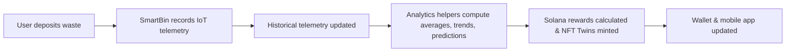

# Polymers Mobile App – E-Waste & Recycling dApp

**Version 1.0 Beta**

A Web3-enabled mobile app built with **Expo** and **React Native** to simplify recycling, track environmental impact, and reward sustainable behavior using **Solana** blockchain tokens. The app features a sleek **dark theme** with a green-gray-white palette, **Font Awesome** icons, and **Satoshi + Geist** typography, designed in **Figma**.

🔗 **Live Demo**: [demo.polymers.app](https://demo.polymers.app)

---

## 📱 Key Features

### 1. Schedule Pickups
- Book e-waste or recycling pickups in a few taps
- Assign SmartBins to scheduled pickups
- Track pickup status in real-time

### 2. SmartBin Telemetry
- Sensors for fill level, weight, temperature, and contamination
- Historical time-series tracking for trend analysis
- Automated Solana rewards for recycling deposits
- Over-the-air (OTA) firmware updates via Expo

### 3. Solana Rewards & NFT Twins
- Tokens: PLY, CARB, EWASTE
- NFT Twins for batch ESG compliance and recycling history
- Instant wallet updates via Solana Pay
- Gamified missions, leaderboards, and achievements

### 4. Predictive Analytics & ESG
- Compute fill levels, contamination trends, and predicted collection times
- ESG impact metrics (e.g., carbon footprint)
- AI/LLM assistant for pickup, reward, and environmental queries

### 5. Gamification
- Missions, challenges, and eco-badges
- Leaderboards for individuals and organizations
- Unlock rewards based on recycling and ESG compliance

---

## 📋 Mobile App Prompts

| Category       | Prompt Example                              | Action/Flow                                      |
|----------------|---------------------------------------------|-------------------------------------------------|
| **Pickups**    | "Schedule an e-waste pickup for tomorrow"   | Books pickup → assigns SmartBin → triggers rewards |
| **SmartBins**  | "Show bins >70% full"                      | Displays AR map → fetches telemetry → updates dashboard |
| **SmartBins**  | "Add new IoT reading"                      | Updates historical data → recomputes analytics → triggers rewards |
| **Rewards**    | "Check my PLY token balance"               | Queries Solana blockchain → updates wallet & NFT Twins |
| **Rewards**    | "Swap 50 PLY to USDC"                      | Executes Solana Pay swap → updates balances      |
| **ESG**        | "Show my carbon footprint this month"       | Computes from IoT history & NFT Twins → displays in app |
| **Predictions**| "Predict next collection time for Bin #12" | Uses historical telemetry + ML → displays ETA    |
| **Gamification**| "Show leaderboard"                        | Retrieves missions and scores → updates display  |

---

## 🔧 Mobile App Architecture

### IoT + Analytics Flow


- **Historical Telemetry**: Stored locally and synced to backend
- **Analytics Helpers**: Automatically compute metrics on new readings
- **Reward Triggers**: Automated Solana token issuance
- **NFT Twins**: Track batch ESG compliance and recycling history

---

## 🚀 Getting Started (Expo + React Native)

### Prerequisites
- **Node.js**: ≥16
- **npm**: ≥8
- **Expo CLI**: `npm install -g expo-cli`
- **Solana CLI**: For blockchain interactions
- **Supabase**: For transaction logging
- **Privy.io**: For authentication
- **TensorFlow.js**: For predictive analytics
- Solana Pay SDK: `@solana/pay`, `@solana/web3.js`, `@solana/spl-token`

### Installation
```bash
git clone https://github.com/PolymersNetwork/polymers-recycling-app.git
cd polymers-recycling-app
npm ci
cp .env.example .env
# Configure environment variables in .env
npx expo start  # Start development server
```

### Environment Variables
```env
NEXT_PUBLIC_SOLANA_RPC_URL=https://api.mainnet-beta.solana.com
NEXT_PUBLIC_SUPABASE_URL=YOUR_SUPABASE_URL
NEXT_PUBLIC_SUPABASE_ANON_KEY=YOUR_SUPABASE_KEY
PLY_MINT=PLY_TOKEN_MINT
CARB_MINT=CARB_TOKEN_MINT
EWASTE_MINT=EWASTE_TOKEN_MINT
REWARD_WALLET_ADDRESS=REWARD_WALLET
REWARD_WALLET_TOKEN_ACCOUNT=REWARD_WALLET_TOKEN
PRIVY_APP_ID=YOUR_PRIVY_APP_ID
CHAINLINK_API_KEY=YOUR_CHAINLINK_KEY
```

---

## 📦 Build & OTA Deployment (Expo)

### Build Production Apps
```bash
npx eas build --platform ios      # iOS
npx eas build --platform android  # Android
```

### Over-the-Air (OTA) Updates
```bash
npx eas update
```

---

## 🧪 Testing
Run unit and integration tests to ensure reliability:
```bash
npm run test
```

Tests cover:
- IoT data ingestion
- Analytics helpers
- Solana reward workflows
- Mobile prompts and gamification

---

## 🛠 Error Monitoring & Rollbacks
- **Monitoring**: Use Sentry for telemetry, blockchain, and app error tracking
- **Rollbacks**: Versioned deployments for Solana program updates to enable safe rollbacks

---

## 🌍 Why Polymers Mobile App?
- Simplifies recycling for homeowners and businesses
- Gamifies eco-friendly actions with tokens and NFTs
- Delivers real-time analytics and ESG insights
- Ensures transparent, secure blockchain-based rewards

---

## 🛡 License
MIT License
