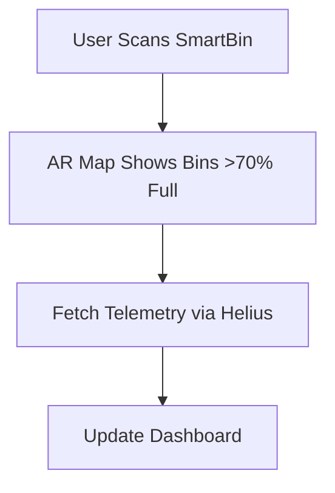
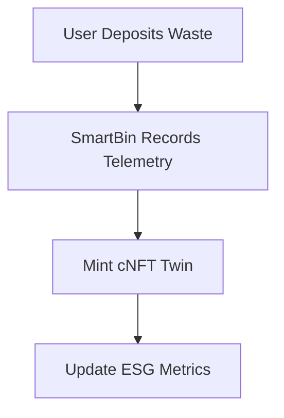
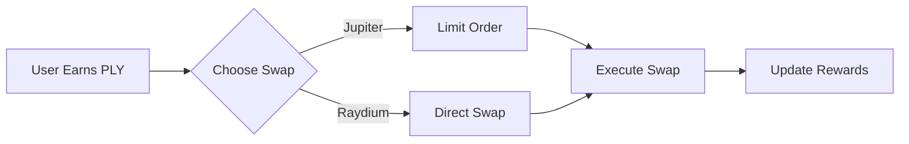
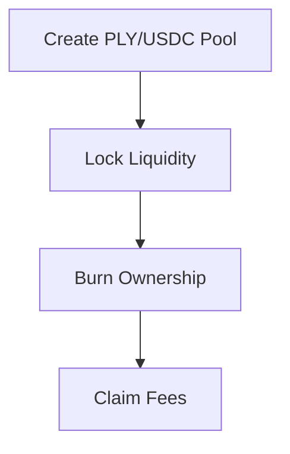
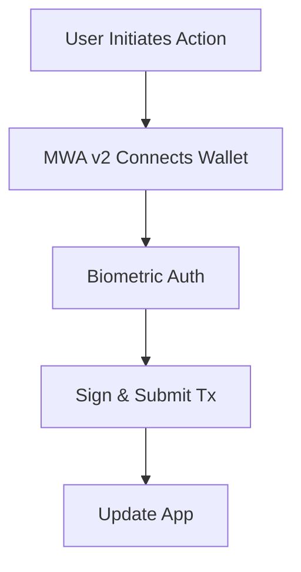
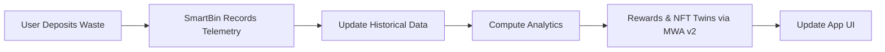
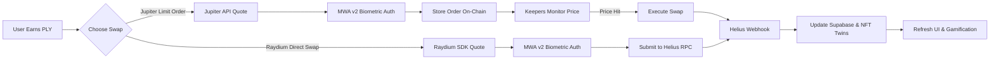
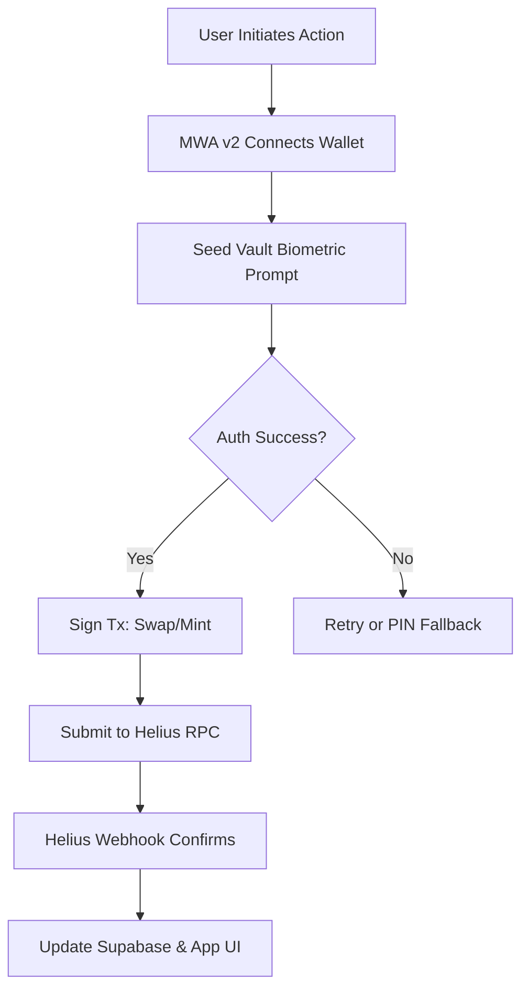

<!-- HERO SECTION -->

<div align="center" style="background: url('https://via.placeholder.com/1200x300?text=Polymers+Hero+Banner') no-repeat center/cover; border-radius: 15px; padding: 60px 20px; color: white; text-shadow: 2px 2px 8px rgba(0,0,0,0.7);">

<h1 style="font-size: 3em; margin-bottom: 10px;">Polymers Mobile App</h1>
<p style="font-size: 1.5em; margin-bottom: 20px;">E-Waste & Recycling dApp Powered by Solana Mobile Stack</p>

<a href="https://your-live-demo-link.com" style="background: #ff6f61; color: white; padding: 12px 24px; border-radius: 8px; text-decoration: none; font-weight: bold;">🚀 Live Demo</a>

<div style="margin-top: 20px;">


</div>
</div>

**Replace the hero banner URL (`https://via.placeholder.com/1200x300?text=Polymers+Hero+Banner`) with your actual banner image.**

⸻

🎨 **App Screenshots (Responsive)**

<div style="display: flex; flex-wrap: wrap; justify-content: center; gap: 25px; margin-top: 30px;">

<div style="flex: 1 1 260px; text-align: center; position: relative;">

<div style="position: absolute; top: 0; left: 0; right: 0; bottom: 0; background: rgba(0,0,0,0.5); opacity: 0; border-radius: 15px; display: flex; align-items: center; justify-content: center; color: white; font-weight: bold; transition: opacity 0.3s ease;" onmouseover="this.style.opacity='1';" onmouseout="this.style.opacity='0';">View Dashboard</div>
<p><b>🏠 Home Dashboard</b></p>
</div>

<div style="flex: 1 1 260px; text-align: center; position: relative;">

<div style="position: absolute; top: 0; left: 0; right: 0; bottom: 0; background: rgba(0,0,0,0.5); opacity: 0; border-radius: 15px; display: flex; align-items: center; justify-content: center; color: white; font-weight: bold; transition: opacity 0.3s ease;" onmouseover="this.style.opacity='1';" onmouseout="this.style.opacity='0';">Explore AR Map</div>
<p><b>🗺️ AR Map Preview</b></p>
</div>

<div style="flex: 1 1 260px; text-align: center; position: relative;">

<div style="position: absolute; top: 0; left: 0; right: 0; bottom: 0; background: rgba(0,0,0,0.5); opacity: 0; border-radius: 15px; display: flex; align-items: center; justify-content: center; color: white; font-weight: bold; transition: opacity 0.3s ease;" onmouseover="this.style.opacity='1';" onmouseout="this.style.opacity='0';">Check NFT Twins</div>
<p><b>🎨 NFT Twins & Rewards</b></p>
</div>

</div>

**Replace screenshot URLs (`https://via.placeholder.com/260x500?text=...`) with your actual app screenshot images.**

**Highlights:**
- ✅ Real-time pickup tracking & rewards via Solana Pay
- 🌍 AR map for SmartBins (>70% full) with Helius telemetry
- 🎟️ cNFT Twins for ESG compliance and recycling history
- 🔄 Biometric-secured hybrid swaps via Jupiter & Raydium
- 🔐 Solana Mobile Stack with Seed Vault & MWA v2
- 🔒 Transparent liquidity with Raydium Burn & Earn

⸻

🖼️ **Responsive Visual Grid Diagram**

<div style="display: flex; flex-wrap: wrap; justify-content: center; gap: 20px; margin-top: 30px;">

<div style="flex: 1 1 280px; text-align: center;">

<p><b>🗺️ AR Map Flow</b></p>
</div>

<div style="flex: 1 1 280px; text-align: center;">

<p><b>🎟️ NFT Twins Flow</b></p>
</div>

<div style="flex: 1 1 280px; text-align: center;">

<p><b>🔄 Hybrid Swap Flow</b></p>
</div>

<div style="flex: 1 1 280px; text-align: center;">

<p><b>🔒 Burn & Earn Flow</b></p>
</div>

<div style="flex: 1 1 280px; text-align: center;">

<p><b>🔐 SMS Flow</b></p>
</div>

</div>

**Grid Explanation**:
- **AR Map Flow**: Locates SmartBins using Helius telemetry.
- **NFT Twins Flow**: Mints cNFTs for ESG tracking post-deposit.
- **Hybrid Swap Flow**: Jupiter/Raydium swaps for reward redemption.
- **Burn & Earn Flow**: Locks PLY/USDC liquidity; reinvests fees.
- **SMS Flow**: Secures actions with MWA v2 biometric auth.

⸻

📱 **Key Features**

<details>
<summary>Click to expand Key Features</summary>

**🛒 Schedule Pickups**  
- Book e-waste/recycling pickups  
- Assign SmartBins  
- Track status in real-time  

**📊 SmartBin Telemetry**  
- Sensors for fill level, weight, contamination  
- Historical analytics  
- Automated Solana rewards  
- OTA updates via Expo  

**💰 Solana Rewards & NFT Twins**  
- Tokens: PLY, CARB, EWASTE  
- cNFT Twins for ESG compliance  
- Biometric swaps via Solana Pay, Jupiter, Raydium  
- Gamified missions & leaderboards  

**🔮 Predictive Analytics & ESG**  
- Predict fill levels & collection times  
- ESG metrics (e.g., carbon footprint)  
- AI/LLM query support  

**🔒 Burn & Earn Liquidity**  
- Lock PLY/USDC pools for trust  
- Burn ownership for transparency  
- Reinvest fees in rewards  

**🔐 Solana Mobile Stack**  
- Seed Vault for secure key storage  
- MWA v2 for biometric transaction signing  
- Solana Pay for QR-based payments  

</details>

⸻

📋 **Mobile App Prompts**

<details>
<summary>Click to expand Prompts & Actions</summary>

| Category       | Prompt Example                              | Action / Flow                                                                 |
|----------------|---------------------------------------------|------------------------------------------------------------------------------|
| Pickups        | “Schedule pickup for tomorrow”             | Books pickup → assigns SmartBin → triggers rewards                           |
| SmartBins      | “Show bins >70% full”                      | AR map → Helius telemetry → dashboard update                                 |
| SmartBins      | “Add IoT reading”                          | Updates telemetry → analytics → rewards                                      |
| Rewards        | “Check PLY balance”                        | Queries Solana → updates wallet & NFT Twins                                  |
| Rewards        | “Swap 50 PLY to USDC”                      | MWA v2 biometric swap (Jupiter/Raydium) → updates balances                   |
| ESG            | “Show carbon footprint”                    | Computes from telemetry & NFT Twins → displays                               |
| Predictions    | “Predict Bin #12 collection”               | ML on telemetry → shows ETA                                                 |
| Gamification   | “Show leaderboard”                         | Retrieves missions/scores → updates display                                  |

</details>

⸻

🔧 **Architecture & IoT Flow**

<details>
<summary>Click to expand Architecture Diagram</summary>



- **Telemetry**: Synced to backend  
- **Analytics**: Real-time metrics  
- **Rewards**: Biometric-secured via Solana Pay  
- **NFT Twins**: ESG compliance tracking  

</details>

⸻

🔄 **Hybrid Swap Flow (Jupiter + Raydium with MWA v2)**

<details>
<summary>Click to expand Hybrid Swap Flow Diagram</summary>



**Flow Explanation**:
- **Jupiter**: Biometric-secured limit orders (e.g., 1 PLY = $0.50 USDC) via MWA v2.
- **Raydium**: Immediate swaps with Seed Vault signing.
- **Unified UX**: Helius webhooks update Supabase, mint NFT Twins, and refresh AR map/leaderboards.

</details>

⸻

🔐 **Solana Mobile Stack Integration**

<details>
<summary>Click to expand SMS Integration Diagram</summary>



**Integration Explanation**:
- **Seed Vault**: Secures keys in hardware enclave; biometric auth for swaps/NFT mints.
- **MWA v2**: Connects to wallets (e.g., Phantom, Seed Vault) with `solana:` deep-links.
- **Solana Pay**: QR-based payments integrated with hybrid swaps.
- **Benefits**: Fast, secure UX for Polymers’ reward redemptions and ESG tracking.

</details>

⸻

🔑 **Environment Variables**

<details>
<summary>Click to expand Environment Variables</summary>

| Variable                     | Description                          | Example                              |
|------------------------------|--------------------------------------|--------------------------------------|
| NEXT_PUBLIC_SOLANA_RPC_URL   | Helius RPC endpoint                  | https://rpc.helius.dev?api-key=...   |
| NEXT_PUBLIC_SUPABASE_URL     | Supabase URL                         | https://xyzcompany.supabase.co       |
| NEXT_PUBLIC_SUPABASE_ANON_KEY| Supabase anon key                    | public-anon-key                      |
| PLY_MINT                     | PLY token mint                       | PLY_TOKEN_MINT_ADDRESS               |
| CARB_MINT                    | CARB token mint                      | CARB_TOKEN_MINT_ADDRESS              |
| EWASTE_MINT                  | EWASTE token mint                    | EWASTE_TOKEN_MINT_ADDRESS            |
| USDC_MINT                    | USDC token mint                      | EPjFWdd5AufqSSqeM2qN1xzybapC8G4wEGGkZwyTDt1v |
| REWARD_WALLET_ADDRESS        | Reward wallet key                    | REWARD_WALLET_PUBLIC_KEY             |
| PRIVY_APP_ID                 | Privy auth ID                        | privy-app-id                         |
| CHAINLINK_API_KEY            | Chainlink oracle key                 | chainlink-key                        |
| BUBBLEGUM_TREE_ID            | Bubblegum Merkle Tree ID             | TREE_PUBLIC_KEY                      |
| CANDY_MACHINE_ID             | Candy Machine ID                     | CANDY_MACHINE_PUBLIC_KEY             |
| HELIUS_API_KEY               | Helius Webhook key                   | helius-api-key                       |
| NEXT_PUBLIC_ENV              | Environment (dev/test/prod)          | production                           |

</details>

⸻

🚀 **Getting Started**

<details>
<summary>Click to expand Setup & Installation</summary>

**Prerequisites**  
- Node.js ≥16, npm ≥8  
- Expo CLI: `npm install -g expo-cli`  
- Solana CLI  
- Supabase (backend)  
- Privy.io (auth)  
- TensorFlow.js (analytics)  
- SDKs: `@solana/pay`, `@solana/web3.js`, `@solana/spl-token`, `@jup-ag/api`, `@raydium-io/raydium-sdk`, `@solana-mobile/mobile-wallet-adapter-protocol-web3js@^2.2.3`, `@solana/wallet-adapter-react@^0.15.35`, `react-native-get-random-values`, `buffer`, `expo-crypto`, `react-native-qrcode-svg`

**Installation**

```bash
git clone https://github.com/PolymersNetwork/polymers-recycling-app.git
cd polymers-recycling-app
npm ci
cp .env.example .env
# Configure environment variables
npx expo start
```

**Build & Deploy**

```bash
# iOS
npx eas build --platform ios
# Android (SMS-optimized)
npx expo run:android
# OTA Updates
npx eas update
```

</details>

⸻

🌍 **Why Polymers?**
- ♻️ Simplifies recycling for all  
- 🎨 Gamifies eco-actions with tokens & NFTs  
- 📊 Real-time ESG analytics via Helius  
- 🔐 Biometric-secured swaps with Solana Mobile Stack  
- 🔄 Flexible Jupiter/Raydium swaps  
- 🔒 Transparent liquidity via Burn & Earn  

⸻

🛡 **License**

MIT License
