# Polymers Recycling Dashboard & Website

**Version 1.0 Beta**

A blockchain-powered, AI-driven platform for polymer and e-waste recycling, enabling supply chain transparency, ESG tracking, and gamified incentives. Built with **Solana**, **AI/ML**, **IoT SmartBins**, **AR**, and **TensorFlow.js**, it offers:

- **SmartBins**: Real-time material detection and IoT integration
- **NFT Twins**: Blockchain-based batch tracking
- **Predictive Analytics**: Contamination and supply chain insights
- **Solana Pay**: Instant rewards and token swaps
- **AI/LLM Assistants**: Operational and ESG guidance

🔗 **Live Web App Demo**: [demo.polymersnetwork.org](https://poiymers-website.vercel.app)

---

## ✨ Key Features

### 1. Solana Pay Integration
- Token swaps: PLY, CARB, USDC, EWASTE
- QR code support for dashboard transactions
- SmartBin rewards via Solana Pay
- Transaction logging in Supabase

### 2. IoT SmartBins
- Sensors for fill level, weight, temperature, and contamination
- Material detection for plastics and e-waste
- Automated rewards for recycling deposits
- NFC/QR scan triggers for rewards

### 3. Predictive Analytics
- LSTM models for material demand and contamination forecasting
- ESG impact predictions
- SmartBin maintenance scheduling
- Real-time dashboards with <50ms inference latency

### 4. NFT Twins & Gamification
- Metaplex NFT-based batch tracking
- Reward missions and leaderboards
- Carbon offset and ESG compliance tracking

### 5. AI & LLM Agent
- Multilingual chat assistant for users, manufacturers, and auditors
- Handles swap, transfer, balance, forecast, and NFT minting queries
- Autonomous recommendations for routes, ESG, and inventory

### 6. Maps & Wayfinding
- AR overlays for SmartBin locations
- Route optimization for pickups
- Notifications for full or contaminated bins
- Heatmaps for polymer and e-waste flows

### 7. ESG Tracking
- Carbon footprint monitoring
- Gamified recycling incentives
- Audit-ready dashboards and reports

### 8. Helper Module
1. `computeIoTAnalytics(history)`
   - Computes average fill level, average contamination score, min/max fill levels, contamination trend
   - Predicts the next collection time based on the fill level trend
2. `addIoTReading(recycledItem, newReading)`
   - Adds the new sensor reading to latest and history
   - Automatically updates `iotAnalytics` for immediate dashboard consumption
3. Ready for ML & AI pipelines
   - The history array and `iotAnalytics` can now be used directly for trend analysis or predictive modeling

---

## 📋 Core Modules

| Module            | Features                                                                 |
|-------------------|--------------------------------------------------------------------------|
| **Wallet & Solana Pay** | Token swaps, balance checks, QR code generation, Supabase transaction logs |
| **SmartBins / IoT**    | Telemetry, contamination scoring, reward issuance                       |
| **LLM Agent**          | Chat prompts, predictive queries, automated transactions                |
| **NFT Twins**          | NFT minting for batches, purity/weight/ESG tracking                     |
| **Analytics / AI**     | LSTM predictions, ESG forecasts, contamination alerts                   |
| **Maps & AR**          | Bin visualization, route planning, polymer/e-waste flow heatmaps        |
| **Gamification**       | Missions, leaderboards, PLY/EWASTE rewards                             |

---

## 📂 Project Structure

/app                   # Frontend dashboard & website
/api                   # Backend APIs
├─ wallet/swap.ts        # Solana Pay token swaps
├─ iot/smartbins.ts      # SmartBin telemetry & rewards
├─ llm/index.ts          # LLM agent API
├─ inventory/predict.ts  # LSTM-based demand forecasts
├─ esg/forecast.ts       # ESG impact predictions
/components            # React components
├─ dashboards/       # Role-specific dashboards
│   ├─ analytics_dashboard.tsx
│   ├─ rewards_dashboard.tsx
│   ├─ leaderboard.tsx
├─ ar_map.tsx        # AR navigation
├─ chat.tsx          # AI assistant
/lib                   # AI & utilities
├─ lstm_model.ts
├─ data_preprocessor.ts
├─ helium.ts         # IoT connectivity
├─ websockets.ts     # Real-time telemetry
├─ error_handler.ts  # Blockchain/IoT error handling
/programs/src          # Solana programs
├─ nft_mint.ts
├─ reward_token.ts
├─ staking.ts
├─ e_waste.ts
/scripts               # Simulation scripts
├─ simulate_iot.ts
/tests                 # Unit & integration tests
├─ wallet/swap.test.ts
├─ iot/smartbins.test.ts
/docs                  # API & contributing docs

---

## 📂 End-to-End Architecture

This diagram visualizes the **Polymers Protocol full-stack flow**, showing **frontend interactions, backend processing, IoT telemetry, AI/LLM, token flows, NFT Twins, dashboards, Solana Pay, Maps/AR, ESG tracking, and CI/CD pipelines**.

```mermaid
%% Full-Stack Architecture: Polymers Recycling Dashboard
%% Colors: dark green (#064635), sand (#D4B483), light gray (#E5E5E5), white (#FFFFFF)

flowchart TB
    style Frontend fill:#D4B483,stroke:#064635,stroke-width:2px
    style Backend fill:#E5E5E5,stroke:#064635,stroke-width:2px
    style Blockchain fill:#FFFFFF,stroke:#064635,stroke-width:2px
    style IoT fill:#064635,stroke:#D4B483,stroke-width:2px
    style Oracles fill:#E5E5E5,stroke:#064635,stroke-width:2px

    subgraph Frontend["Frontend (Dashboard & Website)"]
        Dashboards["Role-based Dashboards<br>(analytics, rewards, leaderboards)"]
        ARMap["Maps & AR Navigation"]
        LLM["AI / LLM Assistant<br>Swap, Forecast, NFT queries"]
        NFTUI["NFT Twins UI"]
    end

    subgraph IoT["SmartBins / Helium DePIN"]
        SmartBin["IoT SmartBins<br>Fill, Weight, Temperature, Contamination"]
        Helium["Helium DePIN LoRaWAN<br>Real-time Telemetry"]
    end

    subgraph Backend["Backend & Services"]
        Supabase["Supabase Realtime DB<br>iot_readings, token_flows, esg_metrics"]
        IoTProcessor["IoT Processing<br>computeIoTAnalytics, batch telemetry"]
        RewardEngine["Token Flow Engine<br>calculateReward"]
        AIAnalytics["Predictive Analytics<br>LSTM Models & ESG Forecasts"]
        NFTMint["NFT Minting Service<br>Metaplex NFTs for Batches"]
    end

    subgraph Oracles["Oracle Integration Layer"]
        Pyth["Pyth: CO₂e Metrics"]
        Chainlink["Chainlink: Token Prices"]
        InternalDB["Internal Emission DB"]
    end

    subgraph Blockchain["Solana Blockchain"]
        SolanaPrograms["NFT, Rewards, Staking Programs"]
        SolanaPay["Solana Pay Token Swaps<br>PLY, CARB, USDC, EWASTE"]
    end

    %% Frontend → Backend
    Dashboards -->|Queries & Updates| Supabase
    ARMap -->|Real-time Telemetry| Supabase
    LLM -->|API Requests| Backend
    NFTUI -->|NFT Info| NFTMint

    %% IoT → Backend
    SmartBin --> Helium
    Helium -->|Telemetry| IoTProcessor
    IoTProcessor --> Supabase
    IoTProcessor --> RewardEngine

    %% Backend → Oracles
    RewardEngine -->|Fetch ESG & Price Data| Pyth
    RewardEngine --> Chainlink
    RewardEngine --> InternalDB
    AIAnalytics -->|Predictive Models| Supabase

    %% Backend → Blockchain
    RewardEngine --> SolanaPrograms
    NFTMint --> SolanaPrograms
    SolanaPay --> SolanaPrograms

    %% Notes
    classDef darkgreen fill:#064635,stroke:#D4B483,stroke-width:2px,color:white;
    classDef sand fill:#D4B483,stroke:#064635,stroke-width:2px,color:#064635;
    classDef lightgray fill:#E5E5E5,stroke:#064635,stroke-width:2px,color:#064635;
    class Frontend,Balances sand;
    class Backend,RewardEngine,AIAnalytics lightgray;
    class Blockchain SolanaPrograms,SolanaPay;
    class IoT,Helium darkgreen;
    class Oracles,Pyth,Chainlink,InternalDB lightgray;
```

🖼 Rendering Instructions
	1.	Install Mermaid CLI:

npm install -g @mermaid-js/mermaid-cli

	2.	Export Diagram to SVG:

npx @mermaid-js/mermaid-cli -i docs/frontend_backend_architecture.md -o docs/frontend_backend_architecture.svg

	3.	Convert SVG to PNG (optional):

convert docs/frontend_backend_architecture.svg docs/frontend_backend_architecture.png

	4.	Embed in README or docs:

⸻

🚀 Getting Started

Prerequisites
	•	Node.js: ≥16
	•	npm: ≥8
	•	Solana CLI: Installed
	•	Supabase: Project for transaction logging
	•	Privy.io: For user authentication
	•	TensorFlow.js: For LSTM inference
	•	Solana Pay SDK: @solana/pay, @solana/web3.js, @solana/spl-token
	•	Git: For version control

Installation

git clone https://github.com/PolymersNetwork/polymers-recycling-platform.git
cd polymers-recycling-platform
npm ci
cp .env.example .env
# Configure environment variables in .env
npm run dev

Environment Variables

NEXT_PUBLIC_SOLANA_RPC_URL=https://api.mainnet-beta.solana.com
NEXT_PUBLIC_SUPABASE_URL=YOUR_SUPABASE_URL
NEXT_PUBLIC_SUPABASE_ANON_KEY=YOUR_SUPABASE_KEY
PLY_MINT=PLY_TOKEN_MINT
CARB_MINT=CARB_TOKEN_MINT
USDC_MINT=USDC_TOKEN_MINT
EWASTE_MINT=EWASTE_TOKEN_MINT
REWARD_WALLET_ADDRESS=REWARD_WALLET
REWARD_WALLET_TOKEN_ACCOUNT=REWARD_WALLET_TOKEN
PRIVY_APP_ID=YOUR_PRIVY_APP_ID
CHAINLINK_API_KEY=YOUR_CHAINLINK_KEY

⸻

🔧 Running the Platform

Development

npm run dev        # Start frontend with hot reload
npm run api:start  # Start API server

Testing

npm run test       # Run unit & integration tests

Deployment
	•	Build: npm run build
	•	Start: npm run start
	•	Deploy to Vercel or a custom Node.js server

⸻

💬 Dashboard & LLM Prompts

Category	Prompt Example	Action
SmartBins	“Show bins >70% full”	Lists bins with high fill levels
	“Forecast PET recovery next 30 days”	Provides LSTM prediction in kg
	“Highlight bins with high contamination”	Flags bins above contamination threshold
Wallet/Swap	“Check my balances”	Shows PLY, CARB, USDC, EWASTE balances
	“Swap 100 PLY to USDC”	Executes Solana Pay swap with QR code
	“Transfer 50 CARB to Wallet ABC123”	Initiates on-chain transaction
NFT Twins	“Mint NFT for Batch #128”	Calls Metaplex mint program
ESG & Analytics	“Generate ESG report for Company X”	Returns carbon offsets & ESG score
AR/Wayfinding	“Guide me to nearest SmartBin”	Displays AR map directions

⸻

🌍 ESG & Waste Impact
	•	Track carbon footprints via NFT Twins
	•	Reward eco-friendly behavior with gamified missions
	•	Generate audit-ready ESG dashboards
	•	Enable traceable recycling with IoT SmartBins

⸻

🛠 Contributing

See CONTRIBUTING.md for details. Focus areas:
	•	Solana Pay and token swaps
	•	SmartBin IoT telemetry
	•	AI/LLM prompts and predictive analytics
	•	NFT Twin minting and gamification

Follow TypeScript standards, modular code practices, and include unit tests.

⸻

📜 License

MIT License
