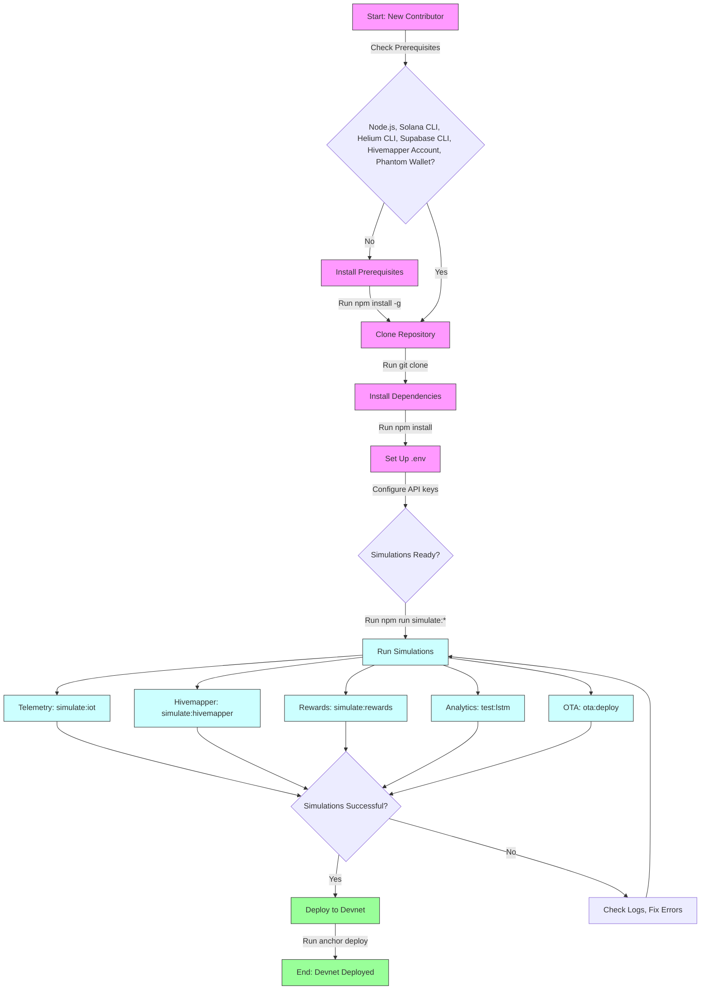

# Polymers Protocol

The **Polymers Protocol** is a decentralized platform built on **Solana** that powers **SmartBin**, a next-generation waste management system. It integrates **Helium’s Decentralized Physical Infrastructure Network (DePIN)** for long-range IoT connectivity and **Hivemapper’s Map Data APIs** for real-time geospatial validation. The protocol incentivizes sustainable waste tracking through token rewards (HNT, IOT, PLY, CARB, EWASTE, HONEY) and provides ESG (Environmental, Social, Governance) analytics for municipalities and enterprises.

This repository contains the code, scripts, and documentation to develop, test, and deploy the Polymers Protocol. For a detailed introduction, see [/docs/introduction.md](./docs/introduction.md). For advanced setup and integration, see [/docs/helium-integration.md](./docs/helium-integration.md).

## Overview

Polymers Protocol enables **SmartBins**—IoT-enabled waste bins that monitor fill levels, contamination, weight, and temperature. Key components include:

- **Helium DePIN**: Long-range LoRaWAN connectivity (up to 10km) with 1.2M+ hotspots globally (September 2025).
- **Hivemapper APIs**: Real-time map validation and features (e.g., speed limits, traffic lights).
- **Solana Blockchain**: High-throughput transactions (~65,000 TPS with Firedancer) for telemetry, rewards, and NFT Twins (~0.002 SOL per mint).
- **Supabase**: Real-time telemetry storage and analytics.
- **Predictive Analytics**: LSTM models for fill level forecasting and route optimization.
- **Rewards**: Token distribution (HNT, IOT, PLY, CARB, EWASTE, HONEY) via Solana Pay based on ESG scores.

## Features

- **SmartBins**: Monitor fill levels, contamination, weight, and temperature using IoT sensors.
- **Telemetry**: Low-cost, high-frequency data logging via Helium LoRaWAN (~$0.00001 per 24KB).
- **Validation & Mapping**: Hivemapper APIs ensure accurate bin locations and enrich analytics with map features.
- **Predictive Analytics**: Forecast fill schedules and optimize collection routes using LSTM models.
- **Rewards**: Distribute tokens and mint NFT Twins based on ESG scoring and Hivemapper contributions.
- **OTA Updates**: Secure firmware updates with staged deployment and rollback support.

## Quickstart

### Prerequisites
- **Node.js**: v18+.
- **Solana CLI**: v1.18+ (`npm install -g @solana/cli`).
- **Helium CLI**: v2.0+ (`npm install -g @helium/cli`).
- **Supabase CLI**: For telemetry database.
- **Hivemapper Account**: API keys from [hivemapper.com/map-data-console](https://hivemapper.com/map-data-console).
- **Phantom Wallet**: For Solana transactions.

### Installation & Environment
1. **Clone Repository**:
   ```bash
   git clone https://github.com/polymers-protocol/polymers
   cd polymers
   npm install
   ```

2. **Set Up Environment**:
   Create `.env` with:
   ```env
   NEXTitsu

NEXT_PUBLIC_SOLANA_RPC_URL=https://api.devnet.solana.com
HELIUM_HOTSPOT_ADDRESS=<your_hotspot_address>
PLY_MINT=<ply_mint_address>
CARB_MINT=<carb_mint_address>
EWASTE_MINT=<ewaste_mint_address>
HONEY_MINT=<honey_mint_address>
REWARD_WALLET_ADDRESS=<reward_wallet_address>
NEXT_PUBLIC_SUPABASE_URL=<supabase_url>
NEXT_PUBLIC_SUPABASE_ANON_KEY=<supabase_anon_key>
HIVEMAPPER_API_KEY=<your_api_key>
HIVEMAPPER_USERNAME=<your_username>
   ```

### Local Simulation
Test SmartBin workflows without hardware:
```bash
npm run simulate:iot
npm run simulate:hivemapper
npm run simulate:rewards
npm run test:lstm
npm run ota:deploy --bin test_bin --file ./firmware/latest.bin
```

### Deploy to Devnet
```bash
anchor deploy --provider.cluster devnet
```

### Developer Notes
- **Prerequisites**: Install all dependencies before cloning to avoid simulation failures:
  ```bash
  npm install -g @solana/cli @helium/cli supabase
  ```
- **Environment**: Verify API keys and wallet addresses in `.env`. Incorrect values can break telemetry or rewards. Store `.env` in a secrets manager (e.g., Doppler) for security.
- **Simulations**: Run simulations before Devnet deployment to validate telemetry, Hivemapper validation, rewards, analytics, and OTA workflows. Use `/scripts/sample_data/sample_telemetry.json` for reproducible tests.
- **OTA Updates**: Test OTA deployments on a simulated bin first:
  ```bash
  npm run ota:deploy --bin test_bin --file ./firmware/latest.bin
  ```
  Use staged deployments to prevent downtime on live bins. See [/docs/helium-integration.md#ota-firmware-management](./docs/helium-integration.md#ota-firmware-management).
- **Rewards**: Verify token mint addresses and Solana Pay configurations in `/api/wallet/swap.ts`. Test reward thresholds (e.g., ESG score > 0.5, Hivemapper coverage > 0.8) using `/scripts/simulate_rewards.ts`. See [/docs/helium-integration.md#rewards-integration](./docs/helium-integration.md#rewards-integration).
- **Troubleshooting**: If simulations fail, check Supabase logs or console output. Refer to [/docs/helium-integration.md#troubleshooting-and-best-practices](./docs/helium-integration.md#troubleshooting-and-best-practices) for fixes.

### Quickstart Flowchart


## Key Files

| File | Purpose |
|------|---------|
| `/lib/helium.ts`, `/lib/hivemapper.ts` | API configuration for Helium and Hivemapper |
| `/api/iot/smartbins.ts` | Telemetry handling with Hivemapper validation ([Telemetry Transmission](./docs/helium-integration.md#telemetry-transmission)) |
| `/api/wallet/swap.ts` | Reward logic ([Rewards Integration](./docs/helium-integration.md#rewards-integration)) |
| `/programs/src/nft_mint.ts` | NFT Twin minting |
| `/lib/lstm_model.ts` | Predictive analytics ([Predictive Analytics](./docs/helium-integration.md#predictive-analytics)) |
| `/scripts/ota_utils.ts` | OTA update management ([OTA Firmware Management](./docs/helium-integration.md#ota-firmware-management)) |
| `/scripts/sample_data/sample_telemetry.json` | Sample telemetry dataset |
| `/scripts/simulate_*.ts` | Simulation scripts for local testing |

## Documentation
- **Introduction & Quickstart**: [/docs/introduction.md](./docs/introduction.md)
- **Helium Integration & Advanced Guides**: [/docs/helium-integration.md](./docs/helium-integration.md)

## Contributing
Submit issues or pull requests on [GitHub](https://github.com/PolymersNetwork/polymers-protocol).

**Community**:
- X: Search “Polymers Protocol” or “Helium IoT” for discussions.
- Hivemapper Discord: [discord.com/invite/FRWMKyy5v2](https://discord.com/invite/FRWMKyy5v2)

## Resources
- **Polymers Protocol**: [github.com/polymers-protocol/polymers](https://github.com/polymers-protocol/polymers)
- **Helium Docs**: [docs.helium.com/solana](https://docs.helium.com/solana)
- **Hivemapper Docs**: [docs.hivemapper.com](https://docs.hivemapper.com)
- **Solana Cookbook**: [solanacookbook.com](https://solanacookbook.com)
- **Supabase Docs**: [supabase.com/docs](https://supabase.com/docs)
