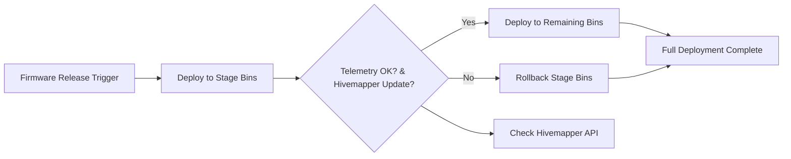

# Helium DePIN Integration with Polymers Protocol

This guide provides a comprehensive walkthrough for integrating **Helium's Decentralized Physical Infrastructure Network (DePIN)** with the **Polymers Protocol** on Solana to enable scalable, low-cost, and incentivized SmartBin functionality. SmartBins leverage Helium’s LoRaWAN for long-range IoT connectivity, Solana’s blockchain for high-throughput transactions, and Supabase for telemetry storage and analytics.

## Table of Contents
1. [Introduction](#introduction)
2. [Prerequisites](#prerequisites)
3. [Wallet and Environment Setup](#wallet-and-environment-setup)
4. [Helium Program Library (HPL) Installation](#helium-program-library-installation)
5. [SmartBin Hardware Setup](#smartbin-hardware-setup)
6. [Telemetry Transmission](#telemetry-transmission)
7. [Rewards Integration](#rewards-integration)
8. [Predictive Analytics](#predictive-analytics)
9. [OTA Firmware Management](#ota-firmware-management)
10. [Devnet Testing](#devnet-testing)
11. [Troubleshooting and Best Practices](#troubleshooting-and-best-practices)
12. [Resources](#resources)

---

## Introduction

The integration combines **Helium’s DePIN** with **Polymers Protocol** to create a decentralized SmartBin network that tracks waste, rewards users, and provides ESG analytics. Key features include:

- **Scalability**: Solana’s 65,000+ TPS (with Firedancer) supports millions of SmartBin transactions.
- **Low Costs**: ~$0.000005 per transaction for micropayments (Data Credits, HNT/IOT, PLY/CARB/EWASTE).
- **Long-Range IoT**: Helium’s LoRaWAN enables energy-efficient connectivity up to 10km.
- **Composability**: Integrates with Solana Pay, Metaplex (NFT Twins), and Pyth oracles for ESG analytics.
- **Rewards Synergy**: Combines HNT/IOT with PLY/CARB/EWASTE tokens for gamified incentives.

### SmartBin Flow
```mermaid
graph TD
    A[SmartBin Sensors] --> B[Helium LoRaWAN]
    B --> C[Telemetry API / Supabase]
    C --> D[Solana Blockchain]
    D --> E[Reward Calculation (HNT, PLY)]
    E --> F[Wallet Updates & NFT Twins]
    F --> G[Dashboard & Mobile App]
    C --> G[Analytics & LSTM Predictions]
```

**Key Files**:
- `/lib/helium.ts`: Configures LoRaWAN routing.
- `/api/iot/smartbins.ts`: Handles telemetry ingestion.
- `/api/wallet/swap.ts`: Manages reward distribution.
- `/programs/src/nft_mint.ts`: Mints SmartBin NFT Twins.
- `/lib/lstm_model.ts`: Runs predictive analytics.
- `/scripts/ota_utils.ts`: Manages OTA firmware updates.

---

## Prerequisites

Before starting, ensure you have the following:

### Software
- **Node.js**: v18 or higher.
- **Solana CLI**: v1.18+ (`npm install -g @solana/cli`).
- **Helium CLI**: v2.0+ (`npm install -g @helium/cli`).
- **Anchor CLI**: v0.30+ for Solana program deployment.
- **Phantom Wallet**: v25.9.x or later for wallet management.
- **Supabase CLI**: For telemetry database setup.
- **TypeScript**: For script and API development.

### Hardware
- **LoRaWAN Devices**: RAK Wireless or Dragino modules.
- **Firmware**: LoRaWAN 1.0.3 compliant with OTA update support.

### Accounts
- **Supabase**: For telemetry storage and analytics.
- **Helium**: For hotspot onboarding and rewards.
- **Solana Devnet**: For testing transactions and programs.

---

## Wallet and Environment Setup

### Step 1: Wallet Setup
1. **Create Solana Wallet**:
   - Install Phantom Wallet and create a new wallet.
   - Back up your seed phrase securely.
2. **Export Helium Wallet**:
   ```bash
   helium wallet export --key-type solana > solana_wallet.json
   ```
   > **Note**: If export fails, update `@helium/sdk` (`npm install @helium/sdk@latest`).
3. **Import into Phantom**:
   - Import `solana_wallet.json` into Phantom and verify HNT/IOT balances.
4. **Create Associated Token Accounts (ATAs)**:
   ```typescript
   import { Connection, Keypair } from '@solana/web3.js';
   import { getOrCreateAssociatedTokenAccount } from '@solana/spl-token';

   const connection = new Connection(process.env.NEXT_PUBLIC_SOLANA_RPC_URL);
   const payer = Keypair.fromSecretKey(Uint8Array.from([...]));
   const mints = [
     process.env.PLY_MINT,
     process.env.CARB_MINT,
     process.env.EWASTE_MINT,
   ];

   for (const mint of mints) {
     const ata = await getOrCreateAssociatedTokenAccount(
       connection,
       payer,
       new PublicKey(mint),
       payer.publicKey
     );
     console.log(`ATA for ${mint}: ${ata.address}`);
   }
   ```

### Step 2: Environment Configuration
Create a `.env` file with the following:
```env
NEXT_PUBLIC_SOLANA_RPC_URL=https://api.devnet.solana.com
HELIUM_HOTSPOT_ADDRESS=<your_hotspot_address>
PLY_MINT=<ply_mint_address>
CARB_MINT=<carb_mint_address>
EWASTE_MINT=<ewaste_mint_address>
REWARD_WALLET_ADDRESS=<reward_wallet_address>
NEXT_PUBLIC_SUPABASE_URL=<supabase_url>
NEXT_PUBLIC_SUPABASE_ANON_KEY=<supabase_anon_key>
```

**Security**:
- Add `.env` to `.gitignore`:
  ```bash
  echo ".env" >> .gitignore
  ```
- Use a secrets manager (e.g., Doppler, AWS Secrets Manager) for production.

---

## Helium Program Library (HPL) Installation

The **Helium Program Library (HPL)** provides Solana programs for hotspot management and rewards.

### Steps
1. **Clone HPL**:
   ```bash
   git clone https://github.com/helium/helium-program-library
   cd helium-program-library
   ```
2. **Build and Test**:
   ```bash
   anchor build
   anchor test
   ```
3. **Deploy to Devnet**:
   ```bash
   anchor deploy --provider.cluster devnet
   ```

**Key Programs**:
- **Hotspot Manager**: Mints NFTs for SmartBins.
- **SubDAOs**: Distributes IOT/HNT rewards.
- **Lazy Distributor**: Triggers oracle-based rewards.

**Production Note**: Deploying to mainnet requires Helium governance approval ([docs.helium.com/solana](https://docs.helium.com/solana)).

---

## SmartBin Hardware Setup

SmartBins use LoRaWAN devices to connect to Helium’s network.

### Steps
1. **Select Hardware**:
   - Use RAK Wireless or Dragino LoRaWAN modules.
   - Ensure firmware supports LoRaWAN 1.0.3 and OTA updates.
2. **Onboard SmartBin**:
   - Use the Helium Hotspot App to register SmartBins.
   - Verify registration via [api.helium.com/v1/hotspots](https://api.helium.com/v1/hotspots).
3. **Mint SmartBin NFT**:
   - Cost: ~0.002 SOL per NFT.
   - Use Metaplex to mint NFTs in `/programs/src/nft_mint.ts`:
     ```typescript
     import { Metaplex } from '@metaplex-foundation/js';
     import { Connection, PublicKey } from '@solana/web3.js';

     const connection = new Connection(process.env.NEXT_PUBLIC_SOLANA_RPC_URL);
     const metaplex = Metaplex.make(connection);
     const nftMetadata = {
       name: `SmartBin_${binId}`,
       symbol: 'SBIN',
       uri: `https://metadata.polymers.io/bins/${binId}`,
       attributes: [{ trait_type: 'Coverage', value: '10km' }],
     };
     const { nft } = await metaplex.nfts().create({
       uri: JSON.stringify(nftMetadata),
       owner: new PublicKey(process.env.REWARD_WALLET_ADDRESS),
     });
     console.log(`Minted NFT: ${nft.address}`);
     ```
4. **Configure LoRaWAN Routing**:
   - Update `/lib/helium.ts`:
     ```typescript
     import { Helium, Wallet } from '@helium/sdk';
     import { Connection, PublicKey } from '@solana/web3.js';

     const connection = new Connection(process.env.NEXT_PUBLIC_SOLANA_RPC_URL);
     const wallet = new Wallet(new PublicKey(process.env.REWARD_WALLET_ADDRESS));
     const helium = new Helium(connection, wallet);

     export async function configureHotspot() {
       const isValid = await helium.hotspots.isValid(process.env.HELIUM_HOTSPOT_ADDRESS);
       if (!isValid) throw new Error('Invalid hotspot address');
       await helium.hotspots.configure({
         hotspot: new PublicKey(process.env.HELIUM_HOTSPOT_ADDRESS),
       });
     }
     ```

**Best Practices**:
- Test OTA updates in a sandbox to avoid bricking devices.
- Monitor NFT minting costs due to Solana network fluctuations.

---

## Telemetry Transmission

SmartBins transmit telemetry (fill level, contamination, weight, temperature) via Helium’s LoRaWAN to the Polymers API, stored in Supabase and logged on Solana.

### Implementation
File: `/api/iot/smartbins.ts`

```typescript
import { Helium, Wallet } from '@helium/sdk';
import { Connection, PublicKey } from '@solana/web3.js';
import { createClient } from '@supabase/supabase-js';

const connection = new Connection(process.env.NEXT_PUBLIC_SOLANA_RPC_URL);
const wallet = new Wallet(new PublicKey(process.env.REWARD_WALLET_ADDRESS));
const helium = new Helium(connection, wallet);
const supabase = createClient(
  process.env.NEXT_PUBLIC_SUPABASE_URL,
  process.env.NEXT_PUBLIC_SUPABASE_ANON_KEY
);

function validateTelemetry(telemetry: any) {
  if (
    !Number.isFinite(telemetry.fill) ||
    !Number.isFinite(telemetry.weight) ||
    !Number.isFinite(telemetry.temp) ||
    !Number.isFinite(telemetry.contamination)
  ) {
    throw new Error('Invalid telemetry data');
  }
}

export async function sendSmartBinTelemetry(binId: string, telemetry: any) {
  try {
    validateTelemetry(telemetry);
    const payloadSize = Buffer.from(JSON.stringify({ binId, ...telemetry })).length;
    if (payloadSize > 24000) throw new Error('Payload exceeds 24KB');
    const submitTx = await helium.hotspots.submitPayload({
      payload: Buffer.from(JSON.stringify({ binId, ...telemetry })),
      hotspot: new PublicKey(process.env.HELIUM_HOTSPOT_ADDRESS),
    });
    const sig = await connection.sendTransaction(submitTx, [wallet.payer], { maxRetries: 3 });
    const { error } = await supabase.from('telemetry').insert({ binId, ...telemetry, tx: sig });
    if (error) throw new Error(`Supabase insert failed: ${error.message}`);
    return sig;
  } catch (e) {
    console.error(`Telemetry error for ${binId}: ${e.message}`);
    throw e;
  }
}

// Example usage
sendSmartBinTelemetry('bin_123', { fill: 75, contamination: 0.1, weight: 10, temp: 22 });
```

### Batch Telemetry
Reduce RPC calls by batching submissions:
```typescript
export async function sendBatchTelemetry(bins: { binId: string; telemetry: any }[]) {
  try {
    const payloads = bins.map(({ binId, telemetry }) => ({
      binId,
      payload: Buffer.from(JSON.stringify({ binId, ...telemetry })),
    }));
    const batchTx = await helium.hotspots.submitBatchPayload(payloads);
    const sig = await connection.sendTransaction(batchTx, [wallet.payer], { maxRetries: 3 });
    const { error } = await supabase.from('telemetry').insert(
      bins.map(({ binId, telemetry }) => ({ binId, ...telemetry, tx: sig }))
    );
    if (error) throw new Error(`Supabase batch insert failed: ${error.message}`);
    return sig;
  } catch (e) {
    console.error(`Batch telemetry error: ${e.message}`);
    throw e;
  }
}
```

**Best Practices**:
- Monitor Data Credits (~$0.00001 per 24KB) to optimize costs.
- Implement rate-limiting on the API to prevent abuse:
  ```typescript
  import rateLimit from 'express-rate-limit';
  app.use(rateLimit({ windowMs: 15 * 60 * 1000, max: 100 }));
  ```
- Validate hotspot addresses before submission.

---

## Rewards Integration

Users earn HNT/IOT via Helium SubDAOs and PLY/CARB/EWASTE via Solana Pay, triggered by telemetry and ESG metrics.

### Implementation
File: `/api/wallet/swap.ts`

```typescript
import { Helium, Wallet } from '@helium/sdk';
import { Connection, PublicKey } from '@solana/web3.js';
import { solanaPay } from '@solana/pay';
import { PythClient } from '@pythnetwork/client';
import { createClient } from '@supabase/supabase-js';

const connection = new Connection(process.env.NEXT_PUBLIC_SOLANA_RPC_URL);
const wallet = new Wallet(new PublicKey(process.env.REWARD_WALLET_ADDRESS));
const helium = new Helium(connection, wallet);
const supabase = createClient(
  process.env.NEXT_PUBLIC_SUPABASE_URL,
  process.env.NEXT_PUBLIC_SUPABASE_ANON_KEY
);

async function getEsgScore(binId: string) {
  const pyth = new PythClient(connection);
  const esgPrice = await pyth.getPrice('ESG/USD');
  return esgPrice.price; // Example: Adjust based on actual oracle
}

export async function issueRewards(binId: string, userWallet: string) {
  try {
    const esgScore = await getEsgScore(binId);
    if (esgScore < 0.5) return; // Example threshold
    const cached = await supabase.from('rewards_cache').select().eq('binId', binId);
    if (cached.data?.length) return; // Skip if already rewarded
    const rewardTx = await helium.rewards.distribute({
      hotspot: new PublicKey(process.env.HELIUM_HOTSPOT_ADDRESS),
      amount: { iot: 0.01, hnt: 0.001 },
      recipient: new PublicKey(userWallet),
    });
    await connection.sendTransaction(rewardTx, [wallet.payer], { maxRetries: 3 });
    const plyTx = await solanaPay.transfer({
      mint: new PublicKey(process.env.PLY_MINT),
      amount: 10,
      recipient: new PublicKey(userWallet),
    });
    await connection.sendTransaction(plyTx, [wallet.payer], { maxRetries: 3 });
    await supabase.from('rewards_cache').insert({ binId, rewardedAt: new Date() });
  } catch (e) {
    console.error(`Reward error for ${binId}: ${e.message}`);
    throw e;
  }
}
```

### Batch Rewards
```typescript
export async function batchIssueRewards(rewards: { binId: string; userWallet: string }[]) {
  try {
    const batchTx = await helium.rewards.batchDistribute(
      rewards.map(({ binId, userWallet }) => ({
        recipient: new PublicKey(userWallet),
        amount: { iot: 0.01, hnt: 0.001 },
      }))
    );
    const sig = await connection.sendTransaction(batchTx, [wallet.payer], { maxRetries: 3 });
    await supabase.from('rewards_log').insert(
      rewards.map(({ binId }) => ({ binId, tx: sig }))
    );
    return sig;
  } catch (e) {
    console.error(`Batch reward error: ${e.message}`);
    throw e;
  }
}
```

**Best Practices**:
- Use Pyth oracles for accurate ESG triggers.
- Cache rewards to prevent duplicates.
- Log reward transactions for audit trails.

---

## Predictive Analytics

Telemetry data is analyzed using an LSTM model to predict fill levels, stored in Supabase and displayed on the dashboard.

### Implementation
File: `/lib/lstm_model.ts`

```typescript
import { createClient } from '@supabase/supabase-js';

const supabase = createClient(
  process.env.NEXT_PUBLIC_SUPABASE_URL,
  process.env.NEXT_PUBLIC_SUPABASE_ANON_KEY
);

function preprocessData(data: any[]) {
  // Normalize telemetry data (example)
  return data.map(d => ({
    fill: d.fill / 100,
    contamination: d.contamination,
    weight: d.weight / 50,
    temp: (d.temp - 10) / 30,
  }));
}

async function lstmPredict(preprocessed: any[]) {
  // Example: Call external ML service
  const response = await fetch('https://ml-service/predict', {
    method: 'POST',
    body: JSON.stringify(preprocessed),
  });
  return response.json();
}

export async function predictFillLevel(binId: string) {
  try {
    const { data, error } = await supabase
      .from('telemetry')
      .select('fill, contamination, weight, temp')
      .eq('binId', binId)
      .limit(100);
    if (error) throw new Error(`Supabase query failed: ${error.message}`);
    if (!data.length) throw new Error(`No telemetry data for ${binId}`);
    const preprocessed = preprocessData(data);
    const prediction = await lstmPredict(preprocessed);
    await supabase.from('predictions').insert({ binId, prediction });
    return prediction;
  } catch (e) {
    console.error(`Prediction error for ${binId}: ${e.message}`);
    throw e;
  }
}
```

### Dashboard Integration
File: `/components/dashboards/analytics_dashboard.tsx`
```typescript
import { useEffect } from 'react';
import { createClient } from '@supabase/supabase-js';

const supabase = createClient(
  process.env.NEXT_PUBLIC_SUPABASE_URL,
  process.env.NEXT_PUBLIC_SUPABASE_ANON_KEY
);

export function AnalyticsDashboard({ binId }: { binId: string }) {
  useEffect(() => {
    const channel = supabase
      .channel('telemetry_updates')
      .on('postgres_changes', { event: 'INSERT', schema: 'public', table: 'telemetry', filter: `binId=eq.${binId}` }, (payload) => {
        updateDashboard(payload.new);
      })
      .subscribe();
    return () => supabase.removeChannel(channel);
  }, [binId]);

  // Render telemetry and predictions
}
```

**Best Practices**:
- Offload LSTM computations to AWS SageMaker or RunPod for scalability.
- Cache preprocessed data in Supabase:
  ```typescript
  const cacheKey = `preprocessed_${binId}`;
  const cachedData = await supabase.from('cache').select().eq('key', cacheKey);
  ```
- Use Helium’s coverage API for real-time maps:
  ```typescript
  const coverage = await fetch('https://api.helium.com/v1/coverage').then(res => res.json());
  ```

---

## OTA Firmware Management

SmartBins support OTA firmware updates with staged deployment and rollback logic.

### OTA Workflow


### Implementation
File: `/scripts/ota_utils.ts`

```typescript
import { sendOTAUpdate, rollbackFirmware } from '@polymers/iot-utils';
import { createClient } from '@supabase/supabase-js';

const supabase = createClient(
  process.env.NEXT_PUBLIC_SUPABASE_URL,
  process.env.NEXT_PUBLIC_SUPABASE_ANON_KEY
);

async function validateFirmwareUpdate(binId: string) {
  const { data } = await supabase
    .from('telemetry')
    .select('fill, weight')
    .eq('binId', binId)
    .limit(1);
  return data && data[0].fill >= 0 && data[0].weight >= 0;
}

async function checkHivemapperUpdate(binId: string) {
  const response = await fetch(`https://api.hivemapper.com/v1/devices/${binId}`);
  const { lastUpdate } = await response.json();
  return lastUpdate > Date.now() - 3600 * 1000; // Updated within last hour
}

export async function deployFirmware(binIds: string[], firmwareFile: string) {
  try {
    for (const bin of binIds) {
      const result = await sendOTAUpdate(bin, firmwareFile);
      const isValid = await validateFirmwareUpdate(bin) && await checkHivemapperUpdate(bin);
      if (!result.success || !isValid) {
        console.warn(`Update failed for ${bin}, rolling back`);
        await rollbackFirmware(bin);
        await supabase.from('ota_logs').insert({ binId: bin, firmwareFile, status: 'failed' });
      } else {
        await supabase.from('ota_logs').insert({ binId: bin, firmwareFile, status: 'success' });
      }
    }
    console.log('OTA deployment complete');
  } catch (e) {
    console.error(`OTA deployment error: ${e.message}`);
    throw e;
  }
}
```

**Best Practices**:
- Test OTA updates in a sandbox environment.
- Log all OTA events to Supabase for auditing.
- Use staged deployment for large fleets to minimize risk.

---

## Devnet Testing

Test the integration on Solana’s devnet to validate functionality.

### Environment Setup
File: `.env.dev`
```env
NEXT_PUBLIC_SOLANA_RPC_URL=https://api.devnet.solana.com
PLY_MINT=<dev_ply_mint>
CARB_MINT=<dev_carb_mint>
EWASTE_MINT=<dev_ewaste_mint>
REWARD_WALLET_ADDRESS=<dev_wallet>
HELIUM_HOTSPOT_ADDRESS=<dev_hotspot>
NEXT_PUBLIC_SUPABASE_URL=<supabase_url>
NEXT_PUBLIC_SUPABASE_ANON_KEY=<supabase_anon_key>
```

### Telemetry Simulation
File: `/scripts/simulate_iot.ts`
```typescript
import { sendSmartBinTelemetry } from '../api/iot/smartbins';
import { createClient } from '@supabase/supabase-js';

const supabase = createClient(
  process.env.NEXT_PUBLIC_SUPABASE_URL,
  process.env.NEXT_PUBLIC_SUPABASE_ANON_KEY
);

async function simulate() {
  const bins = ['bin_001', 'bin_002', 'bin_003'];
  const edgeCases = [
    { fill: 100, weight: 25, temp: 40, contamination: 0.5 },
    { fill: 0, weight: 0, temp: -5, contamination: 0 },
  ];
  for (const bin of bins) {
    const telemetry = {
      fill: Math.floor(Math.random() * 100),
      weight: Math.floor(Math.random() * 20),
      temp: 15 + Math.random() * 10,
      contamination: Math.random() * 0.2,
    };
    await sendSmartBinTelemetry(bin, telemetry);
    await supabase.from('simulation_logs').insert({ binId: bin, telemetry, timestamp: new Date() });
    for (const edgeCase of edgeCases) {
      await sendSmartBinTelemetry(bin, edgeCase);
      await supabase.from('simulation_logs').insert({ binId: bin, telemetry: edgeCase, timestamp: new Date() });
    }
  }
}

simulate();
```

### Rewards Simulation
File: `/scripts/simulate_rewards.ts`
```typescript
import { issueRewards } from '../api/wallet/swap';

async function simulateRewards() {
  const bins = ['bin_001', 'bin_002'];
  for (const bin of bins) {
    await issueRewards(bin, 'test_wallet_address');
  }
}

simulateRewards();
```

### Testing Commands
Update `package.json`:
```json
{
  "scripts": {
    "simulate:iot": "ts-node scripts/simulate_iot.ts",
    "simulate:rewards": "ts-node scripts/simulate_rewards.ts",
    "test:lstm": "ts-node scripts/test_lstm.ts",
    "ota:deploy": "ts-node scripts/ota_utils.ts deploy",
    "ota:rollback": "ts-node scripts/ota_utils.ts rollback"
  }
}
```

**Best Practices**:
- Use a premium RPC provider (e.g., [Helius.dev](https://helius.dev)) for stable devnet access.
- Run local tests with `solana-test-validator`:
  ```bash
  solana-test-validator --rpc-port 8899
  ```
- Monitor Solana fees and Data Credits during tests.

---

## Troubleshooting and Best Practices

### Common Issues
- **RPC Latency**: Use Helius.dev for reliable devnet RPC.
- **Invalid Hotspot**: Validate addresses in `/lib/helium.ts`.
- **OTA Failures**: Test updates in a sandbox and log events to Supabase.
- **Supabase Errors**: Check query limits and connection timeouts.

### Best Practices
- **Security**: Use secrets management and rate-limit APIs.
- **Scalability**: Shard telemetry data for large fleets (e.g., TimescaleDB).
- **Monitoring**: Use Solana Explorer and Supabase logs for debugging.
- **Cost Optimization**: Monitor Data Credits (~$0.00001 per 24KB) and Solana fees.

---

## Resources

- **Helium Docs**: [docs.helium.com/solana](https://docs.helium.com/solana)
- **HPL GitHub**: [helium/helium-program-library](https://github.com/helium/helium-program-library)
- **Solana Cookbook**: [solanacookbook.com](https://solanacookbook.com)
- **Helius.dev**: [helius.dev](https://helius.dev)
- **Supabase Docs**: [supabase.com/docs](https://supabase.com/docs)
- **Metaplex Docs**: [docs.metaplex.com](https://docs.metaplex.com)
- **Pyth Network**: [pyth.network](https://pyth.network)
- **X Community**: Search for Helium IoT updates (1.2M+ hotspots as of September 2025).

---

This guide ensures contributors can set up, test, and deploy the Helium-Polymers integration with confidence. For further assistance, reach out via GitHub issues or the Polymers community on X.
