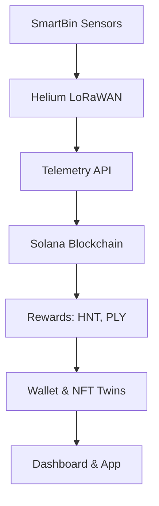

Integrating **Helium's Decentralized Physical Infrastructure Network (DePIN)** with the **Polymers Protocol** enhances its IoT-driven SmartBin functionality by leveraging Helium's Solana-based LoRaWAN network for scalable, low-cost, and long-range connectivity. This guide builds on the provided Polymers Protocol README and the detailed Helium integration guide, tailoring the integration specifically for the Polymers ecosystem. It details how to incorporate Helium for SmartBin telemetry, rewards, and analytics, ensuring seamless operation within the platform’s dashboard, mobile app, and Solana-based infrastructure. The focus is on practical steps, code examples, and alignment with Polymers’ recycling and ESG goals as of September 28, 2025.

---

## Why Helium for Polymers Protocol?
Helium’s migration to Solana in April 2023 enables Polymers to utilize its global network of over 1 million hotspots for IoT connectivity, powering SmartBins with real-time telemetry and rewards.<grok:render type="render_inline_citation">
<argument name="citation_id">14</argument>
</grok:render> Key benefits include:

- **Scalability**: Solana’s high throughput (65,000+ TPS with Firedancer) supports millions of SmartBin transactions.<grok:render type="render_inline_citation">
<argument name="citation_id">23</argument>
</grok:render>
- **Low Costs**: Transactions cost ~$0.000005, ideal for micropayments like Data Credits (DCs) and HNT/IOT rewards.<grok:render type="render_inline_citation">
<argument name="citation_id">1</argument>
</grok:render>
- **Long-Range IoT**: Helium’s LoRaWAN protocol ensures energy-efficient, long-range (up to 10km) data transmission for SmartBins in urban and rural settings.
- **Composability**: Integrates with Solana Pay for PLY/EWASTE rewards, Metaplex for NFT Twins, and Pyth oracles for ESG analytics.<grok:render type="render_inline_citation">
<argument name="citation_id">0</argument>
</grok:render>
- **Rewards Synergy**: HNT/IOT tokens complement PLY/CARB/EWASTE, enhancing gamification and enterprise incentives.

Helium’s 2025 metrics show $20M+ in annual rewards and partnerships with Telefónica and Google Pixel, making it a robust choice for Polymers’ IoT needs.<grok:render type="render_inline_citation">
<argument name="citation_id">14</argument>
</grok:render>

---

## Integration Overview
Polymers’ SmartBins use Helium’s LoRaWAN network to transmit telemetry (fill level, weight, temperature, contamination) to Solana, triggering rewards and analytics. The integration enhances:
- **Telemetry**: Real-time and historical data for dashboard charts.
- **Rewards**: HNT/IOT alongside PLY/EWASTE for user and enterprise incentives.
- **Wayfinding**: Maps and AR navigation for bin locations via Helium coverage data.
- **ESG Tracking**: Auditable telemetry for carbon footprint calculations.

**Flow** (Mermaid):
```mermaid
graph TD
    A[SmartBin Sensors] --> B[Helium LoRaWAN]
    B --> C[Polymers Telemetry API]
    C --> D[Solana Blockchain]
    D --> E[Reward Calculation (HNT, PLY)]
    E --> F[Wallet Updates & NFT Twins]
    F --> G[Dashboard & Mobile App]
    C --> G[Analytics & ESG Metrics]
```

---

## Step-by-Step Integration

### Prerequisites
- **Solana Wallet**: Phantom or Helium Wallet App (supports Solana derivation paths).
- **Tokens**: ~0.02 SOL for fees (~$0.40); HNT for DCs (~$0.00001/byte).<grok:render type="render_inline_citation">
<argument name="citation_id">12</argument>
</grok:render>
- **Hardware**: LoRaWAN-compatible devices (e.g., RAK Wireless for SmartBins, ~$100–$300).
- **Tools**:
  - Node.js ≥18, Rust, Anchor for Solana programs.
  - Helium CLI: `cargo install --git https://github.com/helium/helium-cli`.
  - SDKs: `@helium/sdk`, `@solana/web3.js`, `@solana/spl-token`.
  - Supabase for logging; TensorFlow.js for LSTM analytics.
- **API Access**: Helium Explorer (`api.helium.com/v1`) and Polymers’ Supabase instance.

Test on **Solana Devnet** to avoid mainnet costs.

---

### Step 1: Wallet Setup
1. **Create Solana Wallet**:
   - Use Phantom: Generate or import keypair; add SPL token accounts for HNT, IOT, PLY, CARB, EWASTE.
   - Fund with SOL via Devnet faucet (`solana airdrop 1`) or exchanges.

2. **Helium Wallet Integration**:
   - Export Helium key: `helium wallet export --key-type solana > solana_wallet.json`.
   - Import to Phantom: Settings > Import Private Key > Paste base58 key.<grok:render type="render_inline_citation">
<argument name="citation_id">2</argument>
</grok:render>
   - Verify HNT/IOT balances on Solana Explorer.

3. **Polymers Tokens**: Ensure PLY/CARB/EWASTE ATAs are set up for rewards synergy.

---

### Step 2: Install Helium Program Library (HPL)
HPL provides Solana programs for hotspot management and rewards, critical for Polymers’ SmartBins.<grok:render type="render_inline_citation">
<argument name="citation_id">5</argument>
</grok:render>

1. **Clone and Build**:
   ```bash
   git clone https://github.com/helium/helium-program-library
   cd helium-program-library
   anchor build
   anchor deploy --provider.cluster devnet
   ```

2. **Relevant Programs**:
   - **Hotspot Manager**: Mints NFTs for SmartBins (IoT-enabled).
   - **SubDAOs**: Distributes IOT/HNT rewards for telemetry contributions.
   - **Lazy Distributor**: Automates rewards via Pyth oracles.

Docs: [docs.helium.com/solana/helium-program-library](https://docs.helium.com/solana/helium-program-library).<grok:render type="render_inline_citation">
<argument name="citation_id">8</argument>
</grok:render>

---

### Step 3: SmartBin Hardware Setup
Polymers’ SmartBins use LoRaWAN-enabled sensors for telemetry.

1. **Acquire Hardware**: Use RAK Wireless or Dragino LoRaWAN modules (~$50–$150) for fill, weight, and contamination sensors.<grok:render type="render_inline_citation">
<argument name="citation_id">15</argument>
</grok:render>

2. **Onboard to Helium**:
   - Install Helium Hotspot App (iOS/Android).
   - Connect SmartBin via LoRaWAN; scan QR code to onboard.
   - Mint SmartBin NFT (~0.002 SOL) to assert location and enable Proof-of-Coverage (PoC).<grok:render type="render_inline_citation">
<argument name="citation_id">0</argument>
</grok:render>
   - Configure in Polymers’ `/lib/helium.ts` for telemetry routing.

3. **Firmware**: Update OTA via Helium Console; ensure LoRaWAN 1.0.3 compliance.

---

### Step 4: Telemetry Transmission
SmartBins send data (e.g., fill level, contamination) via Helium’s LoRaWAN network, logged to Supabase and anchored on Solana.

1. **Purchase DCs**: Use HNT to buy Data Credits in Helium Wallet (~1 DC/byte).

2. **Code Example** (Node.js, in `/api/iot/smartbins.ts`):
   ```javascript
   import { Helium, Wallet } from '@helium/sdk';
   import { Connection, PublicKey } from '@solana/web3.js';
   import { createClient } from '@supabase/supabase-js';

   const connection = new Connection(process.env.NEXT_PUBLIC_SOLANA_RPC_URL);
   const wallet = new Wallet(new PublicKey('YOUR_WALLET_PUBKEY'));
   const helium = new Helium(connection, wallet);
   const supabase = createClient(process.env.NEXT_PUBLIC_SUPABASE_URL, process.env.NEXT_PUBLIC_SUPABASE_ANON_KEY);

   async function sendSmartBinTelemetry(binId, telemetry) {
     // Send via Helium LoRaWAN
     const submitTx = await helium.hotspots.submitPayload({
       payload: Buffer.from(JSON.stringify({ binId, ...telemetry })),
       hotspot: new PublicKey(process.env.HELIUM_HOTSPOT_ADDRESS),
     });
     const sig = await connection.sendTransaction(submitTx, [wallet.payer]);
     
     // Log to Supabase
     await supabase.from('telemetry').insert({ binId, ...telemetry, tx: sig });
     
     console.log('Telemetry submitted:', sig);
     return sig;
   }

   // Example: Send fill level and contamination
   sendSmartBinTelemetry('bin_123', { fill: 75, contamination: 0.1, weight: 10, temp: 22 });
   ```
   This burns DCs, routes data via Helium, logs to Supabase, and triggers Polymers’ analytics.<grok:render type="render_inline_citation">
<argument name="citation_id">7</argument>
</grok:render>

3. **Query Telemetry**:
   - Use Helium Explorer API: `curl https://api.helium.com/v1/hotspots/YOUR_HOTSPOT_ADDRESS`.
   - Fetch Polymers data: Supabase query in `/api/iot/smartbins.ts`.

---

### Step 5: Rewards Integration
Helium’s IOT/HNT rewards enhance Polymers’ PLY/CARB/EWASTE system.

1. **Stake HNT** (Optional):
   - Lock HNT for veHNT via Helium Wallet to boost IOT SubDAO rewards (~0.002 SOL).<grok:render type="render_inline_citation">
<argument name="citation_id">11</argument>
</grok:render>

2. **Claim Rewards**:
   - Auto via Lazy Distributor (oracle-triggered).
   - Manual: `helium rewards claim --hotspot YOUR_HOTSPOT_ADDRESS`.
   - Combine with PLY/EWASTE: Update `/api/wallet/swap.ts` to convert IOT to PLY via Jupiter DEX.

3. **Polymers Reward Flow**:
   - SmartBin telemetry triggers HNT/IOT rewards via Helium SubDAO.
   - PLY/EWASTE issued via Solana Pay in `/api/wallet/swap.ts`.
   - Update leaderboards in `/components/leaderboard.tsx`.

**Code Example** (Reward Trigger in `/api/iot/smartbins.ts`):
   ```javascript
   async function issueRewards(binId, userWallet) {
     const rewardTx = await helium.rewards.distribute({
       hotspot: new PublicKey(process.env.HELIUM_HOTSPOT_ADDRESS),
       amount: { iot: 0.01, hnt: 0.001 },
       recipient: new PublicKey(userWallet),
     });
     const sig = await connection.sendTransaction(rewardTx, [wallet.payer]);
     
     // Trigger Polymers PLY reward
     const plyTx = await solanaPay.transfer({
       mint: new PublicKey(process.env.PLY_MINT),
       amount: 10, // 10 PLY for deposit
       recipient: new PublicKey(userWallet),
     });
     const plySig = await connection.sendTransaction(plyTx, [wallet.payer]);
     
     console.log('Rewards issued:', { sig, plySig });
   }
   ```

---

### Step 6: Analytics and Dashboard Integration
Helium telemetry feeds Polymers’ LSTM models and ESG calculations.

1. **Analytics Update** (`/lib/lstm_model.ts`):
   - Process telemetry in Supabase for fill trends and contamination scores.
   - Example:
     ```javascript
     async function updateAnalytics(telemetry) {
       const { data } = await supabase.from('telemetry').select('fill, contamination').eq('binId', telemetry.binId);
       const lstmInput = preprocessData(data); // From /lib/data_preprocessor.ts
       const prediction = await lstmModel.predict(lstmInput); // TensorFlow.js
       await supabase.from('predictions').insert({ binId: telemetry.binId, prediction });
     }
     ```

2. **Dashboard Display** (`/components/dashboards/analytics_dashboard.tsx`):
   - Fetch telemetry and predictions via Supabase.
   - Render heatmaps for bin locations using Helium coverage data (`api.helium.com/v1/coverage`).

---

### Step 7: Testing on Devnet
1. **Setup Devnet**:
   - Update `.env`:
     ```env
     NEXT_PUBLIC_SOLANA_RPC_URL=https://api.devnet.solana.com
     HELIUM_HOTSPOT_ADDRESS=DEV_HOTSPOT_ADDRESS
     PLY_MINT=DEV_PLY_MINT
     ```
   - Fund wallets: `solana airdrop 1`.

2. **Simulate Telemetry** (`/scripts/simulate_iot.ts`):
   ```javascript
   import { sendSmartBinTelemetry } from '../api/iot/smartbins';

   async function simulate() {
     await sendSmartBinTelemetry('test_bin', { fill: 80, contamination: 0.05, weight: 15, temp: 20 });
   }
   simulate();
   ```

3. **Run Tests**:
   ```bash
   npm run test
   ```
   Tests cover IoT ingestion, Helium rewards, and analytics updates.

---

### Common Challenges & Solutions
| Challenge              | Solution                                                                 |
|------------------------|--------------------------------------------------------------------------|
| **LoRaWAN Range**      | Use Helium Explorer to verify hotspot coverage; add repeaters if needed. |
| **Transaction Costs**  | Batch telemetry submissions; use ATAs for HNT/IOT.<grok:render type="render_inline_citation"><argument name="citation_id">8</argument></grok:render> |
| **Data Latency**       | Optimize with Firedancer (~400ms finality); cache telemetry locally.     |
| **Firmware Errors**    | Ensure LoRaWAN 1.0.3 compliance; test OTA updates on Devnet.             |

---

## Resources
- **Helium Docs**: [docs.helium.com/solana](https://docs.helium.com/solana) (HPL, APIs).<grok:render type="render_inline_citation">
<argument name="citation_id">8</argument>
</grok:render>
- **GitHub**: [helium/helium-program-library](https://github.com/helium/helium-program-library).<grok:render type="render_inline_citation">
<argument name="citation_id">7</argument>
</grok:render>
- **Community**: Reddit r/HeliumNetwork; X @helium.<grok:render type="render_inline_citation">
<argument name="citation_id">15</argument>
</grok:render>
- **Solana Tools**: Helius.dev for RPCs; Solana Cookbook for SPL.<grok:render type="render_inline_citation">
<argument name="citation_id">3</argument>
</grok:render>

---

## Integration with Polymers README
To reflect Helium integration in the Polymers Protocol README, the existing section is already well-structured. However, you can enhance it by adding a code snippet and linking to this guide. Here’s a suggested update to the **Helium DePIN Integration** section:

```markdown
## 🌐 Helium DePIN Integration
Polymers leverages **Helium’s Solana-based DePIN** for scalable IoT connectivity, powering SmartBin telemetry and rewards via LoRaWAN.

### Why Helium?
- **Scalability**: Handles millions of SmartBins with ~65,000 TPS.<grok:render type="render_inline_citation">
<argument name="citation_id">23</argument>
</grok:render>
- **Low Costs**: ~$0.000005 per transaction for Data Credits and rewards.<grok:render type="render_inline_citation">
<argument name="citation_id">1</argument>
</grok:render>
- **Coverage**: 1M+ global hotspots for reliable connectivity.<grok:render type="render_inline_citation">
<argument name="citation_id">14</argument>
</grok:render>
- **Composability**: Syncs with Solana Pay, Metaplex NFTs, and Pyth oracles.

### Integration Details
- **Hotspots**: SmartBins use LoRaWAN devices (e.g., RAK Wireless); onboard via Helium App, mint NFTs (~0.002 SOL).
- **Telemetry**: Send fill, weight, contamination data via Helium; log to Supabase.
- **Rewards**: HNT/IOT tokens complement PLY/EWASTE via SubDAOs and Solana Pay.
- **APIs**: Query telemetry via Helium Explorer (`api.helium.com/v1`).

**Example** (Send Telemetry):
```javascript
import { Helium } from '@helium/sdk';
import { Connection, PublicKey } from '@solana/web3.js';

const helium = new Helium(new Connection(process.env.NEXT_PUBLIC_SOLANA_RPC_URL));
async function sendTelemetry(binId, data) {
  const tx = await helium.hotspots.submitPayload({
    payload: Buffer.from(JSON.stringify({ binId, ...data })),
    hotspot: new PublicKey(process.env.HELIUM_HOTSPOT_ADDRESS),
  });
  return await connection.sendTransaction(tx);
}
```

**Flow**:


💡 **See Full Guide**: [Helium Integration for Polymers](docs/helium-integration.md) for setup and troubleshooting.
