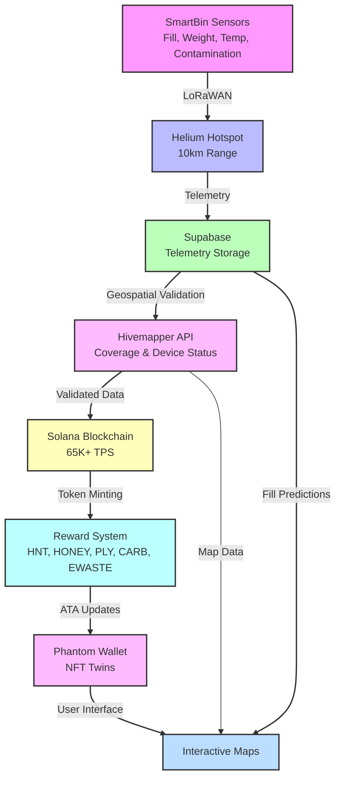

# 🌐 Helium / DePIN Integration

Helium’s [Decentralized Physical Infrastructure Network (DePIN)](https://docs.helium.com/) powers Polymers’ IoT layer, providing low-cost, global connectivity for SmartBins in polymer and e-waste recycling. Leveraging Helium’s LoRaWAN network—on [Solana](https://solana.com) since April 2023 (HIP-70, 81% approval)—Polymers achieves real-time telemetry (fill levels, weight, temperature, contamination) at ~$0.00001 per 24KB payload, feeding [ESG Metrics](#esg-nft-twins--rewards), [NFT Twins](#esg-nft-twins--rewards), [Token Rewards & Swap Panel](#polymers-swap-panel), and [Leaderboard](#gamification--leaderboard).

#### Overview of Helium DePIN
- **LoRaWAN Network**: Low-power, long-range (10–15 km rural, 1–2 km urban) IoT connectivity, ideal for SmartBins.
- **Solana Integration**: Unified HNT token (HIP-138, Jan 2025) for Data Credits (DCs) and on-chain proofs via [Helius](https://helius.dev).
- **Token Model**: DCs minted from HNT for micro-transmissions; daily DC burns (e.g., $20K+ in 2025) reduce HNT supply.
- **Network Growth**: 350K+ Hotspots, 1M+ daily users, with expansions via Telefónica (Mexico) and Google Pixel 8 bundling.


## Introduction

The integration combines **Helium’s DePIN**, **Polymers Protocol**, and **Hivemapper APIs** to create a decentralized SmartBin network for waste tracking, user rewards, and ESG analytics. Key features include:

- **Scalability**: Solana’s 65,000+ TPS (with Firedancer) supports millions of transactions.
- **Low Costs**: ~$0.000005 per transaction for micropayments (Data Credits, HNT/IOT, PLY/CARB/EWASTE, HONEY).
- **Long-Range IoT**: Helium’s LoRaWAN enables connectivity up to 10km.
- **Geospatial Validation**: Hivemapper’s real-time map data ensures accurate bin locations.
- **Composability**: Integrates with Solana Pay, Metaplex (NFT Twins), Pyth oracles, and Hivemapper APIs.
- **Rewards Synergy**: Combines HNT/IOT, PLY/CARB/EWASTE, and HONEY tokens for gamified incentives.

### SmartBin Flow


---

#### Integration Flow
Helium powers `/lib/helium.ts`, with NB-IoT/Sigfox fallbacks (`/lib/nbiot.ts`, `/lib/sigfox.ts`):
1. **Data Capture**: SmartBin sensors (ultrasonic, load cells) transmit via LoRaWAN to Hotspots.
2. **Transmission & DCs**: Payloads (~24KB) consume DCs minted from HNT, authenticated via `HELIUM_API_KEY`.
3. **On-Chain Processing**: Data streams to Supabase via Helius RPC, triggering:
   - [NFT Twins](#esg-nft-twins--rewards) minting (Metaplex).
   - [Token Rewards](#esg-nft-twins--rewards) (PLY, CARB, HONEY) using PYTH oracles.
4. **Feedback Loop**: Updates [Dashboard](#full-stack-features) and Mobile App (AR Wayfinder via Hivemapper/Mapbox); Dialect notifications alert pickups/rewards.
5. **Gamification**: High-quality data boosts [Leaderboard](#gamification--leaderboard) rankings and [Swap Panel](#polymers-swap-panel) eligibility for HNT/HONEY.

This creates a proof-of-coverage ecosystem, with Hotspot owners earning HNT for relaying Polymers’ data.

#### Technical Implementation
- **Libraries**:
  - `@helium/iot-sdk`: Device onboarding, DC payments, telemetry decoding.
  - `helium-cli`: Wallet setup (`helium wallet export --key-type solana`).
  - [Helius](https://helius.dev): RPC for DC burns, HNT mints.
- **Environment Variables**:
  ```plaintext
  HELIUM_API_KEY=YOUR_HELIUM_API_KEY
  NEXT_PUBLIC_SOLANA_RPC_URL=https://api.mainnet-beta.solana.com
  NB_IOT_MQTT_BROKER=mqtt://broker.hivemq.com
  SIGFOX_API_KEY=YOUR_SIGFOX_API_KEY
  ```
- **Code Example** (from `/lib/helium.ts`):
  ```typescript
  import { HeliumIoT } from '@helium/iot-sdk';
  import { Connection } from '@solana/web3.js';
  import { supabase } from '../lib/supabaseClient';

  async function sendTelemetry(payload: Buffer, deviceId: string, connection: Connection) {
    const helium = new HeliumIoT({ apiKey: process.env.HELIUM_API_KEY });
    const dcCost = await helium.calculateDCCost(payload.length); // ~$0.00001/24KB
    const burnTx = await helium.burnHNTForDCs(dcCost, wallet);
    await connection.sendTransaction(burnTx);
    const response = await helium.transmit(payload, deviceId);
    if (response.success) {
      await supabase.from('telemetry').insert({ data: response.payload, binId: deviceId });
    }
    return response;
  }
  ```
- **Testing**:
  ```bash
  npm run simulate:iot  # Mock Hotspot relays
  npm run test          # Verify telemetry, DC burns (<1s latency)
  npm run ota:deploy    # OTA firmware updates
  ```

**Key Files**:
- `/lib/helium.ts`: Configures LoRaWAN routing.
- `/lib/hivemapper.ts`: Handles Hivemapper API calls.
- `/api/iot/smartbins.ts`: Ingests telemetry with Hivemapper validation.
- `/api/wallet/swap.ts`: Manages reward distribution.
- `/programs/src/nft_mint.ts`: Mints SmartBin NFT Twins.
- `/lib/lstm_model.ts`: Runs predictive analytics.
- `/scripts/ota_utils.ts`: Manages OTA firmware updates.
- `/scripts/sample_data/sample_telemetry.json`: Sample dataset for testing.
- `/scripts/simulate_iot.ts`, `/scripts/simulate_rewards.ts`, `/scripts/simulate_hivemapper.ts`, `/scripts/test_lstm.ts`: Simulation scripts.
