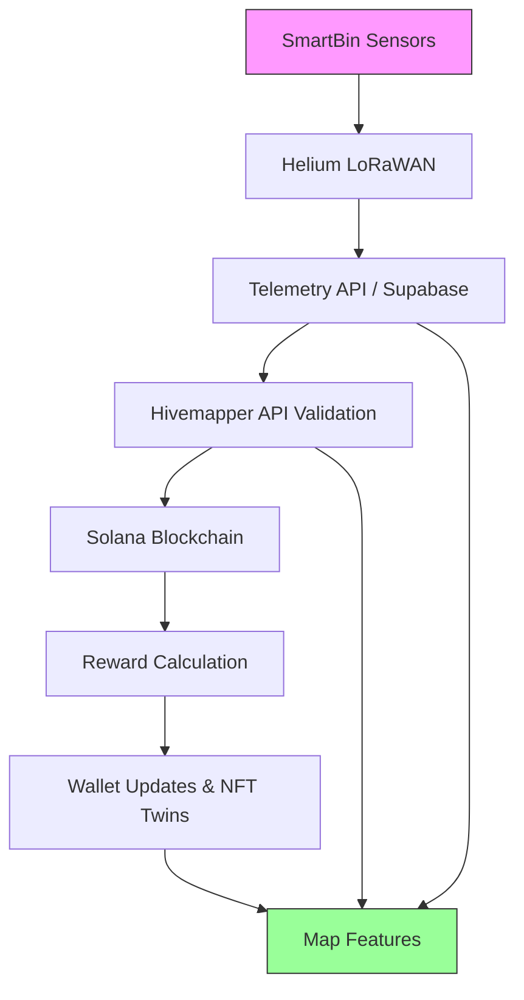

# Introduction to Polymers Protocol

The **Polymers Protocol** is a decentralized platform built on **Solana** that powers **SmartBin**, a next-generation waste management solution leveraging **Helium’s Decentralized Physical Infrastructure Network (DePIN)** for IoT connectivity and **Hivemapper’s Map Data APIs** for geospatial validation. By combining blockchain, IoT, and real-time mapping, Polymers enables scalable, low-cost, and incentivized waste tracking, rewarding users with tokens (HNT, IOT, PLY, CARB, EWASTE, HONEY) while providing ESG (Environmental, Social, Governance) analytics for sustainable urban planning.

This document introduces the protocol, its SmartBin use case, and how to get started with development and testing. For detailed integration steps, see [/docs/helium-integration.md](./helium-integration.md).

## Overview

Polymers Protocol addresses inefficiencies in waste management by deploying **SmartBins**—IoT-enabled waste bins that monitor fill levels, contamination, weight, and temperature. Key components include:

- **Helium DePIN**: Provides long-range, low-power LoRaWAN connectivity (up to 10km) for SmartBins, with 1.2M+ hotspots globally as of September 2025.
- **Hivemapper APIs**: Validates bin locations and enriches analytics with real-time map features (e.g., speed limits, traffic lights).
- **Solana Blockchain**: Handles high-throughput transactions (~65,000 TPS with Firedancer) for telemetry logging, rewards, and NFT Twins (~0.002 SOL per mint).
- **Supabase**: Stores telemetry data and logs for real-time analytics and auditing.
- **Predictive Analytics**: Uses LSTM models to forecast fill levels, enhanced by Hivemapper map data for route optimization.
- **Rewards System**: Distributes HNT/IOT (Helium), PLY/CARB/EWASTE (Polymers), and HONEY (Hivemapper) via Solana Pay based on ESG metrics and mapping contributions.

### System Architecture


## SmartBin Use Case

SmartBins are IoT-enabled waste bins that:
- **Monitor**: Track fill levels, contamination, weight, and temperature via sensors.
- **Transmit**: Send telemetry over Helium’s LoRaWAN (~$0.00001 per 24KB).
- **Validate**: Use Hivemapper APIs to confirm bin locations and map features.
- **Reward**: Issue tokens for user participation and data contributions.
- **Analyze**: Predict fill schedules and optimize collection routes using LSTM models.
- **Update**: Support OTA firmware updates with staged deployment and rollback.

**Benefits**:
- **Scalability**: Handles millions of bins with Solana’s high TPS.
- **Low Costs**: ~$0.000005 per transaction; minimal Data Credits for LoRaWAN.
- **Composability**: Integrates with Solana Pay, Metaplex NFTs, Pyth oracles, and Hivemapper APIs.
- **Sustainability**: Provides ESG analytics for municipalities and enterprises.

## Getting Started

### Prerequisites
- **Node.js**: v18+.
- **Solana CLI**: v1.18+ (`npm install -g @solana/cli`).
- **Helium CLI**: v2.0+ (`npm install -g @helium/cli`).
- **Supabase CLI**: For telemetry database.
- **Hivemapper Account**: API keys from [hivemapper.com/map-data-console](https://hivemapper.com/map-data-console).
- **Phantom Wallet**: For Solana transactions.

### Quickstart
1. **Clone Repository**:
   ```bash
   git clone https://github.com/polymers-protocol/polymers
   cd polymers
   npm install
   ```
2. **Set Up Environment**:
   Create `.env` with:
   ```env
   NEXT_PUBLIC_SOLANA_RPC_URL=https://api.devnet.solana.com
   HELIUM_HOTSPOT_ADDRESS=<your_hotspot_address>
   PLY_MINT=<ply_mint_address>
   CARB_MINT=<carb_mint_address>
   EWASTE_MINT=<ewaste_mint_address>
   HONEY_MINT=<honey_mint_address>
   REWARD_WALLET_ADDRESS=<reward_wallet_address>
   NEXT_PUBLIC_SUPABASE_URL=<supabase_url>
   NEXT_PUBLIC_SUPABASE_ANON_KEY=<supabase_anon_key>
   HIVEMAPPER_API_KEY=<your_api_key>
   HIVEMAPPER_USERNAME=<your_username>
   ```
3. **Run Local Simulations**:
   Test the full SmartBin lifecycle without hardware:
   ```bash
   npm run simulate:iot
   npm run simulate:hivemapper
   npm run simulate:rewards
   npm run test:lstm
   npm run ota:deploy --bin test_bin --file ./firmware/latest.bin
   ```
   See [/docs/helium-integration.md#local-simulation-and-testing](./helium-integration.md#local-simulation-and-testing) for details.

4. **Deploy to Devnet**:
   ```bash
   anchor deploy --provider.cluster devnet
   ```

### Key Files
- `/lib/helium.ts`, `/lib/hivemapper.ts`: Configure Helium and Hivemapper APIs.
- `/api/iot/smartbins.ts`: Handles telemetry with Hivemapper validation.
- `/api/wallet/swap.ts`: Manages rewards.
- `/programs/src/nft_mint.ts`: Mints NFT Twins.
- `/lib/lstm_model.ts`: Runs predictive analytics.
- `/scripts/ota_utils.ts`: Manages OTA updates.
- `/scripts/sample_data/sample_telemetry.json`: Sample dataset for testing.
- `/scripts/simulate_*.ts`: Simulation scripts for local testing.

## Next Steps
- **Detailed Integration**: Follow [/docs/helium-integration.md](./helium-integration.md) for setup, hardware onboarding, telemetry, rewards, analytics, OTA, and testing.
- **Contribute**: Submit issues or PRs on GitHub.
- **Community**: Join discussions on X (search “Polymers Protocol” or “Helium IoT”) or Hivemapper’s Discord ([discord.com/invite/FRWMKyy5v2](https://discord.com/invite/FRWMKyy5v2)).

## Resources
- **Polymers Protocol**: [github.com/polymers-protocol/polymers](https://github.com/polymers-protocol/polymers)
- **Helium Docs**: [docs.helium.com/solana](https://docs.helium.com/solana)
- **Hivemapper Docs**: [docs.hivemapper.com](https://docs.hivemapper.com)
- **Solana Cookbook**: [solanacookbook.com](https://solanacookbook.com)
- **Supabase Docs**: [supabase.com/docs](https://supabase.com/docs)
