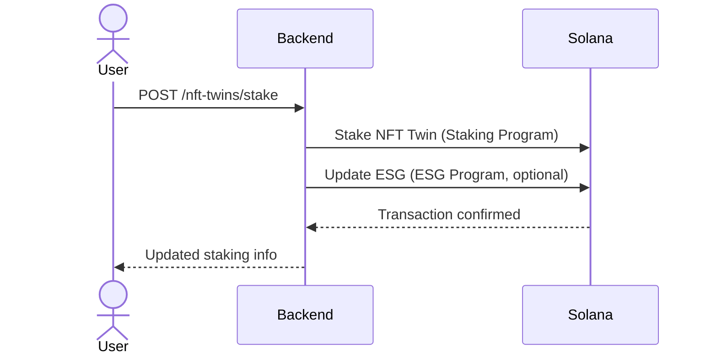
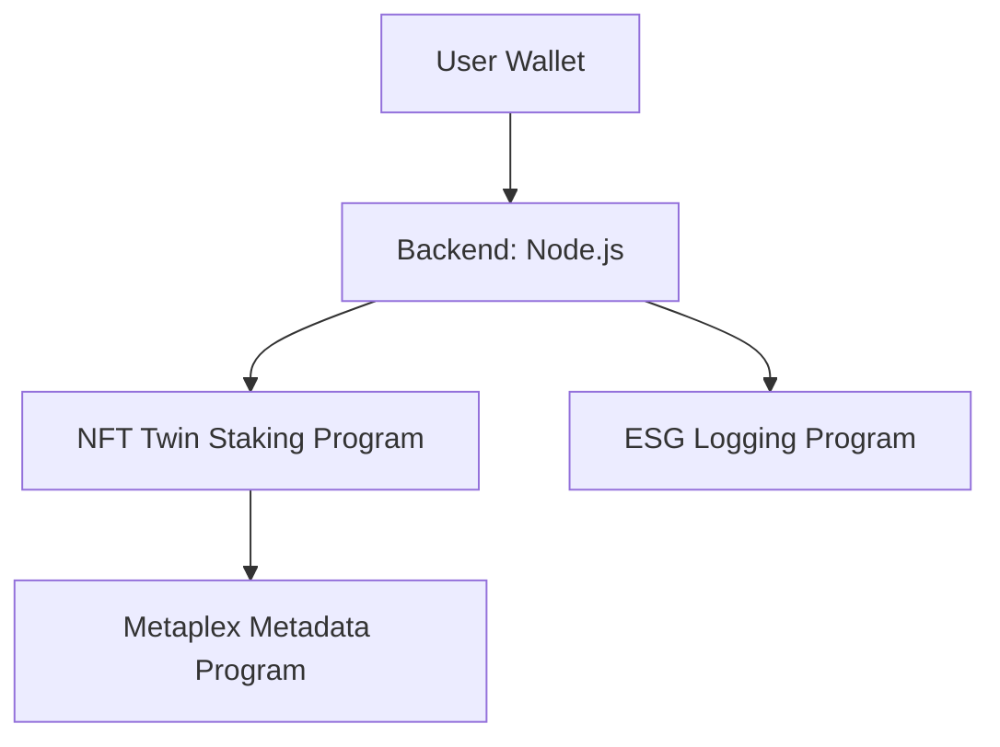
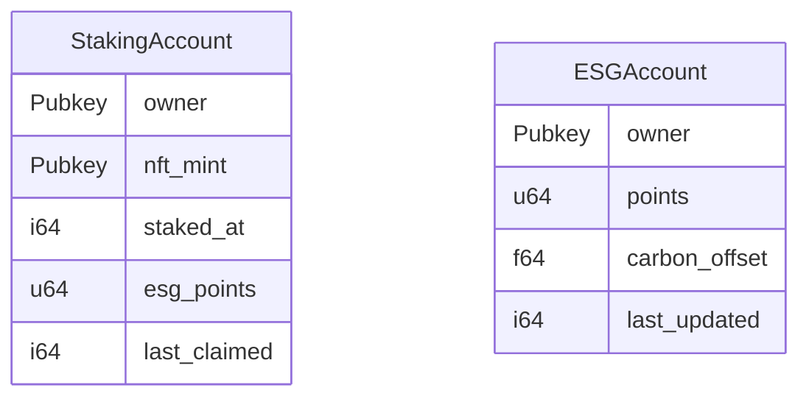

# Polymers Protocol Solana Programs

**Version**: 1.0.0 beta
**Date**: September 28, 2025

---

## Table of Contents
1. [Overview](#overview)
2. [Programs](#programs)
3. [Prerequisites](#prerequisites)
4. [Environment Setup](#environment-setup)
5. [Deployment](#deployment)
6. [Program Instructions](#program-instructions)
7. [Testing](#testing)
8. [Diagrams](#diagrams)
9. [Best Practices](#best-practices)
10. [Next Steps](#next-steps)

---

## Overview

The **Polymers Protocol** leverages Solana programs to enable:
- **NFT Twin Staking**: Users stake NFT Twins to earn PLY token rewards, boosted by ESG points.
- **ESG Logging (Optional)**: Logs carbon offsets and ESG points on-chain for transparency.
- **Metaplex Token Metadata**: Verifies NFT collection, metadata, and ownership.

Programs are written in **Rust** using the **Anchor framework** for secure Program-Derived Addresses (PDAs) and streamlined development. This README serves as the developer reference for building, deploying, and interacting with these programs.

---

## Programs

| Program Name        | Purpose                                   | Program ID (Placeholder)                     |
|---------------------|-------------------------------------------|----------------------------------------------|
| NFT Twin Staking    | Manage NFT staking and reward calculations | `<STAKING_PROGRAM_ID>`                      |
| ESG Logging         | Log carbon offsets and ESG points         | `<ESG_PROGRAM_ID>`                          |
| Metaplex Metadata   | NFT metadata verification                 | `metaqbxxUerdq28cj1RbAWkYQm3ybzjb6a8bt518x1s` |

---

## Prerequisites

- **Rust** ≥ 1.72
- **Solana CLI** ≥ 1.25
- **Anchor CLI** ≥ 0.31.1
- **Node.js** ≥ 20 (for backend integration)
- **Solana Wallet**: Phantom, Solflare, or Backpack
- **Optional**: Mermaid CLI for diagram rendering (`npm install -g @mermaid-js/mermaid-cli`)

---

## Environment Setup

1. **Install Rust & Anchor**:
   ```bash
   curl --proto '=https' --tlsv1.2 -sSf https://sh.rustup.rs | sh
   cargo install --git https://github.com/coral-xyz/anchor avm --locked --force
   avm install latest
   avm use latest
   ```

2. **Configure Solana CLI for Devnet**:
   ```bash
   solana config set --url https://api.devnet.solana.com
   solana airdrop 2 <YOUR_WALLET_ADDRESS>
   ```

3. **Clone Program Repository**:
   ```bash
   git clone https://github.com/PolymersNetwork/programs.git
   cd programs
   ```

4. **Configure `.env`** (for backend integration):
   ```env
   SOLANA_RPC_URL=https://api.devnet.solana.com
   NFT_PROGRAM_ID=metaqbxxUerdq28cj1RbAWkYQm3ybzjb6a8bt518x1s
   TOKEN_PROGRAM_ID=TokenkegQfeZyiNwAJbNbGKPFXCWuBvf9Ss623VQ5DA
   STAKING_PROGRAM_ID=<STAKING_PROGRAM_ID>
   ESG_PROGRAM_ID=<ESG_PROGRAM_ID>
   ```

---

## Deployment

1. **Build Programs**:
   ```bash
   anchor build
   ```

2. **Deploy to Devnet**:
   ```bash
   anchor deploy --provider.cluster devnet
   ```

3. **Verify Deployment**:
   ```bash
   solana program show <PROGRAM_ID>
   ```

4. **Update `.env`**:
   - Replace `<STAKING_PROGRAM_ID>` and `<ESG_PROGRAM_ID>` with deployed program IDs.

---

## Program Instructions

### 1. NFT Twin Staking Program
- **Program ID**: `<STAKING_PROGRAM_ID>`
- **Account Structure** (Rust, Anchor):
  ```rust
  use anchor_lang::prelude::*;

  #[account]
  pub struct StakingAccount {
      pub owner: Pubkey,      // User wallet
      pub nft_mint: Pubkey,   // NFT Twin mint address
      pub staked_at: i64,     // Unix timestamp
      pub esg_points: u64,    // ESG points for reward calculation
      pub last_claimed: i64,  // Last reward claim timestamp
  }
  ```
- **Instructions**:
  - `stake_nft`: Locks NFT in a vault PDA and initializes `StakingAccount`.
  - `claim_rewards`: Transfers PLY tokens based on staking duration and ESG points:
    ```
    Total Reward = (10 PLY/day × Staking Days) + (floor(ESG Points / 100) × 5 PLY)
    ```
  - `unstake_nft`: Releases NFT and updates rewards.
- **Backend Interaction** (in `/services/staking.ts`):
  ```typescript
  import { Connection, PublicKey, Keypair, Transaction } from '@solana/web3.js';

  async function stakeNFT(connection: Connection, user: Keypair, nftMint: PublicKey, stakingProgramId: PublicKey) {
    const [stakingPDA] = await PublicKey.findProgramAddress(
      [Buffer.from('staking'), nftMint.toBuffer(), user.publicKey.toBuffer()],
      stakingProgramId
    );
    const instruction = createStakeInstruction(stakingPDA, user.publicKey, nftMint, stakingProgramId);
    const transaction = new Transaction().add(instruction);
    const signature = await connection.sendTransaction(transaction, [user]);
    await connection.confirmTransaction(signature);
    return signature;
  }
  ```

### 2. ESG Logging Program (Optional)
- **Program ID**: `<ESG_PROGRAM_ID>`
- **Account Structure** (Rust, Anchor):
  ```rust
  use anchor_lang::prelude::*;

  #[account]
  pub struct ESGAccount {
      pub owner: Pubkey,        // User wallet
      pub points: u64,          // Total ESG points
      pub carbon_offset: f64,   // Total kg CO₂e
      pub last_updated: i64,    // Unix timestamp
  }
  ```
- **Instructions**:
  - `initialize_esg`: Creates a new `ESGAccount` for a user.
  - `update_esg`: Updates points and carbon offset.
- **Backend Interaction** (in `/services/esg.ts`):
  ```typescript
  async function logCarbonOffsetOnChain(connection: Connection, user: PublicKey, carbonOffset: number, programId: PublicKey, payer: Keypair) {
    const [esgPDA] = await PublicKey.findProgramAddress([Buffer.from('esg'), user.toBuffer()], programId);
    const instruction = createUpdateESGInstruction(esgPDA, user, carbonOffset, programId);
    const transaction = new Transaction().add(instruction);
    const signature = await connection.sendTransaction(transaction, [payer]);
    await connection.confirmTransaction(signature);
    return signature;
  }
  ```

### 3. Metaplex Token Metadata Program
- **Program ID**: `metaqbxxUerdq28cj1RbAWkYQm3ybzjb6a8bt518x1s`
- **Purpose**: Validates NFT Twin ownership, collection, and metadata.
- **Backend Interaction** (in `/services/nft.ts`):
  ```typescript
  import { Metaplex } from '@metaplex-foundation/js';

  async function getNFTTwins(connection: Connection, wallet: Keypair, owner: PublicKey) {
    const metaplex = Metaplex.make(connection).use(keypairIdentity(wallet));
    const nfts = await metaplex.nfts().findAllByOwner({ owner });
    return nfts.filter(nft => nft.collection?.address.toString() === '<NFT_TWIN_COLLECTION_ADDRESS>');
  }
  ```

---

## Testing

1. **Local Validator**:
   ```bash
   solana-test-validator --reset
   ```

2. **Anchor Tests**:
   ```bash
   anchor test
   ```

3. **Manual Testing**:
   - Use the backend (e.g., `POST /nft-twins/stake`) or Solana CLI to send instructions.
   - Verify:
     - NFT staking creates a `StakingAccount`.
     - ESG updates modify `ESGAccount` (if enabled).
     - Rewards reflect base rate (10 PLY/day) and ESG bonus (5 PLY per 100 points).

4. **Example Test** (in `tests/staking.ts`):
   ```typescript
   import { Program } from '@coral-xyz/anchor';

   it('Stakes an NFT and calculates rewards', async () => {
     const program = anchor.workspace.StakingProgram as Program;
     const [stakingPDA] = await PublicKey.findProgramAddress(
       [Buffer.from('staking'), nftMint.toBuffer(), user.publicKey.toBuffer()],
       program.programId
     );
     await program.rpc.stakeNft({
       accounts: { stakingAccount: stakingPDA, nftMint, user: user.publicKey },
       signers: [user],
     });
     const account = await program.account.stakingAccount.fetch(stakingPDA);
     assert.equal(account.esgPoints, 0);
   });
   ```

---

## Diagrams

### Program Interaction




### Program Architecture




### Account Structure




---

## Best Practices

- **Security**:
  - Use Anchor PDAs for all staking and ESG accounts.
  - Require wallet signatures for all instructions to prevent spoofing.
  - Validate NFT ownership via Metaplex before staking.
- **Performance**:
  - Batch ESG updates to minimize on-chain writes.
  - Cache frequent queries (e.g., NFT metadata) in the backend.
- **Auditing**:
  - Regularly audit `StakingAccount` and `ESGAccount` data.
  - Verify reward calculations against ESG points and staking duration.
- **Error Handling**:
  - Implement robust checks for invalid inputs (e.g., non-existent NFTs).

---

## Next Steps

1. Deploy programs to Devnet for testing.
2. Update `.env` with deployed program IDs and integrate with backend endpoints.
3. Test end-to-end flow: SmartBin submission → ESG points → NFT staking → rewards.
4. Deploy to Mainnet after successful Devnet tests.
5. Export this README as a PDF with embedded diagrams for documentation.

**Quick Action Checklist**:
- [ ] Install Rust, Anchor, and Solana CLI.
- [ ] Build and deploy programs: `anchor build && anchor deploy --provider.cluster devnet`.
- [ ] Test staking and ESG logging with local validator: `solana-test-validator --reset`.
- [ ] Generate high-resolution diagrams for PDF.
- [ ] Export README to PDF using Pandoc, MkDocs, or LaTeX.

---

## Generating the PDF Guide

To create a presentation-ready PDF with embedded diagrams:

1. **Save Diagrams**:
   - Install Mermaid CLI:
     ```bash
     npm install -g @mermaid-js/mermaid-cli
     ```
   - Save Mermaid code blocks as `.mmd` files (e.g., `program_interaction.mmd`, `program_architecture.mmd`, `account_structure.mmd`).
   - Generate images:
     ```bash
     mmdc -i program_interaction.mmd -o diagrams/program_interaction.png --scale 2
     mmdc -i program_architecture.mmd -o diagrams/program_architecture.png --scale 2
     mmdc -i account_structure.mmd -o diagrams/account_structure.png --scale 2
     ```
   - Alternatively, use `mermaid.live` to export PNGs/SVGs.
   - Save images in a `diagrams/` folder.

2. **Convert to PDF**:
   - **Pandoc** (simple):
     ```bash
     pandoc programs_README.md -o programs_README.pdf --pdf-engine=xelatex -V geometry:margin=1in
     ```
   - **MkDocs** (styled):
     - Install: `pip install mkdocs mkdocs-material mkdocs-pdf-export-plugin`
     - Create `mkdocs.yml`:
       ```yaml
       site_name: Polymers Protocol Solana Programs Guide
       theme:
         name: material
         palette:
           primary: teal
       plugins:
         - pdf-export
       ```
     - Move `programs_README.md` to `docs/index.md`.
     - Build and export:
       ```bash
       mkdocs build && mkdocs serve
       ```
   - **Typora** (quick):
     - Open `programs_README.md` in Typora.
     - Render Mermaid diagrams.
     - Export to PDF via `File > Export > PDF`.
   - **LaTeX** (polished):
     - Save the LaTeX template (provided previously) as `programs_guide.tex`.
     - Convert Markdown to LaTeX (optional):
       ```bash
       pandoc programs_README.md -o programs_content.tex
       ```
     - Compile:
       ```bash
       xelatex programs_guide.tex
       ```

3. **Polish**:
   - Add a cover page with title, version, date, and optional logo (uncomment `\includegraphics` in LaTeX).
   - Ensure diagrams are high-resolution (use `--scale 2`).
   - Use Arial or similar font (12pt) for readability.
   - Include a table of contents (auto-generated).

---

## References
- Solana: https://docs.solana.com
- Anchor: https://www.anchor-lang.com
- Metaplex: https://docs.metaplex.com
- GitHub: https://github.com/PolymersNetwork/programs
